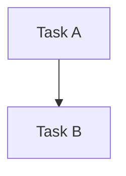

# 📋 Umsetzungsplan — <SPRINT-TITEL>

> Erstellt: YYYY-MM-DD │ Letzte Aktualisierung: YYYY-MM-DD │ Status: 🔵 Aktiv

## Spezifikation

> Spec-Stand: 1 │ Spec-Status: Entwurf │ Freigabe: ausstehend

Quelle: <Eigene Spezifikation oder verlinkte Quelltickets mit Spec-Stand und bestätigter Freigabe. Unveränderte Inhalte pro Rubrik referenzieren statt kopieren.>

## Ausgangslage

Backlog-Quelle: `<TODOs/1-backlog/<domain>/<ticket>.md>`.
Branch: `<branch-name>`.

<Kurz beschreiben: Ist-Zustand, technische Lücke, wichtigste Risiken und warum dieser Sprint jetzt notwendig ist.>

## Ziel

<Klare Zielbeschreibung in 1-3 Sätzen.>

## Beteiligte und Zielgruppen

<Wer nutzt das Ergebnis, wer ist betroffen und wer verantwortet es? Unbekannte Zuständigkeiten als offen kennzeichnen.>

## Anforderungen

<Was muss das Ergebnis leisten? Gewünschtes Verhalten und relevante Qualitätsanforderungen, keine Implementierungsschritte.>

## Nicht-Ziele

<Was ist ausdrücklich nicht Teil des Sprints?>

## Regeln und Einschränkungen

<Fachliche, technische und organisatorische Grenzen; zu erhaltende Verträge, Invarianten und Sicherheitsregeln.>

## Beispiele

<Typische Ausgangslage / Eingabe → gewünschtes Ergebnis. Beschreibt Verhalten, keinen zusätzlichen Testauftrag.>

## Ausnahme- und Fehlerfälle

<Ungültige oder ungewöhnliche Situation → erwartetes Verhalten; falls nicht relevant, kurz begründen.>

## Akzeptanzkriterien

- [ ] AC-01: <Objektiv überprüfbare Bedingung oder Verweis auf freigegebenes Quellkriterium>

## Offene Fragen

<Noch zu entscheidende Fragen mit betroffenem Umfang und Verantwortlichen, soweit bekannt; sonst „keine“.>

## Umsetzung und Nachweis

| Kriterium / Quelle | Beobachtbares Ergebnis oder Verweis | Umsetzung / Phase | Prüfebene | Nachweis / Status |
|---|---|---|---|---|
| AC-01 | <Erwartetes Verhalten; bei mehreren Quellen IDs mit Quelldokument qualifizieren> | <Aufgabe / Phase> | <Kleinste ausreichende Prüfung> | offen |

Umsetzung erst für den freigegebenen Spec-Stand. Spec-Freigabe ersetzt keine Browser-/manuelle Abnahmefreigabe.

## Entscheidungen

| Datum | Entscheidung | Begründung | Architektur-Impact |
|---|---|---|---|
| YYYY-MM-DD | <Entscheidung> | <Warum?> | `<keiner / core / bridge / server / mehrere>` |

## Gesamtfortschritt

[░░░░░░░░░░] 0% — 0 von N Aufgaben erledigt

## ⚠️ Blocker

*Keine Blocker.*

## Phasen-Übersicht

| Phase | Datei | Architektur-Relevanz | Offen | Erledigt | Fortschritt |
|---|---|---|---|---|---|
| 1 — <Phase> | [01-<phase>.md](01-<phase>.md) | `<keine / core / bridge / server / mehrere>` | N | 0 | [░░░░░░░░░░] 0% |

## 📅 Session-Übersicht

| Session | Phase | Ziel | Status |
|---|---|---|---|
| **→ S1** | Phase 1 | <Ziel der ersten Session> | **Nächste** |

## 🔗 Dependency-Übersicht

## Architektur-Update

→ [98-architecture-update.md](98-architecture-update.md)

Pflicht zum Sprint-Abschluss:

- Architektur-Deltas aus Phasen und Session-Log prüfen.
- Relevante Abschnitte in `docs/architecture.md` aktualisieren (Schichten, RPC-Vertrag, Tool-Katalog, Modellierungsregeln).
- Keine unnötigen Code-Samples übernehmen; Architektur als Modulgrenzen, Datenflüsse, Integrationspunkte, Regeln, Diagramme oder Tabellen dokumentieren.
- Wenn keine Architekturänderung nötig ist, Begründung im Architektur-Update und Session-Log festhalten.

## Sprint-Abschluss / Definition of Done

- [ ] Alle Akzeptanzkriterien geprüft oder bewusst in Folgeaufgaben verschoben.
- [ ] Spec-Stand, Aufgaben und Kriteriennachweise stimmen überein; zurückgestellte Kriterien haben eine ausdrückliche Scope-Entscheidung und Folgeaufgabe.
- [ ] Relevante Tests, Builds oder manuelle Prüfungen dokumentiert.
- [ ] Browser- und manuelle Abnahmen gemäß [Freigaberegel](../../README.md#browser--und-manuelle-abnahmeprüfungen) dokumentiert; gültige Nutzer-/Agentennachweise übernommen, keine automatische Wiederholung zum Sprint-Abschluss.
- [ ] Offene Blocker mit Besitzer und nächstem Schritt festgehalten.
- [ ] `99-session-log.md` aktualisiert.
- [ ] Jede erledigte Änderung ist im `99-session-log.md` als `feature`, `bugfix`, `doc`, `removal`, `misc` oder bewusst als `skip` erfasst.
- [ ] `98-architecture-update.md` ausgewertet.
- [ ] `docs/architecture.md` aktualisiert oder begründet als unverändert markiert.
- [ ] Sprint nach `TODOs/3-sprints-erledigt/<YYYY-MM-sprint-name>/` verschoben.
- [ ] Release-Änderungen im `99-session-log.md` vollständig (eine Release-Queue ist derzeit nicht eingerichtet).

## 📓 Session-Log

→ [99-session-log.md](99-session-log.md)
