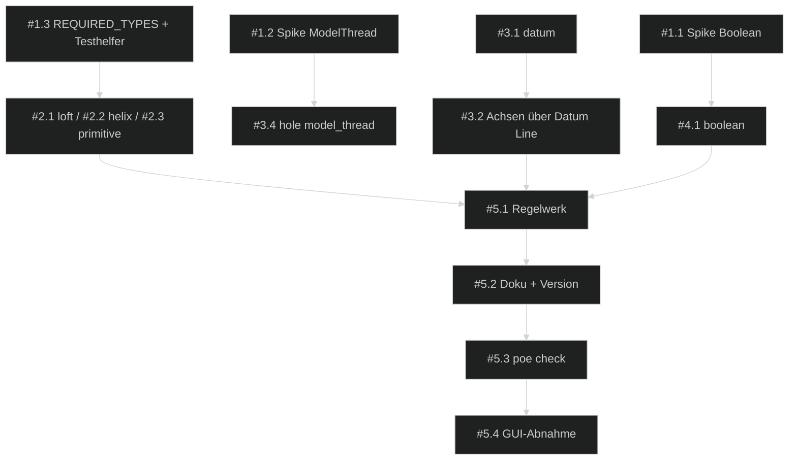

# 📋 Umsetzungsplan — FreeCAD Buddy: PartDesign-Vollständigkeit

> Erstellt: 2026-09-29 │ Letzte Aktualisierung: 2026-09-29 │ Status: 🔵 Aktiv

## Spezifikation

> Spec-Stand: 1 │ Spec-Status: Freigegeben │ Freigabe: Stand 1 durch Ralf im Chat, 2026-09-29 („starte sprint“ auf das Ticket), inklusive der Annahmen OF-01 bis OF-04 als Entscheidungen

Quelle: Backlog-Ticket [`partdesign-vollstaendigkeit.md`](../../1-backlog/freecad-buddy/partdesign-vollstaendigkeit.md), Spec-Stand 1. Die Rubriken Ausgangslage, Beteiligte, Anforderungen (A-01 bis A-10), Nicht-Ziele, Regeln und Einschränkungen, Beispiele, Ausnahme- und Fehlerfälle sowie die Kriterien AC-01 bis AC-11 gelten unverändert aus dem Ticket und werden hier nicht kopiert. Vorgänger-Sprint: [`2026-09-freecad-buddy-design-regelwerk`](../../3-sprints-erledigt/2026-09-freecad-buddy-design-regelwerk/00-index.md).

## Ausgangslage

Backlog-Quelle: [`partdesign-vollstaendigkeit.md`](../../1-backlog/freecad-buddy/partdesign-vollstaendigkeit.md).
Branch: `main`, Stand `4fd92f8`.

Siehe Ticket, Abschnitt Ausgangslage. Kurz: 51 Tools decken die skizzenbasierten Features ab; Loft, Helix allgemein, Primitive, Boolean, Draft und Datum Point/Line/LCS fehlen, dazu Taper in `pad`/`pocket` und ein modelliertes Innengewinde in `hole`.

**Risiken:**

- `PartDesign::Boolean` verschiebt die beteiligten Bodies vermutlich in seine Gruppe und kollidiert dann mit `get_model_tree` und der Regel „ein Body = ein Bauteil“ (OF-02, Spike #1.1).
- `ModelThread` ist im 26.3-Build eventuell anders benannt oder liefert ungültige Solids (OF-03, Spike #1.2).
- Primitive brauchen eine parametrische Lage ohne Solid-Flächen; `AttachmentOffset` mit Ausdrücken ist ungeprüft.

## Ziel

Jedes Standard-Werkzeug der PartDesign-Werkzeugleiste ist über ein Tool erreichbar, parametrisch und mit Headless-Core-Test belegt. Sechs neue Tools (`loft`, `helix`, `primitive`, `boolean`, `draft`, `datum`), Taper und `up_to_first` in `pad`/`pocket`, `model_thread` in `hole`. Tool-Budget 51 → 57.

## Beteiligte und Zielgruppen

Siehe Ticket. Ralf entscheidet und nimmt AC-11 ab, der implementierende Agent setzt die Sessions um.

## Anforderungen

Unverändert A-01 bis A-10 aus dem Ticket. Sprint-eigene Ergänzung:

| ID | Anforderung |
|---|---|
| S-01 | **Spikes zuerst:** OF-02 und OF-03 werden in S1 headless geklärt und im Index unter Entscheidungen festgehalten, bevor `boolean` und `model_thread` umgesetzt werden. |
| S-02 | **Reihenfolge nach Nutzen:** Loft, Helix, Primitive vor Datum und Bestandserweiterungen, Boolean und Draft zuletzt. |

## Nicht-Ziele

Unverändert aus dem Ticket.

## Regeln und Einschränkungen

Unverändert aus dem Ticket. Zusätzlich: Jede Session endet mit grünem `uv run poe check` vor dem Commit.

## Beispiele

Unverändert aus dem Ticket.

## Ausnahme- und Fehlerfälle

Unverändert aus dem Ticket.

## Akzeptanzkriterien

Unverändert AC-01 bis AC-11 aus dem Ticket; der Nachweis steht unten.

## Offene Fragen

| ID | Frage | Betroffen | Annahme bis Klärung | Verantwortlich |
|---|---|---|---|---|
| OF-01 | `draft` aufnehmen? | #4.2, AC-05 | ✅ Entschieden (Annahme, Ralf 2026-09-29): Ja, als letzte Aufgabe | Ralf |
| OF-02 | Verhalten von `PartDesign::Boolean` im Baum | #1.1, #4.1, AC-04 | Spike in S1; fällt er negativ aus, wird `boolean` auf `fuse` beschränkt | Agent (Spike), Entscheidung Ralf |
| OF-03 | `ModelThread` in 26.3 vorhanden und druckbar | #1.2, #3.4, AC-08 | Spike in S1 | Agent (Spike) |
| OF-04 | Ein oder zwei Sprints | Planung | ✅ Entschieden (Annahme, Ralf 2026-09-29): ein Sprint, fünf Phasen | Ralf |
| OF-05 | Versionsnummer nach dem Sprint | #5.2 | 0.3.0 (vermutet: neue Tools = Minor) | Ralf |

## Umsetzung und Nachweis

| Kriterium / Quelle | Beobachtbares Ergebnis oder Verweis | Umsetzung / Phase | Prüfebene | Nachweis / Status |
|---|---|---|---|---|
| AC-01 | Trichter per `loft`, Höhe folgt Parameter, subtraktiv schneidet | #2.1 / P2 | Headless-Core-Test | offen |
| AC-02 | Feder und Nut per `helix`, `thread` unverändert | #2.2 / P2 | Headless-Core-Test + bestehende `thread`-Tests | offen |
| AC-03 | 8 Primitive additiv und subtraktiv, Volumen nach Formel ±1 % | #2.3 / P2 | Headless-Core-Test | offen |
| AC-04 | `boolean` fuse/cut/common, Ablehnungen | #1.1, #4.1 / P1, P4 | Spike + Headless-Core-Test | offen |
| AC-05 | `draft` mit Selektor und Re-Resolve | #4.2 / P4 | Headless-Core-Test | offen |
| AC-06 | `datum` point/line/lcs; Revolve und Polar um Datum Line | #3.1, #3.2 / P3 | Headless-Core-Test Achsvergleich | offen |
| AC-07 | Taper und `up_to_first` in `pad`/`pocket` | #3.3 / P3 | Headless-Core-Test Volumen | offen |
| AC-08 | `hole` mit `model_thread`, `unsupported` ohne Eigenschaft | #1.2, #3.4 / P1, P3 | Spike + Headless-Core-Test | offen |
| AC-09 | Regelwerk nennt neue Tools, `docs/tools.md` regeneriert, ≤ 100 Tools | #1.3, #5.1, #5.2 / P1, P5 | Unit-Tests Regelwerk und Tool-Doku | offen |
| AC-10 | Undo-Schritt, Labels, Sprache, `poe check` grün | #5.3 / P5 | `uv run poe check` | offen |
| AC-11 | Loft, Helix, Primitiv in der GUI weiterbearbeitbar | #5.4 / P5 | Nutzerprüfung GUI (Freigabe nötig) | offen |

Umsetzung erst für den freigegebenen Spec-Stand. Spec-Freigabe ersetzt keine Browser-/manuelle Abnahmefreigabe.

## Entscheidungen

| Datum | Entscheidung | Begründung | Architektur-Impact |
|---|---|---|---|
| 2026-09-29 | Sprint aus dem Ticket mit den Annahmen OF-01 bis OF-04 gestartet (Ralf, „starte sprint“) | Offene Fragen sind als Annahmen tragfähig; OF-02/OF-03 werden per Spike geklärt | mehrere |
| 2026-09-29 | Sechs neue Tools statt Erweiterung bestehender (z. B. kein `pad kind=loft`) | Ein Tool je PartDesign-Werkzeug bleibt für Agent und Regelwerk lesbar; Budget reicht | server |
| 2026-09-29 | `thread` bleibt Intent-Tool und nutzt intern `helix` | Keine zwei Helix-Implementierungen | core |

## Gesamtfortschritt

[░░░░░░░░░░] 0% — 0 von 16 Aufgaben erledigt

## ⚠️ Blocker

*Keine Blocker.*

## Phasen-Übersicht

| Phase | Datei | Architektur-Relevanz | Offen | Erledigt | Fortschritt |
|---|---|---|---|---|---|
| 1 — Spikes & Fundament | [01-spikes-fundament.md](01-spikes-fundament.md) | `core` | 3 | 0 | [░░░░░░░░░░] 0% |
| 2 — Loft, Helix, Primitive | [02-additive-features.md](02-additive-features.md) | `mehrere` | 3 | 0 | [░░░░░░░░░░] 0% |
| 3 — Datum & Bestandserweiterungen | [03-referenzen-bestand.md](03-referenzen-bestand.md) | `mehrere` | 4 | 0 | [░░░░░░░░░░] 0% |
| 4 — Boolean & Draft | [04-boolean-draft.md](04-boolean-draft.md) | `mehrere` | 2 | 0 | [░░░░░░░░░░] 0% |
| 5 — Regelwerk, Doku & Abschluss | [05-regelwerk-doku-abschluss.md](05-regelwerk-doku-abschluss.md) | `docs/architecture.md` | 4 | 0 | [░░░░░░░░░░] 0% |

## 📅 Session-Übersicht

| Session | Phase | Ziel | Status |
|---|---|---|---|
| **→ S1** | Phase 1 + #2.1 | Spikes OF-02/OF-03, `REQUIRED_TYPES`, Testhelfer, `loft` | **Nächste** |
| S2 | Phase 2 | `helix` mit `thread`-Umstellung, `primitive` | Geplant |
| S3 | Phase 3 | `datum`, Achsen über Datum Line, Taper/`up_to_first`, `model_thread` | Geplant |
| S4 | Phase 4 | `boolean`, `draft` | Geplant |
| S5 | Phase 5 | Regelwerk, Doku, Version, `poe check`, GUI-Abnahme AC-11 | Geplant |

## 🔗 Dependency-Übersicht

## Architektur-Update

→ [98-architecture-update.md](98-architecture-update.md)

Pflicht zum Sprint-Abschluss:

- Architektur-Deltas aus Phasen und Session-Log prüfen.
- Relevante Abschnitte in `docs/architecture.md` aktualisieren (Tool-Katalog, Modellierungsregeln: Primitive, Boolean, Datum-Referenzen).
- Keine unnötigen Code-Samples übernehmen.
- Wenn keine Architekturänderung nötig ist, Begründung im Architektur-Update und Session-Log festhalten.

## Sprint-Abschluss / Definition of Done

- [ ] Alle Akzeptanzkriterien geprüft oder bewusst in Folgeaufgaben verschoben.
- [ ] Spec-Stand, Aufgaben und Kriteriennachweise stimmen überein; zurückgestellte Kriterien haben eine ausdrückliche Scope-Entscheidung und Folgeaufgabe.
- [ ] Relevante Tests, Builds oder manuelle Prüfungen dokumentiert.
- [ ] Browser- und manuelle Abnahmen gemäß [Freigaberegel](../../README.md#browser--und-manuelle-abnahmeprüfungen) dokumentiert; gültige Nutzer-/Agentennachweise übernommen, keine automatische Wiederholung zum Sprint-Abschluss.
- [ ] Offene Blocker mit Besitzer und nächstem Schritt festgehalten.
- [ ] `99-session-log.md` aktualisiert.
- [ ] Jede erledigte Änderung ist im `99-session-log.md` als `feature`, `bugfix`, `doc`, `removal`, `misc` oder bewusst als `skip` erfasst.
- [ ] `98-architecture-update.md` ausgewertet.
- [ ] `docs/architecture.md` aktualisiert oder begründet als unverändert markiert.
- [ ] Sprint nach `TODOs/3-sprints-erledigt/<YYYY-MM-sprint-name>/` verschoben.
- [ ] Release-Änderungen im `99-session-log.md` vollständig (eine Release-Queue ist derzeit nicht eingerichtet).

## 📓 Session-Log

→ [99-session-log.md](99-session-log.md)
