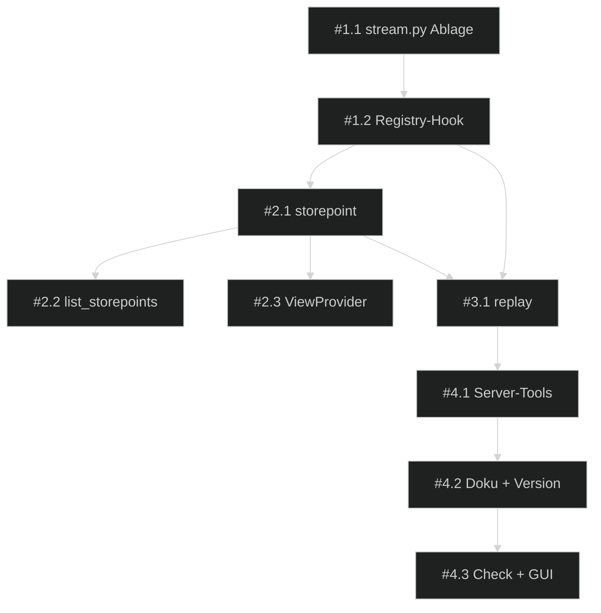

# 📋 Umsetzungsplan — FreeCAD Buddy: Design-Stream mit Storepoints

> Erstellt: 2026-09-29 │ Letzte Aktualisierung: 2026-09-29 │ Status: 🔵 Aktiv

## Spezifikation

> Spec-Stand: 1 │ Spec-Status: Freigegeben │ Freigabe: Stand 1 durch Ralf im Chat, 2026-09-29 („ok, dann umsetzen“), inklusive der Annahmen OF-01 bis OF-05 als Entscheidungen

Quelle: Backlog-Ticket [`design-stream-storepoints.md`](../../1-backlog/freecad-buddy/design-stream-storepoints.md), Spec-Stand 1. Ausgangslage, Beteiligte, Anforderungen (A-01 bis A-08), Nicht-Ziele, Regeln, Beispiele, Ausnahmefälle und die Kriterien AC-01 bis AC-10 gelten unverändert aus dem Ticket. Parallel offen: Sprint [`freecad-buddy-partdesign`](../freecad-buddy-partdesign/00-index.md), nur noch G13 (GUI-Abnahme durch Ralf).

## Ausgangslage

Backlog-Quelle: [`design-stream-storepoints.md`](../../1-backlog/freecad-buddy/design-stream-storepoints.md).
Branch: `main`, Stand `da5701a` (Version 0.3.0, 57 Tools).

Siehe Ticket. Technischer Anker: Jeder Bridge-Aufruf läuft durch `MethodRegistry.invoke` (`buddy_bridge/registry.py`); dort lassen sich Methode, Parameter und Ergebnis nach Erfolg aufzeichnen. Eine Buddy-Transaktion erhöht `doc.UndoCount` um genau eins und trägt ein Label wie `Pad: Base`; daran erkennt die Aufzeichnung mutierende Aufrufe, Undo-Kompaktierung und fremde (manuelle) Transaktionen.

**Risiken:**

- Marker-Objekte (`App::FeaturePython`) mit ViewProvider-Proxy erzeugen ohne Addon eine Proxy-Warnung beim Laden (akzeptiert, Ticket A-08).
- Ein Replay läuft auf dem Qt-Hauptthread und blockiert die GUI für die Dauer des Neuaufbaus; langer Timeout nötig.
- Parameter mit `document=None` meinen „aktives Dokument“; das Replay setzt das Zieldokument explizit.

## Ziel

Ein Design lässt sich aus seinem im Dokument gespeicherten Stream bis zu einem Storepoint in einem neuen Dokument identisch neu aufbauen; Storepoints sind im FreeCAD-Baum sichtbar (Beschreibung am Feature, Marker-Gruppe mit Icon).

## Beteiligte und Zielgruppen

Siehe Ticket.

## Anforderungen

Unverändert A-01 bis A-08 aus dem Ticket. Sprint-eigene Ergänzung:

| ID | Anforderung |
|---|---|
| S-01 | **Ein Ausführungsweg:** Aufzeichnung und Replay laufen über dieselbe Registry-Funktion, es gibt keine zweite Ausführungslogik. |
| S-02 | **Ablage in der Marker-Gruppe:** Der Stream liegt als Property auf der Gruppe `Storepoints` (OF-01: im Dokument); die Gruppe entsteht beim ersten aufgezeichneten Aufruf. |

## Nicht-Ziele

Unverändert aus dem Ticket.

## Regeln und Einschränkungen

Unverändert aus dem Ticket. Zusätzlich: Jede Session endet mit grünem `uv run poe check` vor dem Commit; `uv run --no-sync`, solange Ralfs Server läuft.

## Beispiele

Unverändert aus dem Ticket.

## Ausnahme- und Fehlerfälle

Unverändert aus dem Ticket.

## Akzeptanzkriterien

Unverändert AC-01 bis AC-10 aus dem Ticket; Nachweis unten.

## Offene Fragen

| ID | Frage | Betroffen | Annahme bis Klärung | Verantwortlich |
|---|---|---|---|---|
| OF-01 | Ablage im Dokument oder Sidecar | A-02 | ✅ Entschieden (Annahme): im Dokument, als Property der Gruppe `Storepoints` | Ralf |
| OF-02 | `undo` aufzeichnen oder kompaktieren | A-01 | ✅ Entschieden (Annahme): kompaktieren über den Undo-Namen der Transaktion | Ralf |
| OF-03 | Snapshot-Fallback bei manuellen Änderungen | A-05 | ✅ Entschieden (Annahme): `storepoint(snapshot=true)` speichert eine FCStd-Kopie neben der Datei; Standard aus | Ralf |
| OF-04 | Argumente beim Replay überschreiben | A-04 | ✅ Entschieden (Annahme): nein | Ralf |
| OF-05 | Baum-Anzeige (a), (b) oder beides | A-08 | ✅ Entschieden (Annahme): beides | Ralf |
| OF-06 | Versionsnummer nach dem Sprint | #4.2 | ✅ Umgesetzt als Annahme: 0.4.0 in `pyproject.toml`, `uv.lock`, Server, Bridge, Core und CHANGELOG | Ralf |

## Umsetzung und Nachweis

| Kriterium / Quelle | Beobachtbares Ergebnis oder Verweis | Umsetzung / Phase | Prüfebene | Nachweis / Status |
|---|---|---|---|---|
| AC-01 | Stream enthält jeden mutierenden Aufruf, keine zurückgerollten | #1.1, #1.2 / P1 | Headless-Bridge-Test | **erfüllt** (`test_registry_records_mutating_calls_in_order_and_skips_failures`) |
| AC-02 | Stream überlebt Speichern/Schließen/Öffnen | #1.1 / P1 | Headless-Core-Test | **erfüllt** (`test_stream_survives_save_close_and_open`) |
| AC-03 | `storepoint`, `list_storepoints`, doppelte Namen abgelehnt | #2.1, #2.2 / P2 | Headless-Core-Test | **erfüllt** (`test_storepoint_marks_the_feature_lists_and_undoes`) |
| AC-04 | Replay bis zum letzten Storepoint: gleiche Labels und Volumen | #3.1 / P3 | Headless-Bridge-Test (Referenzmodell) | **erfüllt** (`test_replay_rebuilds_the_design_up_to_each_storepoint`: Labels identisch, Volumen gleich; E2E `test_storepoints_and_replay_over_mcp`) |
| AC-05 | Replay bis zu einem mittleren Storepoint | #3.1 / P3 | Headless-Bridge-Test | **erfüllt** (gleicher Test: Kopie bis „Base“ ohne Pocket) |
| AC-06 | Scheiternder Schritt: Abbruch mit Schrittnummer, Teilergebnis bleibt | #3.1 / P3 | Headless-Bridge-Test | **erfüllt** (`test_replay_skips_python_and_stops_at_a_failing_step`) |
| AC-07 | `manual_edit` erkannt, Replay warnt | #1.1 / P1 | Headless-Core-Test (Fremdtransaktion) + GUI-Nutzerabnahme | headless **erfüllt** (`test_undo_compacts_the_stream_and_manual_edits_are_marked`); GUI-Anteil G15 offen |
| AC-08 | `execute_python` übersprungen, `install_addon` nie erneut | #1.2, #3.1 / P1, P3 | Headless-Bridge-Test | **erfüllt** (Skip-Liste `NEVER_REPLAYED`, Test wie AC-06) |
| AC-09 | Tool-Budget ≤ 100, `poe check` grün, englische Texte | #4.1–#4.3 / P4 | `uv run poe check` | **erfüllt** (60 Tools; ruff, pyright, 186 + 255 Tests grün) |
| AC-10 | `Label2` auf dem Tip-Feature, Marker mit Link, Undo räumt auf; Icon/Tooltip in der GUI | #2.1, #2.3 / P2 | Headless-Core-Test + GUI-Nutzerabnahme | headless **erfüllt** (Test wie AC-03); GUI-Anteil G14 offen |

Umsetzung erst für den freigegebenen Spec-Stand. Spec-Freigabe ersetzt keine Browser-/manuelle Abnahmefreigabe.

## Entscheidungen

| Datum | Entscheidung | Begründung | Architektur-Impact |
|---|---|---|---|
| 2026-09-29 | Sprint aus dem Ticket mit den Annahmen OF-01 bis OF-05 gestartet (Ralf, „ok, dann umsetzen“) | Annahmen sind tragfähig, Ralf kann vor dem Release widersprechen | mehrere |
| 2026-09-29 | Aufzeichnung in `MethodRegistry.invoke` über Undo-Zähler und -Namen statt über eine Liste mutierender Methoden | Jede Buddy-Transaktion ist genau ein Undo-Schritt; neue Tools werden automatisch erfasst | bridge, core |
| 2026-09-29 | Stream-Einträge speichern Bridge-Methode und Parameter (nicht MCP-Tool-Namen) | Replay ohne MCP-Umweg, ein Ausführungsweg (S-01) | bridge |

## Gesamtfortschritt

[█████████░] 90% — 9 von 10 Aufgaben erledigt

## ⚠️ Blocker

- **#4.3 GUI-Abnahme G14/G15** wartet auf Ralf: selbst prüfen, dem Agenten übertragen oder per Scope-Entscheidung ins Folgeticket [`gui-abnahme.md`](../../1-backlog/freecad-buddy/gui-abnahme.md) verschieben. Besitzer: Ralf.

## Phasen-Übersicht

| Phase | Datei | Architektur-Relevanz | Offen | Erledigt | Fortschritt |
|---|---|---|---|---|---|
| 1 — Aufzeichnung & Ablage | [01-aufzeichnung.md](01-aufzeichnung.md) | `core`, `bridge` | 0 | 3 | [██████████] 100% |
| 2 — Storepoints & Baum | [02-storepoints-baum.md](02-storepoints-baum.md) | `core` | 0 | 3 | [██████████] 100% |
| 3 — Replay | [03-replay.md](03-replay.md) | `bridge` | 0 | 1 | [██████████] 100% |
| 4 — Server, Doku & Abschluss | [04-server-doku-abschluss.md](04-server-doku-abschluss.md) | `docs/architecture.md` | 1 | 2 | [███████░░░] 67% |

## 📅 Session-Übersicht

| Session | Phase | Ziel | Status |
|---|---|---|---|
| S1 | Phase 1–4 | Stream-Modul, Registry-Hook, Storepoints, Marker, ViewProvider, Replay, Server-Tools, Doku, Version 0.4.0, `poe check` | ✅ Erledigt (2026-09-29), #4.3 GUI offen |
| **→ S2** | Phase 4 | GUI-Abnahme G14/G15 (nach Freigabe durch Ralf) und Sprint-Abschluss | **Nächste, wartet auf Ralf** |

## 🔗 Dependency-Übersicht

## Architektur-Update

→ [98-architecture-update.md](98-architecture-update.md)

Pflicht zum Sprint-Abschluss:

- Architektur-Deltas aus Phasen und Session-Log prüfen.
- Relevante Abschnitte in `docs/architecture.md` aktualisieren (neuer Abschnitt Design-Stream, Transaktionen).
- Keine unnötigen Code-Samples übernehmen.
- Wenn keine Architekturänderung nötig ist, Begründung im Architektur-Update und Session-Log festhalten.

## Sprint-Abschluss / Definition of Done

- [ ] Alle Akzeptanzkriterien geprüft oder bewusst in Folgeaufgaben verschoben.
- [ ] Spec-Stand, Aufgaben und Kriteriennachweise stimmen überein; zurückgestellte Kriterien haben eine ausdrückliche Scope-Entscheidung und Folgeaufgabe.
- [ ] Relevante Tests, Builds oder manuelle Prüfungen dokumentiert.
- [ ] Browser- und manuelle Abnahmen gemäß [Freigaberegel](../../README.md#browser--und-manuelle-abnahmeprüfungen) dokumentiert; gültige Nutzer-/Agentennachweise übernommen, keine automatische Wiederholung zum Sprint-Abschluss.
- [ ] Offene Blocker mit Besitzer und nächstem Schritt festgehalten.
- [ ] `99-session-log.md` aktualisiert.
- [ ] Jede erledigte Änderung ist im `99-session-log.md` als `feature`, `bugfix`, `doc`, `removal`, `misc` oder bewusst als `skip` erfasst.
- [ ] `98-architecture-update.md` ausgewertet.
- [ ] `docs/architecture.md` aktualisiert oder begründet als unverändert markiert.
- [ ] Sprint nach `TODOs/3-sprints-erledigt/<YYYY-MM-sprint-name>/` verschoben.
- [ ] Release-Änderungen im `99-session-log.md` vollständig (eine Release-Queue ist derzeit nicht eingerichtet).

## 📓 Session-Log

→ [99-session-log.md](99-session-log.md)
