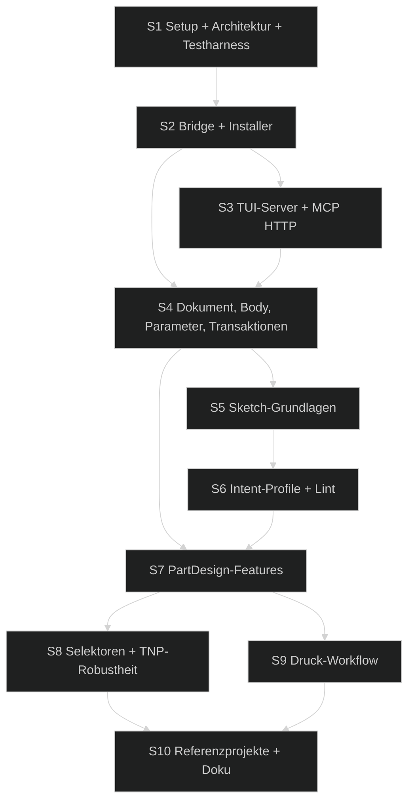

# 📋 Umsetzungsplan — FreeCAD Buddy: PartDesign-first für 3D-Druck

> Erstellt: 2026-09-27 │ Letzte Aktualisierung: 2026-09-28 │ Status: ✅ Erledigt (2026-09-28) – GUI-Abnahme G1–G8 per Scope-Entscheidung in Folgeticket verschoben

## Spezifikation

> Spec-Stand: 2 │ Spec-Status: Freigegeben │ Freigabe: Stand 1 durch Ralf im Chat, 2026-09-27 (inkl. Annahmen OF-01, OF-05, OF-06); Stand 2 durch Ralf im Chat, 2026-09-27 (inkl. OF-08 = 8765)
>
> **Delta Stand 2 (2026-09-27):** Der MCP-Server wird um eine TUI zur Übersicht erweitert und manuell neben FreeCAD gestartet. Folge: MCP-Transport Streamable HTTP statt stdio (R-11, AC-01, AC-12, AC-16, #1.6, #1.8, #1.9, S3). Bridge, Core und JSON-RPC-Vertrag bleiben unverändert. Freigegebener Umfang aus Stand 1 (S2 Bridge, S4 ff.) ist davon nicht betroffen.

Quelle: eigene Spezifikation aus der Chat-Anforderung vom 2026-09-27. Marktanalyse der bestehenden Projekte: [5-konzepte/freecad-mcp-marktanalyse.md](../../5-konzepte/freecad-mcp-marktanalyse.md).

## Ausgangslage

Backlog-Quelle: keine (Sprint direkt aus Chat-Anforderung).
Branch: `main` (Grundgerüst-Commit `6c05a50`; Umsetzung S2–S10 zum Abschluss noch nicht committet).

- Installiert: FreeCAD **26.3.0 weekly** (Build 2026-09-22, Commit `019f5c50a`), Python **3.13.15**, unter `%LOCALAPPDATA%\Programs\FreeCAD 26.3`. `App::VarSet` ist verfügbar. `uv` ist installiert.
- Es existieren mehrere FreeCAD-MCP-Server (neka-nat, spkane, JakobThiessen, blwfish, contextform, sergiudanstan). Gemeinsame Schwächen: Tool-Explosion (bis 165 Tools), Low-Level-Primitive statt Konstruktionsabsicht, `execute_python` als Standard-Ausweg, Part-CSG statt PartDesign, unterbestimmte Skizzen, hartkodierte Topologie-Namen (`Edge12`), keine Druckbarkeitsprüfung.
- Risiken: API-Drift der Weekly-Builds, Topological Naming Problem (TNP) bei Face-/Edge-Referenzen, Qt-Threading (FreeCAD-API nur im GUI-Hauptthread sicher), Screenshots nur mit GUI.

## Ziel

Ein eigener, lokaler MCP-Server, über den ein Agent 3D-Druck-Projekte in FreeCAD **PartDesign mit voll bestimmten Skizzen** so aufbaut, wie ein erfahrener Mensch es tun würde – sodass der Nutzer jederzeit in der GUI manuell weiterarbeiten, Maße ändern und das Modell parametrisch weiterentwickeln kann. Ergebnis sind druckfertige Exporte mit Druckbarkeitsprüfung.

## Beteiligte und Zielgruppen

- **Ralf (Nutzer, Senior Developer):** Auftraggeber, arbeitet parallel manuell in der FreeCAD-GUI, nimmt GUI-Prüfungen und Probedrucke ab.
- **MCP-Client-Agent (Claude Code):** primärer Nutzer der Tools (Annahme, siehe OF-01).
- **Implementierender Agent:** setzt Sessions gemäß diesem Plan um.
- Verantwortung für Freigaben: Ralf.

## Anforderungen

| ID | Anforderung |
|---|---|
| R-01 | Arbeitet gegen eine **laufende FreeCAD-GUI**; Änderungen sind sofort sichtbar, manuelles Arbeiten parallel bleibt möglich. |
| R-02 | **Menschlich wirkende Modelle:** ein `PartDesign::Body` je Bauteil, Skizzen auf Ursprungs- oder Datum-Ebenen, voll bestimmt (DoF = 0), benannte Maß-Constraints, zentrale Parameter, sprechende Labels, sauberer Modellbaum. Keine Part-Primitive/Booleans im Standard-Workflow. |
| R-03 | **Intent-Level-Tools** (z. B. „zentriertes Rechteck 60×40 auf XY“) mit schlanker Tool-Oberfläche (Richtwert ≤ 40 öffentliche Tools); Low-Level-Geometrie/Constraints als Fallback. |
| R-04 | Jede Mutation ist **atomar und rückgängig machbar** (genau ein benannter Undo-Schritt) und liefert eine **strukturierte Rückmeldung**: erzeugte Objekte, DoF, Recompute-Status, Warnungen, Hinweise. |
| R-05 | **Visuelles Feedback:** Screenshots der aktuellen Ansicht/Standardansichten als MCP-Image. |
| R-06 | **3D-Druck-Workflow:** Druckerprofil, Druckbarkeitsprüfung (Solid, Bauraum, Überhang, Wandstärke), Export STL/3MF/STEP. |
| R-07 | **Robustheit:** semantische Kanten-/Flächenauswahl statt Topologie-Namen; Parameteränderungen führen nicht zu falschen Referenzen. |
| R-08 | **Qualität:** typisierter Python-Code, Lint, automatisierte Headless-Tests gegen FreeCAD-Python, Unit-Tests für den Server. |
| R-09 | **Sicherheit:** Bridge nur an `127.0.0.1`, Token-Authentifizierung, `execute_python` standardmäßig deaktiviert. |
| R-10 | **Kompatibilität:** Zielversion FreeCAD 26.3 weekly; API-Abweichungen in einer Kompatibilitätsschicht kapseln. |
| R-11 | **TUI-Server (Stand 2):** Der MCP-Server `freecad-buddy` wird manuell in einem Terminal neben FreeCAD gestartet und zeigt eine Übersicht: Bridge-/FreeCAD-Status, verbundene MCP-Clients, Tool-Aufrufe live (Name, Dauer, Ergebnis) und FreeCAD-Meldungen. MCP-Clients verbinden sich per Streamable HTTP über `127.0.0.1`. Ein Modus ohne TUI (`--headless`) existiert für Tests. |

## Nicht-Ziele

- Assemblies, FEM, CAM, BIM, TechDraw, Draft-Workbench.
- Slicer-Integration (Orca/Prusa/Bambu-CLI) – Backlog-Kandidat.
- Remote-/Cloud-Betrieb, Mehrbenutzerbetrieb, Docker.
- Vollständige Abdeckung der FreeCAD-API; Part-CSG-Modellierung.
- Veröffentlichung als Addon im FreeCAD-Addon-Manager (später prüfbar).
- Unterstützung älterer FreeCAD-Versionen (< 1.0).
- stdio-Transport und Web-Oberfläche für den MCP-Server (Stand 2).

## Regeln und Einschränkungen

- **Schichten:** `core` (reine FreeCAD-Logik, läuft in FreeCAD-Python, headless testbar) → `bridge` (FreeCAD-Addon, nur Transport + Main-Thread-Dispatch) → `server` (manuell gestartete TUI-Anwendung via `uv`: MCP über Streamable HTTP, Schemas, Validierung, Weiterleitung, Übersicht; keine Modellierungslogik). Keine FreeCAD-Imports im `server`, keine MCP-Abhängigkeiten im `core`/`bridge`.
- FreeCAD-Dokumentzugriffe ausschließlich im Qt-Hauptthread.
- Keine zusätzlichen pip-Pakete in FreeCADs Python-Umgebung (Bridge nur Stdlib).
- Modellierungsregeln (verbindlich, in `docs/architecture.md` zu fixieren):
  - Skizzen auf `XY/XZ/YZ` des Body-Origins oder Datum-Ebenen; Face-Attachment nur explizit und mit Warnung.
  - Skizzen am Ursprung verankert, Symmetrie/Equal bevorzugt vor redundanten Maßen; keine `Block`/`Lock`-Constraints.
  - Maße als benannte Constraints mit Expression auf Parameter; Parameternamen ASCII (`Box_Width`).
  - Labels sprechend und stabil (`Sketch_BaseProfile`, `Pad_Base`, `Pocket_ScrewHoles`).
- Weekly-Build: vor Nutzung neuer APIs Verfügbarkeit per Laufzeitprüfung absichern.

## Beispiele

| Eingabe (Agent) | Erwartetes Ergebnis |
|---|---|
| „Box 80×50×30 mm, Wand 2 mm, oben offen“ | Body `Box`; VarSet `Parameters` mit `Box_Length/Width/Height/Wall`; `Sketch_BaseProfile` (zentriertes Rechteck, symmetrisch zum Ursprung, DoF 0) → `Pad_Base` → `Thickness_Shell` auf semantisch gewählter Deckfläche. |
| Nutzer ändert `Box_Width` in der GUI auf 60 | Recompute fehlerfrei, Schale bleibt korrekt, keine gebrochenen Referenzen. |
| „4 Senkkopfbohrungen M4 im Raster 60×30“ | Skizze mit Konstruktionsrechteck + 4 Punkten (Equal/Symmetrie), `Hole_M4_Countersunk` mit ISO-Parametern. |
| `check_printability` auf Testkörper mit 70°-Überhang | Warnung mit betroffenen Flächen und Winkel. |
| `export_body(format="3mf")` | Datei im Projektordner, Name `<Doc>_<Body>.3mf`, Bauteil auf Druckbett (Z ≥ 0) platziert. |

## Ausnahme- und Fehlerfälle

| Situation | Erwartetes Verhalten |
|---|---|
| FreeCAD läuft nicht / Bridge nicht gestartet | Klare Fehlermeldung mit Startanleitung, Timeout ≤ 10 s, kein Hänger. |
| Skizze wird über- oder unterbestimmt | Tool meldet Konflikt/Redundanz/DoF mit Constraint-IDs; bei Konflikt Rollback. |
| Recompute-Fehler eines Features | Rollback der Transaktion, Fehlermeldung mit Ursache und Lösungshinweis. |
| Nutzer hat parallel manuell geändert | Kein Cache-Zustand; jedes Tool liest den aktuellen Dokumentzustand; Labels/IDs werden neu aufgelöst. |
| Semantischer Selektor mehrdeutig oder leer | Fehler mit Kandidatenliste statt stiller Auswahl. |
| Unbekannte API im Weekly-Build | Kompatibilitätsschicht liefert verständlichen Fehler inkl. FreeCAD-Version. |
| `execute_python` ohne Opt-in | Tool nicht registriert bzw. abgelehnt. |
| TUI-Server läuft nicht | Claude Code meldet den MCP-Server als nicht erreichbar; nach Start der TUI verbindet sich Claude Code erneut. |
| FreeCAD/Bridge nicht erreichbar, TUI läuft | TUI zeigt „warte auf Bridge“ und versucht es periodisch erneut; Tools liefern `bridge_unavailable` mit Startanleitung. |
| MCP-Port belegt | TUI startet nicht still weiter, sondern zeigt den Konflikt und den konfigurierbaren Port an. |
| HTTP-Anfrage mit fremdem Host/Origin oder ohne gültiges Token | Abgelehnt (HTTP 403/401), Eintrag im TUI-Log. |

## Akzeptanzkriterien

- [x] AC-01 (Stand 2): Die manuell gestartete TUI `freecad-buddy` ist in Claude Code als HTTP-MCP-Server registriert; `get_status` liefert FreeCAD-Version und Bridge-Status; ohne laufendes FreeCAD kommt nach ≤ 10 s eine verständliche Fehlermeldung (`bridge_unavailable`). *(GUI-Anteil G1 von Ralf abgenommen, 2026-09-29, Sprint `freecad-buddy-design-regelwerk`)*
- [ ] AC-02: Bridge-Aufrufe laufen im GUI-Hauptthread; bei 100 aufeinanderfolgenden Aufrufen bleibt die GUI bedienbar und stabil. *(automatisierter Teil erfüllt; GUI-Anteil → Folgeticket [`gui-abnahme.md`](../../1-backlog/freecad-buddy/gui-abnahme.md))*
- [x] AC-03: Jeder mutierende Tool-Call erzeugt genau einen benannten Undo-Eintrag; bei Fehler ist das Dokument unverändert (Rollback).
- [x] AC-04: Profil-Tools erzeugen voll bestimmte Skizzen (DoF = 0, keine Konflikte/Redundanzen, keine Block/Lock-Constraints) mit benannten Maß-Constraints.
- [x] AC-05: Maß-Constraints sind per Expression an VarSet-Parameter gebunden; Parameteränderung + Recompute aktualisiert das Modell fehlerfrei.
- [x] AC-06: Pad, Pocket, Revolution, Groove, Hole, Fillet, Chamfer, Thickness, Mirrored, LinearPattern, PolarPattern und Datum-Ebene sind per Tool nutzbar; Ergebnis ist ein gültiger Solid im Body.
- [x] AC-07: Kanten-/Flächenauswahl erfolgt über semantische Selektoren; in den Referenzprojekten führt eine topologieverschiebende Parameteränderung nicht zu falschen Referenzen.
- [x] AC-08: Der Modellbaum erzeugter Modelle folgt der Namenskonvention (keine unbenannten `Sketch001`/`Pad002`).
- [x] AC-09: `screenshot` liefert ein PNG als MCP-Image-Content für aktuelle und Standardansichten. *(GUI-Anteil G4 abgenommen, 2026-09-29, Sprint `freecad-buddy-design-regelwerk`)*
- [x] AC-10: `check_printability` erkennt an Testkörpern mit bekannten Fehlern: ungültiger Solid, Bauraum-Überschreitung, Überhang über Grenzwinkel, Wand unter Mindestwandstärke.
- [ ] AC-11: Export STL/3MF/STEP pro Body erzeugt reimportierbare Dateien (Volumenabweichung < 1 %). *(automatisierter Teil erfüllt; GUI-Anteil → Folgeticket [`gui-abnahme.md`](../../1-backlog/freecad-buddy/gui-abnahme.md))*
- [x] AC-12 (Stand 2): Bridge und MCP-HTTP-Endpunkt binden nur `127.0.0.1` und verlangen jeweils ein Token; der HTTP-Endpunkt lehnt fremde `Host`/`Origin`-Header ab; `execute_python` ist ohne Opt-in nicht verfügbar.
- [x] AC-13: Headless-Core-Tests (FreeCAD-Python) und Server-Unit-Tests laufen mit einem Befehl grün.
- [x] AC-14: Drei Referenzprojekte (Box mit Deckel, Wandhalter, Drehknopf) laufen E2E über MCP und sind in der GUI manuell weiterbearbeitbar (Nutzerabnahme). *(GUI-Anteil G5 von Ralf abgenommen, 2026-09-29, Sprint `freecad-buddy-design-regelwerk`)*
- [x] AC-15: Höchstens 40 öffentliche Tools, jedes mit Beschreibung, Schema und Beispiel im Tool-Katalog.
- [x] AC-16 (Stand 2): Die TUI zeigt Bridge-Status (inkl. FreeCAD-Version), Anzahl verbundener MCP-Sessions, die letzten Tool-Aufrufe mit Name, Dauer und Ergebnis sowie FreeCAD-Konsolenmeldungen live; das Log ist auf 1000 Einträge begrenzt und die Oberfläche bleibt nach 10.000 simulierten Aufrufen bedienbar.

## Offene Fragen

| ID | Frage | Betroffen | Annahme bis Klärung | Verantwortlich |
|---|---|---|---|---|
| OF-01 | Primärer MCP-Client | #1.2, #1.6, #1.9 | ✅ Entschieden: Claude Code (`.mcp.json` im Repo, ab Stand 2 als HTTP-Server-Eintrag) | Ralf, 2026-09-27 |
| OF-02 | Parameter-Ablage | #2.3, AC-05 | ✅ Entschieden: `App::VarSet` `Parameters` | Ralf, 2026-09-27 |
| OF-03 | Default-Druckerprofil | #5.1, AC-10 | ✅ Entschieden: 256×256×256 mm, Düse 0,4 mm, Layer 0,2 mm, PLA | Ralf, 2026-09-27 |
| OF-04 | `execute_python` | #1.6, AC-12 | ✅ Entschieden: Opt-in per `FREECAD_BUDDY_ALLOW_PYTHON=1` | Ralf, 2026-09-27 |
| OF-05 | Git-Hosting/Lizenz/Veröffentlichung | #1.2 | ✅ Entschieden: lokales Git, MIT, keine Veröffentlichung | Ralf, 2026-09-27 |
| OF-06 | Sprache für Labels/Parameter | #2.5 | ✅ Entschieden: Englisch, ASCII | Ralf, 2026-09-27 |
| OF-07 | Bridge-Start: Workbench-Button oder Autostart? | #1.5 | ✅ Umgesetzt mit der dokumentierten Annahme: beides, Autostart standardmäßig an (abschaltbar) – Ralf kann das jederzeit umentscheiden | Agent, 2026-09-27 |
| OF-08 | Standardport des MCP-HTTP-Endpunkts | #1.6, #1.9 | ✅ Entschieden: `8765`, konfigurierbar per `--port`/Env | Ralf, 2026-09-27 |

Keine offenen Fragen mehr. Die GUI-/manuellen Abnahmen G1–G8 ([`docs/acceptance.md`](../../../docs/acceptance.md)) sind per Scope-Entscheidung von Ralf (2026-09-28) in das Folgeticket [`gui-abnahme.md`](../../1-backlog/freecad-buddy/gui-abnahme.md) verschoben.

## Umsetzung und Nachweis

| Kriterium | Beobachtbares Ergebnis | Umsetzung / Phase | Prüfebene | Nachweis / Status |
|---|---|---|---|---|
| AC-01 | `get_status` über HTTP + Fehlerfall ohne FreeCAD | #1.5–#1.9 / P1 | E2E (MCP-Client → HTTP → Server → Headless-Bridge) + Nutzerprüfung G1 | **automatisiert erfüllt** (`tests/server/test_e2e.py`: Status 26.3, `bridge_unavailable` ≤ 10 s); G1 → Folgeticket |
| AC-02 | GUI bleibt bedienbar, keine Abstürze | #1.5 / P1 | Dispatcher-Test headless + Nutzerprüfung G2 | **implementiert**, Signal-Dispatch headless belegt (`tests/bridge/test_qt_dispatcher.py`); G2 → Folgeticket |
| AC-03 | ein Undo-Eintrag pro Tool, Rollback | #2.2 / P2 | Headless-Core-Test | **erfüllt** (`tests/core/test_documents_transactions.py`); G3 optional → Folgeticket |
| AC-04 | DoF 0, keine Block/Lock | #3.1–#3.7 / P3 | Headless-Core-Test je Profil | **erfüllt** (`tests/core/test_sketch.py`, alle 7 Profile) |
| AC-05 | Parameteränderung → korrektes Modell | #2.3, #3.3, #4.6 / P2–P4 | Headless-Core-Test | **erfüllt** (`test_sketch.py`, `test_robustness.py`, `test_values_select.py`) |
| AC-06 | Feature-Tools erzeugen gültige Solids | #4.1–#4.4 / P4 | Headless-Core-Test je Feature | **erfüllt** (`tests/core/test_features.py`: alle 12 Feature-Typen) |
| AC-07 | keine falschen Referenzen nach Parameteränderung | #4.5, #4.6 / P4 | Headless-Robustheitstest | **erfüllt** (`test_robustness.py`, Innenkante folgt `Thickness` in `test_values_select.py`) |
| AC-08 | Labels gemäß Konvention | #2.5, #3.7 / P2–P3 | Lint über Modellbaum | **erfüllt** (`label_issues == []` in Core-, E2E- und Referenzprojekt-Tests) |
| AC-09 | PNG als Image-Content | #2.4 / P2 | nur mit GUI prüfbar (G4) | **implementiert**; headless `unsupported` belegt; G4 → Folgeticket |
| AC-10 | Fehler an Testkörpern erkannt | #5.1, #5.2, #5.4 / P5 | Headless-Core-Test mit Fixture-Körpern | **erfüllt** (`tests/core/test_printing_check.py`) |
| AC-11 | Reimport, Volumen < 1 % | #5.3 / P5 | Headless-Core-Test + Slicer G6 | **erfüllt** für STL/3MF/STEP (`test_printing_export.py`); G6 → Folgeticket |
| AC-12 | localhost, Tokens, Host/Origin-Prüfung, kein `execute_python` | #1.5, #1.6 / P1 | Unit-/Integrationstests | **erfüllt** (`tests/bridge/test_server.py`, `tests/server/test_app.py`) |
| AC-13 | ein Befehl, alles grün | #1.4, #1.6, #6.3 / P1, P6 | Testlauf | **erfüllt**: `uv run poe check` – Lint, Pyright, 45 Tests Projekt-Python, 135 Tests FreeCAD-Python (inkl. Regressionstests aus dem unabhängigen Review) |
| AC-14 | 3 Referenzprojekte E2E + GUI-Weiterbearbeitung | #6.2, #6.4 / P6 | E2E + Nutzerabnahme G5 | **automatisierter Teil erfüllt** (`tests/server/test_reference_projects.py`, 3/3); G5 → Folgeticket |
| AC-15 | ≤ 40 Tools, dokumentiert | #6.1, #6.3 / P6 | Unit-Tests | **erfüllt**: 32 (+1 opt-in), `docs/tools.md` generiert und per Test aktuell |
| AC-16 | TUI-Übersicht, begrenztes Log, bleibt bedienbar | #1.8 / P1 | Textual-Pilot-Test + Sichtung G7 | **erfüllt** (`tests/server/test_tui.py`, 10 000 Events ≤ 1000 Zeilen); G7 optional → Folgeticket |

Umsetzung erst für den freigegebenen Spec-Stand. Spec-Freigabe ersetzt keine GUI-/manuelle Abnahmefreigabe.

## Entscheidungen

| Datum | Entscheidung | Begründung | Architektur-Impact |
|---|---|---|---|
| 2026-09-27 | Python in allen Schichten (kein Node) | FreeCAD-Scripting ist Python; ein Toolchain-Stack | mehrere |
| 2026-09-27 | Zwei Prozesse: Bridge-Addon in FreeCAD + MCP-Server via `uv` (~~stdio~~ → Streamable HTTP ab Stand 2) | MCP-SDK-Abhängigkeiten nicht in FreeCADs Python; Server-Neustart ohne FreeCAD-Neustart | mehrere |
| 2026-09-27 | JSON-RPC 2.0 über TCP (NDJSON) statt XML-RPC | Strukturierte Fehlerobjekte, einfache Typen, Stdlib-only auf Bridge-Seite | bridge, server |
| 2026-09-27 | Geschäftslogik im `core`, Bridge nur Transport | Headless testbar mit FreeCAD-Python; GUI-unabhängig | core |
| 2026-09-27 | PartDesign-first, Intent-Level-Tools, `execute_python` nur opt-in | Differenzierung ggü. bestehenden Projekten; menschlich wirkende, editierbare Modelle | mehrere |
| 2026-09-27 | VarSet für Parameter, Default-Profil 256³/0,4/PLA, `execute_python` opt-in | Entscheidung Ralf (OF-02–OF-04) | core, server |
| 2026-09-27 | Core und Bridge liegen unter `addon/FreeCADBuddy/`, Server unter `src/buddy_server/` | FreeCAD nimmt `Mod/<Addon>` in `sys.path` auf, dadurch ohne Pfad-Tricks importierbar (technische Präzisierung, kein Scope-Wechsel) | mehrere |
| 2026-09-27 | Core-Tests laufen in FreeCADs `python.exe`, pytest wird aus dem venv über `sys.path` geliehen | Nichts in FreeCADs Umgebung installieren; echter FreeCAD-Build statt Mocks | core |
| 2026-09-27 | MCP-Server als manuell gestartete TUI (Textual) mit Streamable HTTP auf `127.0.0.1` (Stand 2, Vorschlag Ralf) | Bessere Übersicht; eine TUI kann nicht über stdio laufen, weil Claude Code dort stdin/stdout des Prozesses belegt | server |

Entscheidungen bis einschließlich „Core-Tests …“ sind mit Spec-Stand 1 bestätigt; die TUI-Entscheidung mit Spec-Stand 2 (2026-09-27).

## Gesamtfortschritt

[██████████] 100% — 36 von 36 Aufgaben umgesetzt (GUI-/manuelle Abnahmen G1–G8 → Folgeticket)

## ⚠️ Blocker

*Keine Blocker.* Die Nutzerabnahme nach [`docs/acceptance.md`](../../../docs/acceptance.md) läuft im Folgeticket [`gui-abnahme.md`](../../1-backlog/freecad-buddy/gui-abnahme.md) weiter (Verantwortlich: Ralf).

## Phasen-Übersicht

| Phase | Datei | Architektur-Relevanz | Offen | Erledigt | Fortschritt |
|---|---|---|---|---|---|
| 1 — Fundament, Bridge & TUI-Server | [01-fundament-bridge.md](01-fundament-bridge.md) | `mehrere` | 0 | 9 | [██████████] 100% |
| 2 — Dokument-Kern & Feedback | [02-dokument-kern.md](02-dokument-kern.md) | `core` | 0 | 5 | [██████████] 100% |
| 3 — Sketch-Engine | [03-sketch-engine.md](03-sketch-engine.md) | `core` | 0 | 7 | [██████████] 100% |
| 4 — PartDesign-Features & Robustheit | [04-partdesign-features.md](04-partdesign-features.md) | `core` | 0 | 7 | [██████████] 100% |
| 5 — 3D-Druck-Workflow | [05-druck-workflow.md](05-druck-workflow.md) | `core` | 0 | 4 | [██████████] 100% |
| 6 — Agenten-Workflow & Referenzprojekte | [06-referenzprojekte.md](06-referenzprojekte.md) | `server` | 0 | 4 | [██████████] 100% |

## 📅 Session-Übersicht

| Session | Phase | Ziel | Status |
|---|---|---|---|
| S1 | Phase 1 | Referenz-Code analysiert, Repo + Toolchain + Architektur-Doku + Headless-Testharness | ✅ Erledigt (2026-09-27) |
| S2 | Phase 1 | Bridge-Addon in FreeCAD + Installer | ✅ Erledigt (2026-09-27) |
| S3 | Phase 1 | TUI-Server `freecad-buddy` mit MCP über Streamable HTTP | ✅ Erledigt (2026-09-27) |
| S4 | Phase 2 | Dokument/Body/Parameter/Transaktionen/Screenshot | ✅ Erledigt (2026-09-27) |
| S5 | Phase 3 | Sketch anlegen, Low-Level-Geometrie, Constraints, DoF-Analyse | ✅ Erledigt (2026-09-27) |
| S6 | Phase 3 | Intent-Profile, Fully-Constrain-Assistent, Skizzen-Lint | ✅ Erledigt (2026-09-27) |
| S7 | Phase 4 | PartDesign-Features | ✅ Erledigt (2026-09-27) |
| S8 | Phase 4 | Semantische Selektoren, TNP-Robustheitstests, Fehlerkatalog | ✅ Erledigt (2026-09-27) |
| S9 | Phase 5 | Druckerprofil, Druckbarkeits-Check, Export | ✅ Erledigt (2026-09-27) |
| S10 | Phase 6 | MCP-Prompts, Referenzprojekte E2E, Doku | ✅ Erledigt (2026-09-27); Nutzerabnahme G1–G8 → Folgeticket |

## 🔗 Dependency-Übersicht

## Architektur-Update

→ [98-architecture-update.md](98-architecture-update.md)

Pflicht zum Sprint-Abschluss:

- Architektur-Deltas aus Phasen und Session-Log prüfen.
- Relevante Abschnitte in `docs/architecture.md` aktualisieren (Schichten, RPC-Vertrag, Tool-Katalog, Modellierungsregeln).
- Keine unnötigen Code-Samples übernehmen; Architektur als Modulgrenzen, Datenflüsse, Integrationspunkte, Regeln, Diagramme oder Tabellen dokumentieren.
- Wenn keine Architekturänderung nötig ist, Begründung im Architektur-Update und Session-Log festhalten.

## Abnahmeregel

GUI-, manuelle und Probedruck-Prüfungen gemäß [Freigaberegel](../../README.md#browser--und-manuelle-abnahmeprüfungen): vor der Ausführung fragen, welche Prüfungen Ralf bereits selbst durchgeführt und bestätigt hat und welche der Agent übernehmen darf. Nur ausdrücklich freigegebene Prüfungen ausführen; ohne Antwort bleibt die Prüfung offen. Headless-Tests und Unit-Tests während der Implementierung sind davon nicht betroffen.

## Sprint-Abschluss / Definition of Done

- [x] Alle Akzeptanzkriterien geprüft oder bewusst in Folgeaufgaben verschoben. *(automatisierbare Teile erfüllt; GUI-Anteile von AC-01, AC-02, AC-09, AC-11, AC-14 per Scope-Entscheidung Ralf 2026-09-28 → [`gui-abnahme.md`](../../1-backlog/freecad-buddy/gui-abnahme.md))*
- [x] Spec-Stand, Aufgaben und Kriteriennachweise stimmen überein (Spec-Stand 2, 36 Aufgaben, Nachweise in der Tabelle oben).
- [x] Relevante Tests, Builds oder manuelle Prüfungen dokumentiert (`uv run poe check`, `99-session-log.md`).
- [x] GUI- und manuelle Abnahmen gemäß [Freigaberegel](../../README.md#browser--und-manuelle-abnahmeprüfungen) dokumentiert. *(nicht abgenommen, Teilnachweise G1/G7 und Checkliste im Folgeticket [`gui-abnahme.md`](../../1-backlog/freecad-buddy/gui-abnahme.md))*
- [x] Offene Blocker mit Besitzer und nächstem Schritt festgehalten (Nutzerabnahme im Folgeticket, Ralf).
- [x] `99-session-log.md` aktualisiert.
- [x] Jede erledigte Änderung ist im `99-session-log.md` als `feature`, `bugfix`, `doc`, `removal`, `misc` oder bewusst als `skip` erfasst.
- [x] `98-architecture-update.md` ausgewertet.
- [x] `docs/architecture.md` aktualisiert.
- [x] Sprint nach `TODOs/3-sprints-erledigt/2026-09-freecad-buddy-aufbau/` verschoben, `master-todo.md` angepasst (2026-09-28).
- [x] Release-Änderungen im `99-session-log.md` vollständig; `CHANGELOG.md` 0.1.0 angelegt.

## 📓 Session-Log

→ [99-session-log.md](99-session-log.md)
