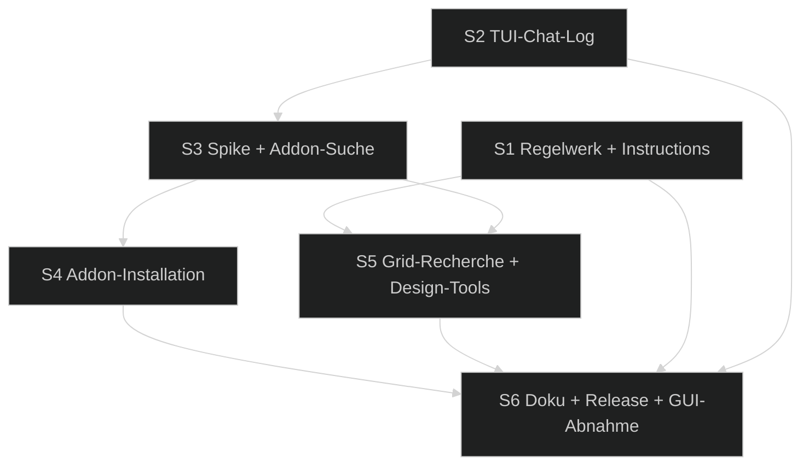

# 📋 Umsetzungsplan — FreeCAD Buddy: Design-Regelwerk, Design-Tools & Addon-Suche

> Erstellt: 2026-09-28 │ Letzte Aktualisierung: 2026-09-29 │ Status: ✅ Erledigt (2026-09-29) – Spec-Stand 6 freigegeben

## Spezifikation

> Spec-Stand: 6 │ Spec-Status: Freigegeben │ Freigabe: Stand 1 durch Ralf im Chat, 2026-09-28, inklusive der Annahmen OF-01 bis OF-08 als Entscheidungen; Stand 2 (R-12, AC-16) durch Ralfs Auftrag im Chat, 2026-09-28 („gleich in Regelwerk einbauen“); Stand 3 (R-13, AC-17) durch Ralfs Auftrag im Chat, 2026-09-28 („keinen deutschen Text mehr im MCP-Server“); Stand 4 (R-07 geändert) durch Ralfs Auftrag im Chat, 2026-09-28 („--allow-addon-install als default setzen“); Stand 5 (R-10, AC-12 geändert) durch Ralfs Auftrag im Chat, 2026-09-28 („wir erhöhen die Toolgrenze auf 100“); Stand 6 (R-09, AC-11, OF-10) durch Ralfs Auftrag im Chat, 2026-09-29 („ein Tool generell für Fills, ob das Loch oder Hex ist, soll dann ein Parameter entscheiden“)
>
> **Delta Stand 6 (2026-09-29):** `hole_grid` wird zum allgemeinen Fill-Tool `fill_pattern`. Der Parameter `cell` (`round` | `hex`) bestimmt die Zellform, `size` ersetzt `diameter` (bei `hex` ist das die Schlüsselweite, die Zellen stehen auf der Ecke). Standard-Layout ist `hex` für Sechseck-Zellen und `rect` für runde Zellen. Umgesetzt ist das Tool nativ und performant mit einem MultiTransform. Ein Addon-Backend gibt es nicht (OF-10, entschieden: kein Addon). Änderung an R-09 und AC-11. `hole_grid` war noch nicht veröffentlicht, deshalb gibt es keinen Alias.
>
> **Delta Stand 5 (2026-09-28):** Tool-Budget von ≤ 40 auf ≤ 100 öffentliche Tools angehoben. Tools werden nur zusammengelegt, wenn es nötig ist oder wirklich Sinn ergibt – kein Zusammenlegen, nur um das Budget zu halten. Änderung an R-10 und AC-12.
>
> **Delta Stand 4 (2026-09-28):** Der Server bietet `install_addon` standardmäßig an (abschaltbar mit `--no-allow-addon-install` oder `FREECAD_BUDDY_ALLOW_ADDON_INSTALL=0`). Die Freischaltung in FreeCAD und der Bestätigungsdialog jeder Installation bleiben Pflicht, eine Headless-Bridge bietet die Installation nie an. Die FreeCAD-Schalter (Autostart, Python, Addon-Installation) sind je zwei Buttons wie „Bridge starten/stoppen“. Neu: Änderung an R-07, AC-08 unverändert.
>
> **Delta Stand 3 (2026-09-28):** Alle Ausgaben des MCP-Servers sind neutral auf Englisch, das umfasst Tool-Beschreibungen, Ergebnisse, Fehler, Hinweise, Regelwerk, Instructions und Prompts. Neuer Code gilt ab sofort, der Bestand wird am Sprint-Schluss umgestellt (#5.4). Doku, TODOs und Chat bleiben deutsch. Neu: R-13, AC-17, #5.4.
>
> **Delta Stand 2 (2026-09-28):** Ansichtsregel. Das Bauteil soll immer komplett sichtbar und leicht isometrisch dargestellt werden, als erster und letzter Schritt. Neu: R-12, AC-16, Aufgabe #1.6 und das Tool `set_view`. Der übrige Umfang bleibt unverändert.

Quelle: Chat-Auftrag von Ralf vom 2026-09-28, festgehalten in den Backlog-Tickets [`design-regelwerk.md`](../../1-backlog/freecad-buddy/design-regelwerk.md), [`addon-manager-integration.md`](../../1-backlog/freecad-buddy/addon-manager-integration.md), [`grid-loesung-recherche.md`](../../1-backlog/freecad-buddy/grid-loesung-recherche.md), [`tui-chat-log.md`](../../1-backlog/freecad-buddy/tui-chat-log.md) und [`gui-abnahme.md`](../../1-backlog/freecad-buddy/gui-abnahme.md). Die Kriterien des letzten Tickets werden unverändert übernommen und als `GA-AC-01` … `GA-AC-08` referenziert. Vorgänger-Sprint: [`2026-09-freecad-buddy-aufbau`](../../3-sprints-erledigt/2026-09-freecad-buddy-aufbau/00-index.md).

## Ausgangslage

Backlog-Quelle: die fünf oben genannten Tickets.
Branch: `main`. Die Umsetzung aus dem Vorgänger-Sprint seit `6c05a50` ist noch nicht committet; das sollte vor S1 passieren.

- Die Instructions umfassen sechs Kurzregeln in `src/buddy_server/prompts.py`, dazu kommen die Prompts `design_part` und `human_modeling_guide`. Ein Regelwerk nach Themen fehlt. Konkrete FDM-Werte stehen nur verstreut in `buddy_core/printing`.
- Komplexe Wiederholungsaufgaben baut der Agent ad hoc nach. Beispiel Sieb: Das Muster auf ein Muster ist in PartDesign gescheitert, die Lösung kam erst nachträglich als `pattern kind="grid"`.
- Das Tool-Log der TUI zeigt pro Aufruf nur eine Zeile mit Kurzfassung. `ToolFinished` enthält weder Argumente noch Antwort, deshalb lässt sich nicht nachvollziehen, was der Agent angefragt und was er zurückbekommen hat.
- FreeCAD 26.3 enthält den Addon Manager 2026.8.18 mit zentralem Katalog (`addons.freecad.org/addon_catalog_cache.zip` samt `.sha256`, `macro_cache.zip`), lokalem Cache `<UserCache>/AddonManager2026-1` sowie `AddonInstaller` und `MacroInstaller` (beide QObject). Einen Buddy-Zugang dazu gibt es nicht.
- **Risiken:**
  - Clients könnten lange Instructions kürzen (vermutet, ungeprüft).
  - Die Programmier-API des Addon Managers ist intern und kann sich zwischen Weekly-Builds ändern.
  - Eine Installation dauert länger als die Bridge-Timeouts (30/60/120 s).
  - Addons sind fremder Code, der im FreeCAD-Prozess läuft.

## Ziel

Der Agent konstruiert nach einem abrufbaren, thematisch gegliederten Design-Regelwerk. Wiederkehrende komplexe Aufgaben löst er über Design-Tools, sonst schlägt er ein neues vor. Außerdem findet er fertige Lösungen im FreeCAD-Addon-Katalog und kann sie nach deiner Bestätigung in FreeCAD installieren. Das erste Design-Tool ist `fill_pattern`, abgeleitet aus der Grid-Recherche. In der TUI ist jeder Tool-Aufruf als farbiger Chat-Verlauf aus Anfrage und Antwort nachvollziehbar.

## Beteiligte und Zielgruppen

- **Ralf:** Auftraggeber. Er bestätigt Installationen im FreeCAD-Dialog und nimmt die GUI-Prüfungen ab.
- **MCP-Client-Agent (Claude Code):** liest Instructions und Regelwerk und nutzt die neuen Tools.
- **Implementierender Agent:** setzt die Sessions um.

## Anforderungen

| ID | Anforderung |
|---|---|
| R-01 | **Eine Quelle:** Das Regelwerk liegt an genau einer Stelle im Server. Instructions, `get_design_rules`, die MCP-Resource und der Prompt `human_modeling_guide` werden daraus erzeugt. |
| R-02 | **Kompakte Instructions:** nur Kernregeln, Design-Tool-Regel und der Hinweis auf `get_design_rules`, innerhalb eines Längenbudgets (OF-01). |
| R-03 | **Themen des Regelwerks:** Grundsätze und Workflow, Parameter, Skizzen, Referenzen/TNP, Features, Benennung, 3D-Druck (FDM), Design-Tools, Addons. Jede Regel ist kurz und umsetzbar. FDM-Zahlen kommen aus dem aktiven Druckerprofil. |
| R-04 | **Design-Tool-Regel:** Eine Aufgabe gilt als wiederkehrend-komplex, wenn sie im Projekt mindestens zum zweiten Mal vorkommt oder ≥ 5 Tool-Aufrufe braucht. Dann prüft der Agent in dieser Reihenfolge: vorhandenes Design-Tool → fertiges Addon (`search_addons`) → `propose_design_tool`. Eine Einmallösung aus Einzelschritten ist erlaubt, der Vorschlag trotzdem Pflicht. |
| R-05 | **Vorschlagsliste:** `propose_design_tool` speichert Vorschläge dauerhaft. Gleichnamige Vorschläge werden zusammengeführt und gezählt. Die TUI zeigt neue Vorschläge an. Umgesetzt wird ein Vorschlag als Buddy-Tool im Code, nicht zur Laufzeit. |
| R-06 | **Addon-Suche:** `search_addons` und `get_addon` durchsuchen Workbenches, Makros und Preference Packs aus dem offiziellen Katalog. Sie zeigen Kompatibilität mit dem laufenden FreeCAD, Installationsstatus, Lizenz und Quelle. Der Cache wird mit FreeCADs Addon Manager geteilt. |
| R-07 | **Addon-Installation:** `install_addon` ist nur verfügbar, wenn sowohl der Server (standardmäßig an, abschaltbar mit `--no-allow-addon-install` bzw. Env `=0`) als auch FreeCAD (Einstellung, Workbench-Button „Addon-Installation erlauben“) freigeschaltet sind. Jede Installation braucht deine Bestätigung in einem modalen FreeCAD-Dialog mit Name, Quelle, Lizenz, Abhängigkeiten und Standardknopf „Abbrechen“. Installiert wird über FreeCADs Installer, sodass der Addon Manager das Addon danach als installiert führt. |
| R-08 | **Lange Laufzeit:** Die Installation blockiert weder die GUI noch läuft sie in Bridge-Timeouts. Der Agent erhält Fortschritt bzw. Endergebnis, auch den nötigen FreeCAD-Neustart. |
| R-09 | **`fill_pattern` (Stand 6):** Allgemeines Fill-Tool, `cell` wählt runde Löcher oder Sechseck-Zellen. Ein Aufruf erzeugt Parameter im VarSet, eine vollständig bestimmte Skizze mit Startzelle, ein Pocket und ein Raster. Layout `rect`, `hex` laut OF-05. Eingaben: Feldgröße oder Anzahl, Lochdurchmesser, Raster, Randabstand, Tiefe bzw. durchgehend. Das Ergebnis ist ein Undo-Schritt und bleibt über Parameter änderbar. |
| R-11 | **Chat-Log in der TUI:** Jeder Tool-Aufruf erscheint als Paar aus Anfrage-Blase (Tool, Argumente als formatiertes JSON, MCP-Session) und Antwort-Blase (Ergebnis bzw. Fehler mit Code und Hinweis, Warnungen, Dauer). Farben unterscheiden Anfrage, Erfolg, Warnung und Fehler. Die Anfrage erscheint schon beim Start, die Antwort ergänzt sie danach, laufende Aufrufe sind sichtbar. Lange Inhalte sind gekürzt und in einer Detailansicht vollständig lesbar. Binärdaten wie Screenshots erscheinen als Platzhalter mit Größe. Geheimnisse (Tokens, Authorization) erscheinen nie. Die Oberfläche bleibt bei 1 000 Einträgen und großen Antworten flüssig. Optional wird als JSONL-Datei mitgeschrieben (OF-07). |
| R-12 | **Ansichtsregel (Stand 2):** Nach dem ersten Basis-Feature eines Bodys (erstes `pad` bzw. additives `revolve`) setzt FreeCAD Buddy die Ansicht selbst auf iso mit `fit`, damit Ralf den Aufbau live verfolgen kann (Präzisierung Ralf, 2026-09-28: „sobald das Basis Body gesetzt ist“). Als letzten Schritt verlangt das Regelwerk `set_view`. In beiden Fällen ist das Bauteil komplett sichtbar und leicht isometrisch. Das Tool `set_view` setzt die Live-Ansicht in FreeCAD dauerhaft (iso, dimetric, trimetric, Normalansichten; `fit` passt alles ein). Ohne GUI kommt `unsupported`. |
| R-13 | **Englische Ausgaben (Stand 3):** Alles, was der MCP-Server an Clients liefert, ist neutral auf Englisch: Instructions, Regelwerk, Prompts, Tool- und Parameterbeschreibungen, Ergebnisse, Warnungen, Hinweise und Fehlermeldungen, auch die aus Core und Bridge. Doku, TODOs, Code-Kommentare in Deutsch und der Chat mit Ralf bleiben deutsch. Offen (OF-09): FreeCAD-Oberfläche (Workbench-Befehle, Bestätigungsdialog, Konsole) und TUI. |
| R-10 | **Budget und Doku (Stand 5):** höchstens 100 öffentliche Tools; Tools nur zusammenlegen, wenn es nötig ist oder wirklich Sinn ergibt. `docs/tools.md` kennzeichnet Design-Tools als eigene Kategorie. |

## Nicht-Ziele

- Agenten, die zur Laufzeit selbst Design-Tools als Skripte anlegen. Das ist verworfen, weil es Code-Ausführung wie `execute_python` braucht.
- Deinstallieren oder Aktualisieren von Addons über MCP. Das bleibt im Addon Manager.
- Installation von Python-Abhängigkeiten eines Addons per pip (OF-03).
- Eigene Addon-Quellen bzw. Custom Repositories.
- Weitere Design-Tools außer `fill_pattern`. Weitere kommen über die Vorschlagsliste in spätere Sprints.

## Regeln und Einschränkungen

- Bestehende Verträge bleiben: JSON-RPC-Protokoll, Undo-Schritt pro Tool, Sicherheitsmodell von `execute_python` und Tool-Namen aus 0.1.0.
- Tests laufen ohne Netz, mit lokalem Fake-Katalog und Fixture-Addon. Live-Zugriffe auf `addons.freecad.org` in einer Session nur mit Ralfs Zustimmung. Echte Installationen macht nur Ralf in der GUI (G9).
- Die interne Addon-Manager-API wird in einem einzigen Adapter-Modul gekapselt, mit Kompatibilitätstest gegen den laufenden Build wie `tests/core/test_compat.py`.
- Der Bestätigungsdialog läuft im Qt-Hauptthread. Kann FreeCAD headless keinen Dialog zeigen, wird die Installation mit `unsupported` abgelehnt.

## Beispiele

- `get_design_rules()` → Themenliste mit Einzeilern. `get_design_rules("printing")` → FDM-Regeln mit den Zahlen des aktiven Profils, z. B. Mindestwand 0,8 mm bei Düse 0,4.
- Der Agent soll ein Sieb bauen und findet `fill_pattern` → ein Aufruf statt fünf.
- Der Agent soll zum zweiten Mal einen Schraubendom bauen und findet kein Tool → `search_addons("screw boss")` → kein Treffer → `propose_design_tool("screw_boss", …)` → Eintrag in der TUI.
- Der Agent ruft `pad(sketch="Sketch_Plate", length="Plate_Thickness")` auf → in der TUI eine blaue Anfrage-Blase mit den Argumenten, darunter eine grüne Antwort-Blase mit `created: Pad_Plate` und 180 ms. Bei Fehler rot mit `[recompute_failed]` und Hinweis. Enter auf einem Eintrag öffnet das vollständige JSON.
- `search_addons("grid")` → Trefferliste mit Kompatibilität und Installationsstatus. `install_addon("Lattice2")` → Dialog in FreeCAD → du bestätigst → „installiert, FreeCAD-Neustart nötig“.

## Ausnahme- und Fehlerfälle

| Situation | Erwartetes Verhalten |
|---|---|
| Unbekanntes Regelwerk-Thema | `validation` mit Liste gültiger Themen |
| Katalog nicht erreichbar, lokaler Cache vorhanden | Suche auf dem Cache, Warnung mit Cache-Alter |
| Katalog nicht erreichbar, kein Cache | `bridge_unavailable`-artiger, verständlicher Fehler mit Hinweis auf Netz oder Proxy |
| Prüfsumme des Katalogs passt nicht | Katalog verwerfen, Fehler, kein Teil-Update |
| `install_addon` ohne beide Opt-ins | Tool nicht registriert bzw. `unauthorized` |
| Dialog abgelehnt oder geschlossen | `user_declined`, nichts verändert |
| Addon bereits installiert, inkompatibel oder mit Python-Abhängigkeiten | Ablehnung mit Grund und Hinweis auf den Addon Manager |
| Abbruch oder Netzfehler während der Installation | kein halb installiertes Addon (Aufräumen), Fehler mit Grund |
| `fill_pattern` passt nicht ins Feld oder Loch ≥ Raster | `validation` mit Rechnung und Vorschlag |
| Antwort sehr groß (z. B. Modellbaum mit 900 Features) oder Bild | Blase gekürzt mit „… (+N Zeilen)“ bzw. `[PNG 240 KB]`, vollständig in der Detailansicht (Bilder nur als Metadaten) |
| Argument oder Antwort enthält Token-ähnliche Werte | maskiert (`***`), auch in Detailansicht und JSONL |
| Aufruf läuft noch, wenn die TUI beendet wird | Eintrag mit Status „abgebrochen“ |
| Vorschlag mit bestehendem Namen | Zähler erhöhen, Beschreibung ergänzen, kein Duplikat |

## Akzeptanzkriterien

- [x] AC-01: Die Server-Instructions liegen innerhalb des Budgets (OF-01). Sie enthalten die Kernregeln, die Design-Tool-Regel (R-04) und den Verweis auf `get_design_rules` und erscheinen in Claude Code als Server-Instructions.
- [x] AC-02: `get_design_rules()` liefert die Themenliste, `get_design_rules(topic)` den Themeninhalt, ein unbekanntes Thema ergibt `validation` mit gültigen Themen. Dieselben Inhalte gibt es als MCP-Resource `buddy://design-rules/{topic}`. Der Prompt `human_modeling_guide` stammt aus derselben Quelle.
- [x] AC-03: Das Regelwerk deckt alle Themen aus R-03 ab. Jedes darin genannte Tool existiert (Test). FDM-Zahlen ändern sich mit dem Druckerprofil (Test mit Düse 0,6).
- [x] AC-04: Die Design-Tool-Regel ist mit Kriterium und Reihenfolge (R-04) in Instructions und Thema `design_tools` formuliert. `design_part` verweist darauf.
- [x] AC-05: `propose_design_tool` legt Vorschläge dauerhaft ab, führt gleichnamige zusammen (Zähler) und meldet sie in der TUI. Die Liste ist über ein Tool abrufbar.
- [x] AC-06: `search_addons(query, kind)` liefert gerankte Treffer mit Id, Name, Art, Kurzbeschreibung, Kompatibilität mit dem laufenden FreeCAD, Installationsstatus und Quelle. Ohne Netz, aber mit Cache gibt es Treffer plus Warnung. Ohne Netz und ohne Cache kommt ein verständlicher Fehler. Eine falsche Prüfsumme wird erkannt.
- [x] AC-07: `get_addon(id)` liefert Lizenz, Maintainer, Repository, letzte Aktualisierung, Abhängigkeiten (FreeCAD, Addons, Python) und einen README-Auszug.
- [x] AC-08: Ohne beide Opt-ins ist `install_addon` nicht nutzbar. Mit Opt-ins erscheint der Dialog. Bei Ablehnung kommt `user_declined` und nichts ändert sich. Bei Zustimmung wird über FreeCADs Installer installiert, das Addon gilt im Addon Manager als installiert und das Ergebnis nennt den Neustart. Weder GUI noch Bridge laufen in einen Timeout (R-08). Nachweis headless mit Fixture-Addon und simulierter Bestätigung, GUI über G9.
- [x] AC-09: Bereits installierte, inkompatible oder Addons mit Python-Abhängigkeiten werden mit Grund abgelehnt. Nach einem Installationsabbruch bleibt kein Rest im Mod-Verzeichnis.
- [x] AC-10: Die Grid-Recherche ist in `TODOs/5-konzepte/grid-loesungen.md` dokumentiert. Die Kandidaten kommen aus `search_addons` (mindestens die Begriffe grid, array, lattice, pattern, perforation, sieve) und sind bewertet nach PartDesign-Tauglichkeit, Parametrik, Lizenz, Pflege und Kompatibilität mit 26.3. Am Ende steht eine Empfehlung.
- [x] AC-11: `fill_pattern` erfüllt R-09 für `rect`. Das Sieb der Testplatte (34 × 27 Löcher Ø 1 mm, Raster 3 mm) lässt sich mit einem Aufruf erzeugen. Eine Parameteränderung (z. B. Raster 4 mm) aktualisiert das Modell. `hex` gemäß OF-05.
- [x] AC-12: Höchstens 100 öffentliche Tools (Stand 5). `docs/tools.md` ist erneuert, mit Kategorie Design-Tools. `uv run poe check` ist grün, alle neuen Tests laufen ohne Netz.
- [x] AC-14: Pro Tool-Aufruf zeigt die TUI eine Anfrage-Blase (Tool, Argumente, Session) sofort beim Start und eine Antwort-Blase (Ergebnis oder Fehler mit Code und Hinweis, Warnungen, Dauer) nach Abschluss, farblich nach Anfrage, Erfolg, Warnung und Fehler unterschieden. Nachweis per Textual-Pilot-Test mit Snapshot.
- [x] AC-15: Lange Inhalte werden gekürzt und sind per Detailansicht vollständig abrufbar. Bilder erscheinen als Platzhalter. Tokens sind maskiert (Test mit präpariertem Argument). Nach 10 000 simulierten Aufrufen mit je 50 KB Antwort bleibt die TUI bedienbar, höchstens 1 000 Einträge. Das optionale JSONL-Log (OF-07) enthält dieselben, ebenfalls maskierten Daten.
- [x] AC-16 (Stand 2): Die Ansichtsregel ist eine Kernregel der Instructions und steht direkt nach „get_model_tree lesen“. `set_view` ist registriert und setzt die Live-Ansicht, ohne GUI liefert es `unsupported`. Das erste Basis-Feature setzt die Ansicht automatisch (G12).
- [x] AC-17 (Stand 3): Keine deutschsprachigen Texte mehr in MCP-Ausgaben. Ein Test prüft Instructions, Regelwerk, Prompts, Tool-Schemas und typische Ergebnisse bzw. Fehler auf deutsche Wörter und Umlaute.
- [x] AC-13: Übernommene GUI-Abnahme `GA-AC-01` … `GA-AC-08` (G1–G8) sowie neu G9 (Installationsdialog mit Ablehnung und Zustimmung an einem echten Addon) G10 (`fill_pattern` in der GUI weiterbearbeitbar) G11 (Chat-Log in der TUI verständlich) und G12 (Ansicht nach `set_view` komplett und isometrisch) sind abgenommen oder per Scope-Entscheidung verschoben.

## Offene Fragen

| ID | Frage | Betroffen | Annahme bis Klärung | Verantwortlich |
|---|---|---|---|---|
| OF-01 | Längenbudget der Instructions: Wie viel übernimmt Claude Code? | #1.1, AC-01 | ≤ 2 000 Zeichen; wird in #1.1 an aktueller Doku geprüft | Agent (Recherche) |
| OF-02 | Wo läuft die Katalogsuche: in FreeCAD über die Addon-Manager-Module oder im Server? | #2.1, #2.2 | ✅ Entschieden nach Spike #2.1 (2026-09-28), abweichend von der Annahme: **Suche und Details im Server** (eigener Cache mit SHA-256-Prüfung, asynchroner Download, blockiert die GUI nie, funktioniert offline); **Status und Installation in der Bridge** (`Mod/`, Makro-Ordner, AM-Installer). Grund: Der AM lädt offline seinen lokalen Cache nicht (Bug), schreibt beim Abruf seine Hash-Preference und blockiert den Hauptthread bis zu ~100 s | Agent (Spike), zur Kenntnis an Ralf |
| OF-03 | Addons mit Python-Abhängigkeiten | #2.4, AC-09 | ✅ Entschieden: Ablehnen mit Hinweis auf den Addon Manager (keine pip-Installation über MCP) | Ralf |
| OF-04 | Makros und Preference Packs installierbar oder nur suchbar? | #2.4 | ✅ Entschieden: Suchen: alle Arten. Installieren: Workbenches und Makros mit demselben Dialog, Preference Packs nur suchen | Ralf |
| OF-05 | `fill_pattern` mit Layout `hex` (versetzte Reihen) im Umfang? | #3.3, AC-11 | ✅ Entschieden: Ja, als zweites Raster mit halbem Versatz (vermutet machbar mit zwei MultiTransforms, ungeprüft); scheitert der Spike, nur `rect` plus Vorschlag | Ralf |
| OF-07 | Chat-Log zusätzlich als JSONL-Datei mitschreiben? | #4.3, AC-15 | ✅ Entschieden: Ja, per `--log-file <pfad>` (Standard aus), rotierend ab 10 MB | Ralf |
| OF-08 | Nur Chat-Ansicht oder umschaltbar auf die bisherige Einzeilen-Liste? | #4.2 | ✅ Entschieden: Umschaltbar per Taste `v`, Standard Chat | Ralf |
| OF-09 | Gilt „Englisch“ auch für FreeCAD-Oberfläche (Workbench-Befehle, Bestätigungsdialog, Konsole) und TUI? | #5.4 | ✅ Entschieden (Ralf, 2026-09-29): Nein, nur MCP-Ausgaben. Workbench, Bestätigungsdialog, FreeCAD-Konsole, TUI und Headless-Log bleiben deutsch; im Code per Datei-Ausnahme oder Marker `# ui-de` | Ralf |
| OF-10 | Soll `fill_pattern` ein fertiges Addon (HexFill) als Backend nutzen? | #3.3, AC-11 | ✅ Entschieden (Ralf, 2026-09-29): Nein, kein Addon. `fill_pattern` bleibt rein nativ, HexFill wird weder angesteuert noch empfohlen | Ralf |
| OF-06 | Versionsnummer | #5.2 | ✅ Entschieden: 0.2.0 | Ralf |

## Umsetzung und Nachweis

| Kriterium / Quelle | Beobachtbares Ergebnis oder Verweis | Umsetzung / Phase | Prüfebene | Nachweis / Status |
|---|---|---|---|---|
| AC-01 | kompakte Instructions im Budget | #1.1, #1.3 / P1 | Unit-Test (Länge, Pflichtinhalte) + Sichtung in Claude Code | **erfüllt** (Budget per `test_design_rules.py`; Sichtung in Claude Code am 2026-09-29: englische Instructions kommen an) |
| AC-02 | Regelwerk per Tool, Resource, Prompt | #1.2, #1.4 / P1 | E2E über MCP (Headless) | **erfüllt** (`test_tool_resource_and_prompt_over_mcp`) |
| AC-03 | Themenabdeckung, Tool-Konsistenz, Profilwerte | #1.2, #1.5 / P1 | Unit-Tests | **erfüllt** (`test_rules_only_name_registered_tools`, `test_printing_numbers_follow_the_profile`, `test_every_topic_of_r03_is_covered`) |
| AC-04 | Design-Tool-Regel formuliert | #1.3, #3.1 / P1, P3 | Unit-Test (Pflichtinhalte) | **erfüllt** (`test_instructions_are_compact_and_complete`, `test_design_tool_rule_names_the_tool_steps_and_design_part_points_to_it`: Kriterium, Reihenfolge `fill_pattern` → `search_addons` → `propose_design_tool`, Verweis in `design_part`) |
| AC-05 | Vorschlagsliste mit Zusammenführung und TUI | #3.2 / P3 | Unit- + Textual-Pilot-Test | **erfüllt** (`test_proposals_with_the_same_name_are_merged_and_counted`, E2E `test_fill_pattern_and_proposals_over_mcp` mit Event, `test_design_tool_proposal_appears_in_the_messages`) |
| AC-06 | Suche mit Cache, Offline- und Prüfsummenfall | #2.1, #2.2 / P2 | Headless-Core-Test mit Fake-Katalog | **erfüllt** (`test_addon_service.py`: Download, Cache, offline mit/ohne Cache, falsche Prüfsumme; `test_addon_catalog.py`: Ranking; E2E `test_search_and_details_over_mcp`) |
| AC-07 | Addon-Details | #2.3 / P2 | Headless-Core-Test | **erfüllt** (`get_addon` mit Lizenz, Maintainer, Repository, Aktualisierung, Abhängigkeiten, Kompatibilität, Status und bereinigtem README-Auszug; E2E) |
| AC-08 | Installation mit doppeltem Opt-in und Dialog | #2.4, #2.5 / P2 | Headless-Test mit Fixture-Addon und simulierter Bestätigung + G9 | **automatisiert erfüllt** (`test_addons_install.py`: Dialog, Ablehnung, Installation, Doppelstart; `test_addon_install_tool.py`: Server-Opt-in, doppeltes Opt-in gegen Headless-Bridge); G9 von Ralf abgenommen, 2026-09-29 |
| AC-09 | Ablehnungsgründe, Aufräumen | #2.4, #2.5 / P2 | Headless-Core-Test | **erfüllt** (Vorprüfungen installiert/inkompatibel/Python-Pakete/Addon-Abhängigkeiten/git; kein Rest nach Fehler oder Ausnahme) |
| AC-10 | Grid-Recherche dokumentiert | #3.1 / P3 | Dokument, Live-Suche nur mit Ralfs Zustimmung | **erfüllt** ([`grid-loesungen.md`](../../5-konzepte/grid-loesungen.md), auf dem Cache aus S3, ohne neuen Live-Zugriff) |
| AC-11 | `fill_pattern` | #3.3 / P3 | Headless-Core-Test + E2E Testplatte + G10 | **automatisiert erfüllt** (`test_design_tools.py`: Sieb 34 × 27 Ø 1 Raster 3 mit einem Aufruf und einem Undo-Schritt, Raster 4, Feldmodus, `hex`, Validierung; E2E über MCP); G10 abgenommen (Agent und Ralf, 2026-09-29) |
| AC-14 | Chat-Blasen für Anfrage und Antwort | #4.1, #4.2 / P4 | Textual-Pilot- und Snapshot-Test | **erfüllt** (`test_request_and_response_bubbles_with_state_colors`; Pilot-Test mit Widget-Assertions statt Snapshot-Plugin); G11 von Ralf abgenommen, 2026-09-29 |
| AC-15 | Kürzung, Detailansicht, Maskierung, Last, JSONL | #4.1–#4.3 / P4 | Unit- + Pilot-Lasttest | **erfüllt** (`test_payloads.py`, `test_tool_chat_is_capped_under_load_and_stays_usable`, `test_enter_opens_full_detail_and_escape_closes`) |
| AC-12 | Tool-Budget, Doku, Gesamtcheck | #5.1, #5.2 / P5 | `uv run poe check` | **erfüllt** für den Sprint-Stand (51 ≤ 100 Tools, Doku aktuell, `poe check` grün bis Commit `451f715`); Gesamtcheck nach Abschluss paralleler Arbeiten im Checkout erneut |
| AC-16 | Ansichtsregel und `set_view` | #1.6 / P1 | Unit-Test (Instructions) + Bridge-Test headless + G12 | **erfüllt** automatisiert (`test_view_rule_is_first_core_rule_after_reading_the_tree`, `test_set_view_without_gui_is_unsupported`); G12 agentenseitig abgenommen, 2026-09-29 |
| AC-17 | MCP-Ausgaben englisch | #5.4 / P5 | Unit-Test (Sprachprüfung) | **erfüllt** (`test_language.py`: Instructions, Regelwerk, Prompts, Resources und Tool-Schemas dynamisch; alle Meldungstexte in Server, Core und Bridge statisch; UI-Texte nach OF-09 ausgenommen) |
| AC-13 / GA-AC-01 … 08 | GUI-Abnahme G1–G12 | #5.3 / P5 | Nutzerabnahme | **erfüllt bzw. verschoben**: G1, G3, G4, G5, G7/G11, G9, G10, G12 abgenommen (Agent und Ralf, 2026-09-29); G2, G6, G8 nicht getestet → Scope-Entscheidung, Folgeticket [`gui-abnahme.md`](../../1-backlog/freecad-buddy/gui-abnahme.md) |

Umsetzung erst für den freigegebenen Spec-Stand. Spec-Freigabe ersetzt keine Browser-/manuelle Abnahmefreigabe.

## Entscheidungen

| Datum | Entscheidung | Begründung | Architektur-Impact |
|---|---|---|---|
| 2026-09-28 | Regelwerk kompakt in Instructions, vollständig über `get_design_rules` und MCP-Resource, aus einer Quelle (Ralf) | Clients könnten kürzen (vermutet); weniger Kontext pro Session | server |
| 2026-09-28 | Addon-Installation nur mit doppeltem Opt-in und Bestätigungsdialog in FreeCAD, über FreeCADs Installer (Ralf) | Addons sind fremder Code im FreeCAD-Prozess; der Addon Manager bleibt konsistent | mehrere |
| 2026-09-28 | Server-Opt-in für `install_addon` standardmäßig an; FreeCAD-Schalter als Button-Paare (Ralf) | Eine Freischaltung weniger im Alltag; FreeCAD-Opt-in und Dialog bleiben die eigentliche Sperre | server, bridge |
| 2026-09-28 | Design-Tool-Regel mit Vorschlagsliste; Design-Tools entstehen als Buddy-Tools im Code, nicht zur Laufzeit (Ralf) | Laufzeit-Skripte bräuchten Code-Ausführung; Code-Tools sind testbar | server, core |
| 2026-09-28 | Tool-Log wird zur farbigen Chat-Ansicht mit Anfrage und Antwort (Ralf) | Nachvollziehbarkeit der Agentenarbeit | server |
| 2026-09-28 | Ansichtsregel: erster und letzter Schritt `set_view` iso, alles sichtbar (Ralf, Spec-Stand 2) | Der Nutzer sieht immer das ganze Bauteil | core, server |
| 2026-09-28 | MCP-Ausgaben neutral auf Englisch, Doku bleibt deutsch (Ralf, Spec-Stand 3) | Neutral für beliebige Clients und LLMs | server, core |
| 2026-09-29 | `hole_grid` wird zu `fill_pattern` mit `cell` round/hex, nativ über MultiTransform (Ralf, Spec-Stand 6) | Ein Tool für alle Fills; eigene Umsetzung ist parametrisch, portabel und per MCP steuerbar, kein Addon bietet eine API | core, server |
| 2026-09-28 | GUI-Abnahme G1–G8 aus dem Vorgänger-Sprint wird als Phase 5 mitgeführt (Ralf) | Abnahme zusammen mit neuen GUI-Prüfungen G9/G10 | keiner |

## Gesamtfortschritt

[██████████] 100% — 21 von 21 Aufgaben erledigt

## ⚠️ Blocker

*Keine Blocker.*

**Tool-Budget (R-10, Stand 5):** 51 öffentliche Tools (nach S5 und der parallelen Arbeit an Zahnrädern, Normteilen und Slicer) (inkl. `install_addon`, ohne `execute_python`), Grenze 100. Das Risiko aus S4 ist mit Spec-Stand 5 erledigt.

## Phasen-Übersicht

| Phase | Datei | Architektur-Relevanz | Offen | Erledigt | Fortschritt |
|---|---|---|---|---|---|
| 1 — Design-Regelwerk & Instructions | [01-design-regelwerk.md](01-design-regelwerk.md) | `server` | 0 | 6 | [██████████] 100% |
| 2 — Addon-Manager-Integration | [02-addon-manager.md](02-addon-manager.md) | `mehrere` | 0 | 5 | [██████████] 100% |
| 3 — Grid-Recherche & Design-Tools | [03-design-tools.md](03-design-tools.md) | `core`, `server` | 0 | 3 | [██████████] 100% |
| 4 — TUI-Chat-Log | [04-tui-chat-log.md](04-tui-chat-log.md) | `server` | 0 | 3 | [██████████] 100% |
| 5 — Doku, Release & GUI-Abnahme | [05-abschluss-abnahme.md](05-abschluss-abnahme.md) | `keine` | 0 | 4 | [██████████] 100% |

## 📅 Session-Übersicht

| Session | Phase | Ziel | Status |
|---|---|---|---|
| S1 | Phase 1 | Regelwerk-Quelle, kompakte Instructions, `get_design_rules`, Resource | ✅ Erledigt (2026-09-28) |
| S2 | Phase 4 | TUI-Chat-Log: Events mit Payload, Chat-Blasen, Detailansicht, JSONL | ✅ Erledigt (2026-09-28) |
| S3 | Phase 2 | Spike Addon-Manager-API, Adapter, Katalogsuche und Details | ✅ Erledigt (2026-09-28) |
| S4 | Phase 2 | Installation mit Opt-in, Dialog, Job-Muster, Aufräumen | ✅ Erledigt (2026-09-28) |
| S5 | Phase 3 | Grid-Recherche, `propose_design_tool`, `fill_pattern` | ✅ Erledigt (2026-09-29) |
| S6 | Phase 5 | Englische MCP-Ausgaben, Doku, Release 0.2.0, GUI-Abnahme G1–G12 | ✅ Erledigt (2026-09-29) |

## 🔗 Dependency-Übersicht

## Architektur-Update

→ [98-architecture-update.md](98-architecture-update.md)

Pflicht zum Sprint-Abschluss:

- Architektur-Deltas aus Phasen und Session-Log prüfen.
- Relevante Abschnitte in `docs/architecture.md` aktualisieren (Schichten, RPC-Vertrag, Tool-Katalog, Modellierungsregeln).
- Keine unnötigen Code-Samples übernehmen; Architektur als Modulgrenzen, Datenflüsse, Integrationspunkte, Regeln, Diagramme oder Tabellen dokumentieren.
- Wenn keine Architekturänderung nötig ist, Begründung im Architektur-Update und Session-Log festhalten.

## Abnahmeregel

GUI-, manuelle und Live-Netz-Prüfungen laufen nach der [Freigaberegel](../../README.md#browser--und-manuelle-abnahmeprüfungen). Vorher wird geklärt, was Ralf bereits geprüft hat und was der Agent übernehmen darf. Echte Addon-Installationen führt nur Ralf durch.

## Sprint-Abschluss / Definition of Done

- [x] Alle Akzeptanzkriterien geprüft oder bewusst in Folgeaufgaben verschoben.
- [x] Spec-Stand, Aufgaben und Kriteriennachweise stimmen überein; zurückgestellte Kriterien haben eine ausdrückliche Scope-Entscheidung und Folgeaufgabe.
- [x] Relevante Tests, Builds oder manuelle Prüfungen dokumentiert.
- [x] Browser- und manuelle Abnahmen gemäß [Freigaberegel](../../README.md#browser--und-manuelle-abnahmeprüfungen) dokumentiert; gültige Nutzer-/Agentennachweise übernommen, keine automatische Wiederholung zum Sprint-Abschluss.
- [x] Offene Blocker mit Besitzer und nächstem Schritt festgehalten (keine; Rest-Abnahme G2/G6/G8 im Ticket `gui-abnahme.md`, Besitzer Ralf).
- [x] `99-session-log.md` aktualisiert.
- [x] Jede erledigte Änderung ist im `99-session-log.md` als `feature`, `bugfix`, `doc`, `removal`, `misc` oder bewusst als `skip` erfasst.
- [x] `98-architecture-update.md` ausgewertet.
- [x] `docs/architecture.md` aktualisiert oder begründet als unverändert markiert.
- [x] Sprint nach `TODOs/3-sprints-erledigt/<YYYY-MM-sprint-name>/` verschoben, `master-todo.md` angepasst.
- [x] Release-Änderungen im `99-session-log.md` vollständig (eine Release-Queue ist derzeit nicht eingerichtet).

## 📓 Session-Log

→ [99-session-log.md](99-session-log.md)
