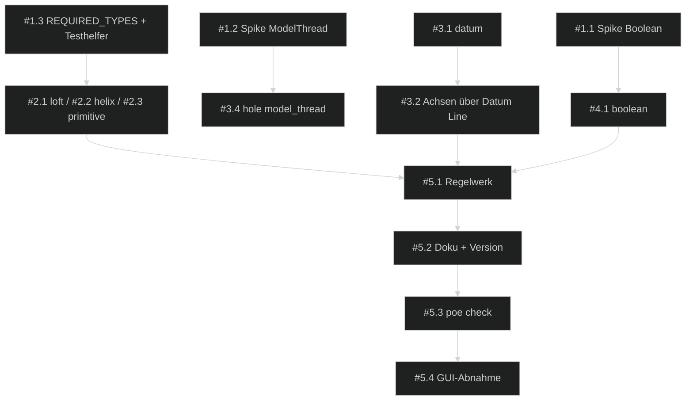

# 📋 Umsetzungsplan — FreeCAD Buddy: PartDesign-Vollständigkeit

> Erstellt: 2026-09-29 │ Letzte Aktualisierung: 2026-09-30 │ Status: ✅ Erledigt (2026-09-30) – Review-Gate bestanden, Abnahme durch Ralf

## Spezifikation

> Spec-Stand: 1 │ Spec-Status: Freigegeben │ Freigabe: Stand 1 durch Ralf im Chat, 2026-09-29 („starte sprint“ auf das Ticket), inklusive der Annahmen OF-01 bis OF-04 als Entscheidungen

Quelle: Backlog-Ticket [`partdesign-vollstaendigkeit.md`](../../1-backlog/freecad-buddy/partdesign-vollstaendigkeit.md), Spec-Stand 1. Die Rubriken Ausgangslage, Beteiligte, Anforderungen (A-01 bis A-10), Nicht-Ziele, Regeln und Einschränkungen, Beispiele, Ausnahme- und Fehlerfälle sowie die Kriterien AC-01 bis AC-11 gelten unverändert aus dem Ticket und werden hier nicht kopiert. Vorgänger-Sprint: [`2026-09-freecad-buddy-design-regelwerk`](../../3-sprints-erledigt/2026-09-freecad-buddy-design-regelwerk/00-index.md).

## Ausgangslage

Backlog-Quelle: [`partdesign-vollstaendigkeit.md`](../../1-backlog/freecad-buddy/partdesign-vollstaendigkeit.md).
Branch: `main`, Stand `4fd92f8`.

Siehe Ticket, Abschnitt Ausgangslage. Kurz: 51 Tools decken die skizzenbasierten Features ab; Loft, Helix allgemein, Primitive, Boolean, Draft und Datum Point/Line/LCS fehlen, dazu Taper in `pad`/`pocket` und ein modelliertes Innengewinde in `hole`.

**Risiken:**

- `PartDesign::Boolean` verschiebt die beteiligten Bodies vermutlich in seine Gruppe und kollidiert dann mit `get_model_tree` und der Regel „ein Body = ein Bauteil“ (OF-02, Spike #1.1).
- `ModelThread` ist im 26.3-Build eventuell anders benannt oder liefert ungültige Solids (OF-03, Spike #1.2).
- Primitive brauchen eine parametrische Lage ohne Solid-Flächen; `AttachmentOffset` mit Ausdrücken ist ungeprüft.

## Ziel

Jedes Standard-Werkzeug der PartDesign-Werkzeugleiste ist über ein Tool erreichbar, parametrisch und mit Headless-Core-Test belegt. Sechs neue Tools (`loft`, `helix`, `primitive`, `boolean`, `draft`, `datum`), Taper und `up_to_first` in `pad`/`pocket`, `model_thread` in `hole`. Tool-Budget 51 → 57.

## Beteiligte und Zielgruppen

Siehe Ticket. Ralf entscheidet und nimmt AC-11 ab, der implementierende Agent setzt die Sessions um.

## Anforderungen

Unverändert A-01 bis A-10 aus dem Ticket. Sprint-eigene Ergänzung:

| ID | Anforderung |
|---|---|
| S-01 | **Spikes zuerst:** OF-02 und OF-03 werden in S1 headless geklärt und im Index unter Entscheidungen festgehalten, bevor `boolean` und `model_thread` umgesetzt werden. |
| S-02 | **Reihenfolge nach Nutzen:** Loft, Helix, Primitive vor Datum und Bestandserweiterungen, Boolean und Draft zuletzt. |

## Nicht-Ziele

Unverändert aus dem Ticket.

## Regeln und Einschränkungen

Unverändert aus dem Ticket. Zusätzlich: Jede Session endet mit grünem `uv run poe check` vor dem Commit.

## Beispiele

Unverändert aus dem Ticket.

## Ausnahme- und Fehlerfälle

Unverändert aus dem Ticket.

## Akzeptanzkriterien

Unverändert AC-01 bis AC-11 aus dem Ticket; der Nachweis steht unten.

## Offene Fragen

| ID | Frage | Betroffen | Annahme bis Klärung | Verantwortlich |
|---|---|---|---|---|
| OF-01 | `draft` aufnehmen? | #4.2, AC-05 | ✅ Entschieden (Annahme, Ralf 2026-09-29): Ja, als letzte Aufgabe | Ralf |
| OF-02 | Verhalten von `PartDesign::Boolean` im Baum | #1.1, #4.1, AC-04 | ✅ Geklärt (Spike S1, 2026-09-29): `addObjects` verschiebt die beteiligten Bodies in die Boolean-Gruppe (nicht mehr Root-Objekt), ihr Shape bleibt gültig und `get_model_tree` listet sie weiter als Bodies; Undo und Rollback lassen beide Bodies gültig. Entscheidung: fuse/cut/common voll umsetzen, Bodies aus Assembly-`Parts` ablehnen | Agent (Spike), zur Kenntnis an Ralf |
| OF-03 | `ModelThread` in 26.3 vorhanden und druckbar | #1.2, #3.4, AC-08 | ✅ Geklärt (Spike S1, 2026-09-29): Eigenschaft vorhanden (dazu `CosmeticThread`, `ThreadDepth`, `ThreadFit`); M6 ≈ 1,8 s und 91 Flächen je Loch, M10 ≈ 1,4 s, Solids gültig, Volumen bei M6 467 statt 393 mm³ und bei M10 1321 statt 1135 mm³, also 19 % bzw. 16 % mehr entferntes Lochvolumen als beim kosmetischen Gewinde (Messung in `01-spikes-fundament.md`, #1.2). Regel: `model_thread` nur für einzelne Gewinde, nicht für Raster. Druckbarkeit mit 0,4-mm-Düse ungeprüft (Probedruck offen, Regelwerk-Empfehlung ab M5 vermutet) | Agent (Spike) |
| OF-04 | Ein oder zwei Sprints | Planung | ✅ Entschieden (Annahme, Ralf 2026-09-29): ein Sprint, fünf Phasen | Ralf |
| OF-05 | Versionsnummer nach dem Sprint | #5.2 | ✅ Umgesetzt als Annahme (S5): 0.3.0 in `pyproject.toml`, `uv.lock`, Server, Bridge, Core und CHANGELOG; Ralf kann vor dem Release-Tag widersprechen | Ralf |

## Umsetzung und Nachweis

| Kriterium / Quelle | Beobachtbares Ergebnis oder Verweis | Umsetzung / Phase | Prüfebene | Nachweis / Status |
|---|---|---|---|---|
| AC-01 | Trichter per `loft`, Höhe folgt Parameter, subtraktiv schneidet | #2.1 / P2 | Headless-Core-Test | **erfüllt** (S1: `test_loft_makes_a_funnel_that_follows_its_parameters`, `test_subtractive_loft_cuts_a_tapered_pocket`, `test_loft_rejects_one_sketch_and_sketches_on_the_same_plane`) |
| AC-02 | Feder und Nut per `helix`, `thread` unverändert | #2.2 / P2 | Headless-Core-Test + bestehende `thread`-Tests | **erfüllt** (S2: `test_helix_makes_a_spring_whose_volume_follows_the_pitch`, `test_subtractive_helix_cuts_a_groove_by_turns`, `test_helix_rejects_bad_pitch_and_missing_length`; `thread`-Tests grün über `make_helix`) |
| AC-03 | 8 Primitive additiv und subtraktiv, Volumen nach Formel ±1 % | #2.3 / P2 | Headless-Core-Test | **teilweise erfüllt** (S2): Alle 8 Arten additiv mit Lehrbuch-Volumen (`test_primitives_have_the_textbook_volume` × 8); subtraktiv nur der Zylinder mit Volumen und Parameterfolge (`test_subtractive_primitive_cuts_and_follows_its_parameter`) und der Leerschnitt-Fehler der Kugel (`test_primitive_rejects_unknown_kind_missing_dims_and_empty_cut`); dazu `test_primitive_center_and_datum_plane_offset_are_parametric`. Ein Test für alle 8 subtraktiven Primitive steht als Folgeaufgabe im Backlog-Eingang (E-40) |
| AC-04 | `boolean` fuse/cut/common, Ablehnungen | #1.1, #4.1 / P1, P4 | Spike + Headless-Core-Test | **erfüllt** (S4: `test_boolean_cut_fuse_and_common_between_bodies` mit Volumenprüfung und Undo, `test_boolean_rejects_itself_empty_bodies_and_assembly_parts`) |
| AC-05 | `draft` mit Selektor und Re-Resolve | #4.2 / P4 | Headless-Core-Test | **erfüllt** (S4: `test_draft_tilts_the_side_walls_and_follows_its_parameter`: Narrowing-Formel ±1 %, Parameteränderung, `reversed`) |
| AC-06 | `datum` point/line/lcs; Revolve und Polar um Datum Line | #3.1, #3.2 / P3 | Headless-Core-Test Achsvergleich | **teilweise erfüllt** (S3): `datum` point/line/lcs folgen ihren Parametern (`test_datum_point_line_and_lcs_follow_their_parameters`); `test_sketch_on_lcs_and_axes_through_a_datum_line` belegt den Revolve um die Datum Line gegen die Torus-Formel, die Gültigkeit von Helix und Polar um dieselbe Line und die Skizze auf LCS. Ein Vergleich mit der Body-Achse bei gleicher Lage fehlt; Folgetest im Backlog-Eingang (E-40) |
| AC-07 | Taper und `up_to_first` in `pad`/`pocket` | #3.3 / P3 | Headless-Core-Test Volumen | **erfüllt** (S3: `test_pad_taper_and_up_to_first` mit Pyramidenstumpf-Formel, `test_pocket_up_to_first_and_taper`) |
| AC-08 | `hole` mit `model_thread`, `unsupported` ohne Eigenschaft | #1.2, #3.4 / P1, P3 | Spike + Headless-Core-Test | **erfüllt** (S3: `test_hole_model_thread_cuts_real_thread_geometry`; `unsupported`-Pfad ist ein Guard ohne eigenen Test, da 26.3 die Eigenschaft hat) |
| AC-09 | Regelwerk nennt neue Tools, `docs/tools.md` regeneriert, ≤ 100 Tools | #1.3, #5.1, #5.2 / P1, P5 | Unit-Tests Regelwerk und Tool-Doku | **erfüllt** (S5: sechs neue Regeln in `features`/`references` mit `requires`; `test_rules_only_name_registered_tools`, `test_every_topic_of_r03_is_covered`, `test_every_tool_has_an_example_and_docs_are_current` grün; 57 ≤ 100 Tools) |
| AC-10 | Undo-Schritt, Labels, Sprache, `poe check` grün | #5.3 / P5 | `uv run poe check` | **erfüllt** (S5): `poe check` grün; Undo im Core-Test nur für `boolean` und `draft`; `loft`, `helix` und `primitive` manuell in G13 geprüft, `datum` nicht separat; Labels per Präfix-Konvention; `test_language.py` grün |
| AC-11 | Loft, Helix, Primitiv in der GUI weiterbearbeitbar | #5.4 / P5 | Nutzerprüfung GUI (Freigabe nötig) | **erfüllt** – G13 am 2026-09-30 von Ralf in der GUI bestätigt (Task-Panels, Parameteränderung, Recompute ohne Fehler, Skizzen DoF 0) |

Umsetzung erst für den freigegebenen Spec-Stand. Spec-Freigabe ersetzt keine Browser-/manuelle Abnahmefreigabe.

## Entscheidungen

| Datum | Entscheidung | Begründung | Architektur-Impact |
|---|---|---|---|
| 2026-09-29 | Sprint aus dem Ticket mit den Annahmen OF-01 bis OF-04 gestartet (Ralf, „starte sprint“) | Offene Fragen sind als Annahmen tragfähig; OF-02/OF-03 werden per Spike geklärt | mehrere |
| 2026-09-29 | Sechs neue Tools statt Erweiterung bestehender (z. B. kein `pad kind=loft`) | Ein Tool je PartDesign-Werkzeug bleibt für Agent und Regelwerk lesbar; Budget reicht | server |
| 2026-09-29 | `thread` bleibt Intent-Tool und nutzt intern `helix` | Keine zwei Helix-Implementierungen | core |
| 2026-09-29 | `boolean` mit fuse/cut/common; die Werkzeug-Bodies wandern in die Boolean-Gruppe des Ziel-Bodys, Bodies aus Assembly-`Parts` werden abgelehnt (Spike S1, OF-02) | FreeCAD-Verhalten ist stabil, Undo/Rollback sauber; `get_model_tree` zeigt die Bodies weiter | core, server |
| 2026-09-29 | `model_thread` wird umgesetzt, das Regelwerk beschränkt es auf einzelne Gewinde (Spike S1, OF-03) | ≈ 1,5 s und 60–90 Flächen je Loch; in Rastern zu teuer | core, server |
| 2026-09-29 | `loft` verlangt eigene Ebenen je Skizze und prüft das vor der Transaktion (`validation`, kein Recompute-Fehler) | Verständlicher Fehler statt OCC-Meldung | core |
| 2026-09-29 | Primitive werden über ihren Referenzpunkt (Fußabdruck-Mitte bei Box/Wedge, Basis-Mitte bei Zylinder/Kegel/Prisma, Mittelpunkt bei Kugel/Ellipsoid/Torus) auf einer Ursprungs- oder Datum-Ebene plus `offset` gesetzt; Maße als Durchmesser/Ausdehnungen; Wedge-Höhe zeigt in die Ebenennormale (Attachment um 90° gedreht) | So denkt ein Mensch; `AttachmentOffset` per Expression hält alles parametrisch | core |
| 2026-09-29 | `thread` erzeugt seine SubtractiveHelix über `features.make_helix` | Genau eine Helix-Implementierung (Entscheidung aus der Planung umgesetzt) | core |
| 2026-09-29 | `datum`-Offsets sind Ebenenkoordinaten der Basis-Ebene (x, y in der Ebene, z entlang der Normalen), wie `datum_plane` und `create_sketch`; eine Datum Line läuft entlang der Normalen der Basis-Ebene | Ein Koordinatenmodell für alle Referenzen; Expressions bleiben ohne Vorzeichen-Umrechnung gültig | core |
| 2026-09-29 | `plane_support` liefert den Attachment-Modus mit; ein LCS ist als Skizzenebene erlaubt (`ObjectXY`) | Skizzen, Primitive und Datums nutzen denselben Ebenen-Resolver | core |
| 2026-09-29 | Positiver Taper macht Pad und Pocket zum Ende hin weiter (FreeCAD-Konvention), im Tool beschrieben | Keine eigene Vorzeichenlogik über FreeCAD | server |
| 2026-09-29 | `draft` setzt immer eine Neutral Plane (Standard XY = Druckbett); ohne sie rechnet FreeCAD je nach `Reversed` unterschiedlich oder gar nicht (Spike S4) | Reproduzierbares Ergebnis; Flächen neigen sich oberhalb der Ebene nach innen, `reversed` nach außen | core |
| 2026-09-29 | `draft` ohne `pull_direction`: Die Zugrichtung ist die Normale der Neutral Plane | Im Spike änderte Pull Direction bei planaren Seitenwänden nichts; die Neutral Plane macht die Richtung bereits eindeutig (Session-Log S4, `04-boolean-draft.md` #4.2) | core, server |
| 2026-09-29 | Neuer Face-Selektor `faces:vertical` (planare Flächen mit waagrechter Normale), Gegenstück zu `edges:vertical` | Draft braucht „alle Seitenwände“ als einen Selektor | core |
| 2026-09-29 | `boolean` lehnt Bodies der Assembly-`Parts`-Gruppe und bereits verbrauchte Bodies ab; Werkzeug-Bodies bleiben editierbar in der Boolean-Gruppe | Umsetzung der Spike-Entscheidung OF-02 | core, server |

## Gesamtfortschritt

[██████████] 100% — 16 von 16 Aufgaben erledigt

## ⚠️ Blocker

- **Review-Gate** ([Regel](../../README.md#review-gate-sprint-abnahme)): in frischer Session `git diff --name-status 4fd92f8..da5701a` in `97-review.md` eintragen, Dateien bewerten, Abnahme durch Ralf; erst danach Verschieben nach `3-sprints-erledigt/`. Besitzer: Agent (Review), Ralf (Abnahme).

## Phasen-Übersicht

| Phase | Datei | Architektur-Relevanz | Offen | Erledigt | Fortschritt |
|---|---|---|---|---|---|
| 1 — Spikes & Fundament | [01-spikes-fundament.md](01-spikes-fundament.md) | `core` | 0 | 3 | [██████████] 100% |
| 2 — Loft, Helix, Primitive | [02-additive-features.md](02-additive-features.md) | `mehrere` | 0 | 3 | [██████████] 100% |
| 3 — Datum & Bestandserweiterungen | [03-referenzen-bestand.md](03-referenzen-bestand.md) | `mehrere` | 0 | 4 | [██████████] 100% |
| 4 — Boolean & Draft | [04-boolean-draft.md](04-boolean-draft.md) | `mehrere` | 0 | 2 | [██████████] 100% |
| 5 — Regelwerk, Doku & Abschluss | [05-regelwerk-doku-abschluss.md](05-regelwerk-doku-abschluss.md) | `docs/architecture.md` | 0 | 4 | [██████████] 100% |

## 📅 Session-Übersicht

| Session | Phase | Ziel | Status |
|---|---|---|---|
| S1 | Phase 1 + #2.1 | Spikes OF-02/OF-03, `REQUIRED_TYPES`, `loft` | ✅ Erledigt (2026-09-29) |
| S2 | Phase 2 | `helix` mit `thread`-Umstellung, `primitive` | ✅ Erledigt (2026-09-29) |
| S3 | Phase 3 | `datum`, Achsen über Datum Line, Taper/`up_to_first`, `model_thread` | ✅ Erledigt (2026-09-29) |
| S4 | Phase 4 | `boolean`, `draft` | ✅ Erledigt (2026-09-29) |
| S5 | Phase 5 | Regelwerk, Doku, Version 0.3.0, `poe check` | ✅ Erledigt (2026-09-29), #5.4 offen |
| S6 | Phase 5 | GUI-Abnahme G13 (Agent führt, Ralf prüft) | ✅ Erledigt (2026-09-30) |
| **→ S7** | — | Review-Gate (`97-review.md`, Bereich `4fd92f8..da5701a`), Abnahme durch Ralf, Verschieben nach `3-sprints-erledigt/` | **Nächste** |

## 🔗 Dependency-Übersicht

## Architektur-Update

→ [98-architecture-update.md](98-architecture-update.md)

Pflicht zum Sprint-Abschluss:

- Architektur-Deltas aus Phasen und Session-Log prüfen.
- Relevante Abschnitte in `docs/architecture.md` aktualisieren (Tool-Katalog, Modellierungsregeln: Primitive, Boolean, Datum-Referenzen).
- Keine unnötigen Code-Samples übernehmen.
- Wenn keine Architekturänderung nötig ist, Begründung im Architektur-Update und Session-Log festhalten.

## Sprint-Abschluss / Definition of Done

- [x] Alle Akzeptanzkriterien geprüft oder bewusst in Folgeaufgaben verschoben.
- [x] Spec-Stand, Aufgaben und Kriteriennachweise stimmen überein; zurückgestellte Kriterien haben eine ausdrückliche Scope-Entscheidung und Folgeaufgabe.
- [x] Relevante Tests, Builds oder manuelle Prüfungen dokumentiert.
- [x] Browser- und manuelle Abnahmen gemäß [Freigaberegel](../../README.md#browser--und-manuelle-abnahmeprüfungen) dokumentiert; gültige Nutzer-/Agentennachweise übernommen, keine automatische Wiederholung zum Sprint-Abschluss.
- [x] Offene Blocker mit Besitzer und nächstem Schritt festgehalten (Review-Gate).
- [x] `99-session-log.md` aktualisiert.
- [x] Jede erledigte Änderung ist im `99-session-log.md` als `feature`, `bugfix`, `doc`, `removal`, `misc` oder bewusst als `skip` erfasst.
- [x] `98-architecture-update.md` ausgewertet.
- [x] `docs/architecture.md` aktualisiert oder begründet als unverändert markiert.
- [x] Review-Gate bestanden (`97-review.md`, Abnahme durch Ralf am 2026-09-30).
- [x] Sprint nach `TODOs/3-sprints-erledigt/2026-09-freecad-buddy-partdesign/` verschoben.
- [x] Release-Änderungen im `99-session-log.md` vollständig (eine Release-Queue ist derzeit nicht eingerichtet).

## 📓 Session-Log

→ [99-session-log.md](99-session-log.md)
