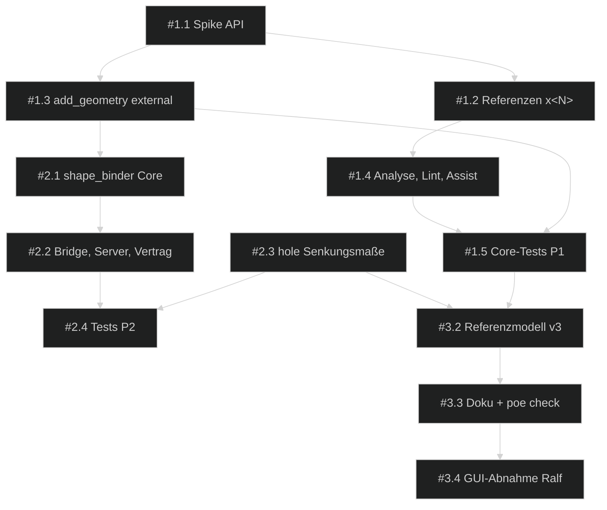

# 📋 Umsetzungsplan — FreeCAD Buddy: Externe Geometrie, Shape-Binder & Layout-Skizze

> Erstellt: 2026-09-28 │ Letzte Aktualisierung: 2026-09-28 │ Status: ✅ Erledigt (2026-09-28) – Spec-Stand 2 freigegeben

## Spezifikation

> Spec-Stand: 2 │ Spec-Status: Freigegeben │ Freigabe: Stand 1 durch Ralf im Chat, 2026-09-28 („Freigeben, S1 starten“); Umfang zuvor von Ralf gewählt (externe Geometrie, `shape_binder`, Senkungsmaße bei `hole`, Regel Layout-Skizze), OF-01 von Ralf entschieden (Tool-Budget 100); Stand 2 (R-11, R-12, AC-13, AC-14) durch Ralfs Auftrag und Auswahl im Chat, 2026-09-28 („Tools … mehr gruppieren, und die document-tools in einem tool zusammenfassen“; gewählt: Gruppen nach Arbeitsphase, `document(action=…)` ohne Aliase, Kategorie-Präfix)
>
> **Delta Stand 2 (2026-09-28):** Tool-Katalog nach Arbeitsphasen gruppiert (eine Quelle für Server und Doku), Kategorie als Präfix in jeder Tool-Beschreibung; `new_document`, `open_document`, `save_document`, `close_document`, `revert_document` werden zu `document(action=new|open|save|close|revert)` – **bewusster Breaking Change** gegenüber der Regel „Tool-Namen aus 0.1.0 bleiben“ (nur interne Nutzung), 49 → 45 Tools. Neu: R-11, R-12, AC-13, AC-14, #3.6, #3.7.

Quelle: Chat-Auftrag von Ralf vom 2026-09-28 („Dann lass uns für den Buddy die entsprechenden Tools entwickeln, da die sehr wichtig sind und oft gebraucht werden“). Anlass war der Lüfter-Adapter 50 → 60 mm (`out/Fan_Frame_50_to_60_v2.FCStd`). Kein Backlog-Ticket. Querbezug: R-13 (englische Ausgaben) und R-10/AC-12 (Tool-Budget) aus dem aktiven Sprint [`freecad-buddy-design-regelwerk`](../2026-09-freecad-buddy-design-regelwerk/00-index.md#anforderungen).

## Ausgangslage

Backlog-Quelle: keine (Chat-Auftrag).
Branch: `main`.

- Eine Skizze kennt nur eigene Referenzen: `g<N>`, `g<N>.start|end|center`, `origin`, `x_axis`, `y_axis` (`buddy_core/sketch/refs.py`). `add_geometry` kann `line`, `circle`, `arc` und `point` anlegen, externe Geometrie aber nicht (`buddy_core/sketch/lowlevel.py`). `analyze_sketch` liest `ExternalGeometry` nur für eine pauschale TNP-Warnung aus (`analysis.py`).
- Folge beim Lüfterrahmen v2: Den Lochabstand von 70 mm musste der Agent in drei Skizzen einzeln absichern (`Sketch_Lug`, `Sketch_ScrewHead`, `Sketch_MountHole`). Das Maß zwischen den Löchern entsteht dort erst durch Radius-Constraint und 180°-Muster und steht nirgends direkt.
- Ralfs Konstruktionsweg: In einer **Basis-Skizze** liegt eine 70-mm-Konstruktionslinie symmetrisch zum Ursprung, die Löcher sitzen an ihren Enden, und ein Abstandsmaß zum Rahmen richtet die Linie automatisch aus. Andere Skizzen übernehmen die Lage als externe Geometrie. Mit Buddy lässt sich das bisher nicht bauen.
- Referenzen über Body-Grenzen hinweg, etwa Deckel auf Kasten, sind nur über Parameter möglich. Einen Shape-Binder gibt es nicht.
- `hole` legt bei `counterbore`/`countersink` feste ISO-Werte an (M3: Senkung Ø6 × 3,4 mm bzw. Ø6,7 × 90°). Tiefe und Durchmesser der Senkung lassen sich weder als Zahl noch als Parameter setzen.
- Tool-Katalog: 48 Tools (`docs/tools.md`). Das Budget aus R-10 des aktiven Sprints lag bei ≤ 40; Ralf hat es am 2026-09-28 auf 100 angehoben.
- **Risiken:**
  - Die Semantik von `Sketch.addExternal` hat sich über die Versionen geändert, z. B. mit dem Parameter `defining` seit 1.0. Die Kantennamen einer Skizzen-Shape (`EdgeN`) entsprechen nicht zwingend dem Geometrieindex `g<N>`, weil Konstruktionsgeometrie nicht in der Shape steckt (vermutet, Spike #1.1).
  - Ob sich Konstruktionsgeometrie einer anderen Skizze extern referenzieren lässt, ist in FreeCAD 26.3 ungeprüft. Davon hängt ab, ob Ralfs 70-mm-Konstruktionslinie direkt referenzierbar ist oder die Lochkreise die Referenz bilden (OF-02).
  - Externe Bezüge auf Körperflächen sind anfällig für das Topological Naming Problem (TNP).

## Ziel

Der Agent definiert Lochbilder und Anschlussmaße genau einmal in einer Layout-Skizze. Andere Skizzen desselben Bodys übernehmen sie als externe Geometrie, andere Bodies über einen Shape-Binder. Ändert sich ein Parameter der Layout-Skizze, folgen alle abhängigen Skizzen und Features ohne doppelte Maße. Senkungen von Bohrungen sind in Durchmesser und Tiefe parametrisch.

## Beteiligte und Zielgruppen

- **Ralf:** Auftraggeber. Er gibt die Spec frei, entscheidet OF-01 und nimmt die GUI-Prüfung ab (AC-12).
- **MCP-Client-Agent (Claude Code):** nutzt die erweiterten Tools und die neue Regel beim Konstruieren.
- **Implementierender Agent:** setzt die Sessions S1–S3 um.

## Anforderungen

| ID | Anforderung |
|---|---|
| R-01 | **Externe Geometrie:** `add_geometry` nimmt den Typ `external` an: `{type: "external", source: <Label>, element: <Referenz>, defining?: bool}`. `source` ist eine Skizze, eine Datum-Ebene/-Linie/-Punkt oder ein Shape-Binder im selben Body und liegt im Modellbaum vor der Zielskizze. Bei einer Skizze ist `element` eine Buddy-Referenz (`g<N>`, `g<N>.start|end|center`), sonst `EdgeN`/`VertexN` oder ein semantischer Selektor (`select_geometry`). Die Rückgabe sind Referenzen `x<N>`. |
| R-02 | **Referenzen `x<N>`:** `add_constraints`, `analyze_sketch` und `fully_constrain_sketch` verstehen `x<N>`, `x<N>.start`, `x<N>.end` und `x<N>.center`. Ergebnisse und Befunde geben externe Elemente ebenfalls als `x<N>` aus. |
| R-03 | **Defining-Geometrie:** Mit `defining: true` wird die externe Kante Teil des Profils, etwa die Rahmenkontur aus der Layout-Skizze. Ohne diese Angabe dient sie nur als Bezug. |
| R-04 | **Nachführen:** Ändert sich die Quelle (Parameter, Maß), folgen nach dem Recompute alle abhängigen Skizzen und Features. Das Ergebnis bleibt gültig und manuell in FreeCAD bearbeitbar. |
| R-05 | **Lint:** `analyze_sketch` listet externe Geometrie mit Quelle und Element. Bezüge auf Skizzen, Datums und Binder sind `info`, Bezüge auf Körperflächen und -kanten `warning` (TNP). |
| R-06 | **`shape_binder`:** Ein neues Tool legt einen `PartDesign::SubShapeBinder` im Ziel-Body an. Er referenziert ganze Objekte oder einzelne Elemente eines anderen Bodys, heißt `Binder_<Zweck>`, folgt der Quelle synchron und ist Quelle für `external` (R-01), `pad`/`pocket`-Skizzen und Datums. |
| R-07 | **Senkungsmaße:** `hole` nimmt `cut_diameter` und `cut_depth` (counterbore) bzw. `cut_diameter` und `countersink_angle` (countersink) als Zahl, Parameter oder Ausdruck an. FreeCAD übernimmt dann eigene Werte statt der ISO-Standardwerte. |
| R-08 | **Regel Layout-Skizze:** Das Regelwerk-Thema `references` enthält die Regel: Lochbilder und Anschlussmaße einmal in einer Layout- bzw. Basis-Skizze definieren, abhängige Skizzen referenzieren sie über `external`, andere Bodies über `shape_binder`, Maße nie duplizieren. Flächenbezüge nur als letzte Option. |
| R-09 | **Englische Ausgaben:** Alle neuen Tool- und Parameterbeschreibungen, Ergebnisse, Fehler, Hinweise und die neue Regel sind englisch (R-13 des aktiven Sprints). |
| R-11 | **Gruppierter Katalog (Stand 2):** Jedes Tool gehört zu genau einer Gruppe nach Arbeitsphase (Session & Dokument, Modell & Parameter, Skizze, Referenzen, Features, Design-Tools, Baugruppe, Material & Ansicht, 3D-Druck, Regelwerk & Addons, Experte). Die Zuordnung liegt an einer Stelle; `docs/tools.md` ist danach gegliedert, jede Tool-Beschreibung beginnt mit `[<Category>]` (englisch). |
| R-12 | **Ein Dokument-Tool (Stand 2):** `document(action, name?, path?, unsaved?, document?)` ersetzt die fünf Dokument-Tools ohne Aliase; fehlende Pflichtangaben je Aktion (`new` → `name`, `open` → `path`) werden als Tool-Fehler gemeldet; Verhalten je Aktion wie bisher (Bridge-Methoden unverändert). Alle Verweise (Hinweistexte, Beispiele, Referenzprojekte, Tests) nutzen das neue Tool. |
| R-10 | **Doku und Vertrag:** `docs/tools.md` ist neu generiert. Der Tool↔Bridge-Vertragstest deckt `shape_binder` ab, `docs/architecture.md` beschreibt das Referenzmodell. |

## Nicht-Ziele

- Externe Geometrie aus einem anderen Body **ohne** Binder. FreeCAD erlaubt das nur mit einer Nutzereinstellung, und es erzeugt schwer wartbare Abhängigkeiten.
- Automatisches Umbauen bestehender Modelle, etwa v2 des Lüfterrahmens, auf die Layout-Skizze.
- Carbon-Copy (`Sketch.carbonCopy`) sowie Intersection- bzw. Projektionsmodi der externen Geometrie (FreeCAD 1.x), außer der Spike zeigt, dass Konstruktionsgeometrie nur so erreichbar ist (OF-02).
- Assembly-Referenzen (Assembly4/Assembly-Workbench). Die bleiben bei `add_to_assembly`.
- Neue Design-Tools, z. B. ein `screw_lug`. Die kommen über die Vorschlagsliste des aktiven Sprints.

## Regeln und Einschränkungen

- Bestehende Verträge bleiben: Tool-Namen und Parameter aus 0.1.0 (nur Erweiterungen), ein Undo-Schritt pro Tool, Ergebnisvertrag (`ok`, `created`, `modified`, `warnings`, `hints`), Rollback bei ungültiger Skizze.
- Die Quelle einer externen Referenz liegt im selben Body und im Baum vor der Zielskizze. Zyklen werden vor dem Ändern abgelehnt, nicht erst beim Recompute.
- FreeCAD-API-Unterschiede zwischen Builds (z. B. `addExternal(..., defining)`) laufen über eine Laufzeitprüfung. Fehlt die Fähigkeit, antwortet das Tool mit `1007 unsupported`, nie mit einer rohen Exception (`docs/architecture.md`, Kompatibilität).
- `buddy_core` bleibt ohne Abhängigkeiten außer Stdlib und FreeCAD (Import-Wächter `tests/tools/test_addon_imports.py`).
- Tests laufen ohne Netz. Core-Tests laufen headless in FreeCADs Python.
- Tool-Budget: höchstens 100 öffentliche Tools (Ralf, 2026-09-28). Tools werden nur zusammengelegt, wenn es nötig ist oder wirklich Sinn ergibt; `shape_binder` ist Tool Nr. 49.

## Beispiele

- **Lüfterrahmen, Layout zuerst:** `Sketch_Frame` enthält Rahmenkontur, Laschen, eine 70-mm-Konstruktionslinie symmetrisch zum Ursprung und zwei Lochkreise an deren Enden. Das Abstandsmaß Loch–Rahmen ist `Wall + Head_D/2`. `Sketch_ScrewHead` legt mit `add_geometry([{type:"external", source:"Sketch_Frame", element:"g17"}])` die Referenz → `x0` an. Dann Kreis `g0` und `coincident(g0.center, x0.center)`, DoF 0. `set_parameters(Mount_Diag=80)` verschiebt Laschen, Kopftaschen und Löcher gemeinsam, gemessener Lochabstand 80,000 mm.
- **Kontur übernehmen:** `add_geometry([{type:"external", source:"Sketch_Frame", element:"g6", defining:true}])` → die Kante gehört zum Profil der Zielskizze.
- **Deckel auf Kasten:** `shape_binder(body="Lid", sources=["Box:Sketch_Base"], purpose="BoxOutline")` → `Binder_BoxOutline` im Body `Lid`. `add_geometry` mit `source:"Binder_BoxOutline"`, `element:"Edge1"` → Deckelkontur folgt der Kastenbreite.
- **Senkung parametrisch:** `hole(sketch="Sketch_Frame", cut="counterbore", cut_diameter="Head_D", cut_depth="Fan_H + Rim_T - Lug_Floor")` → Senkung Ø6,5 mm, 3 mm Restboden, folgt den Parametern.

## Ausnahme- und Fehlerfälle

| Situation | Erwartetes Verhalten |
|---|---|
| `source` unbekannt oder die Zielskizze selbst | `validation`-Fehler mit Liste möglicher Quellen, keine Änderung |
| `source` liegt im Baum nach der Zielskizze oder erzeugt einen Zyklus | `validation`-Fehler „would create a dependency cycle“, keine Änderung |
| `source` liegt in einem anderen Body | `validation`-Fehler mit Hinweis auf `shape_binder` |
| `element` existiert nicht, z. B. `g42` bei 20 Geometrien | `validation`-Fehler mit Anzahl vorhandener Elemente |
| `element` ist Konstruktionsgeometrie und in FreeCAD nicht referenzierbar (OF-02) | `validation`-Fehler mit Hinweis: reale Geometrie, z. B. den Lochkreis, oder eine Layout-Skizze verwenden |
| Körperfläche oder -kante als Quelle (`face:`-Selektor) | erlaubt nur mit `allow_face_reference: true`, danach `warning` TNP im Ergebnis und in `analyze_sketch` |
| `x<N>` in `add_constraints` existiert nicht | `validation`-Fehler, Rollback |
| Quelle wird später gelöscht | `analyze_sketch`/`get_model_tree` melden die gebrochene Referenz. Kein stilles Weiterbauen, Hinweis auf `undo` |
| `shape_binder` mit Quelle im selben Body | `validation`-Fehler mit Hinweis auf `external` |
| `hole(cut="none", cut_depth=…)` oder `cut_diameter ≤ diameter` | `validation`-Fehler, keine Bohrung |
| FreeCAD-Build ohne benötigte API | `1007 unsupported` mit Build-Hinweis |

## Akzeptanzkriterien

- [x] AC-01: `add_geometry` mit `type: external` auf eine Skizze im selben Body liefert `x<N>`. Die Zielskizze bleibt gültig, und ein Constraint auf `x<N>.center` bringt einen neuen Kreis auf DoF 0.
- [x] AC-02: Eine Parameteränderung in der Quellskizze führt alle abhängigen Skizzen und Features nach dem Recompute nach. Alle Objekte sind gültig, gemessene Lagen entsprechen dem neuen Wert.
- [x] AC-03: `x<N>`, `x<N>.start|end|center` funktionieren in `add_constraints`, `analyze_sketch` und `fully_constrain_sketch`. Ausgaben verwenden dieselbe Notation.
- [x] AC-04: `defining: true` macht die externe Kante zum Profilbestandteil: Ein Pad der Zielskizze nutzt sie.
- [x] AC-05: Alle Fälle aus „Ausnahme- und Fehlerfälle“ zu `external` enden mit dem beschriebenen Fehler bzw. der Warnung und ändern das Dokument nicht (Undo-Liste unverändert).
- [x] AC-06: `analyze_sketch` listet externe Geometrie mit Quelle und Element. Die Lint-Stufe ist `info` für Skizze, Datum und Binder, `warning` für Körperflächen.
- [x] AC-07: `shape_binder` legt einen synchronen `SubShapeBinder` im Ziel-Body an, der Quelländerungen folgt und als `source` für `external` dient. Eine Quelle im selben Body wird mit Hinweis abgelehnt.
- [x] AC-08: `hole` übernimmt `cut_diameter`, `cut_depth` und `countersink_angle` als Zahl, Parameter oder Ausdruck (Expression gebunden). Die ungültigen Kombinationen werden abgelehnt.
- [x] AC-09: `get_design_rules("references")` enthält die Regel zur Layout-Skizze auf Englisch. Die Server-Instructions bleiben im Budget des aktiven Sprints (≤ 2 000 Zeichen).
- [x] AC-10: Referenzmodell Lüfterrahmen v3 (Test): Lochlage, Laschen, Kopftaschen und Löcher hängen an genau einer Layout-Quelle. Ändern von `Mount_Diag` oder `Wall` führt alles konsistent nach, der Lochabstand wird gemessen und ist korrekt.
- [x] AC-11: `docs/tools.md` ist neu generiert, der Vertragstest deckt `shape_binder` ab, `docs/architecture.md` ist aktualisiert, alle neuen Ausgaben sind englisch. `uv run poe check` ist grün, ohne Netz.
- [x] AC-13: `docs/tools.md` ist nach den Gruppen aus R-11 gegliedert; jedes registrierte Tool ist genau einer Gruppe zugeordnet (Test schlägt bei fehlender Zuordnung fehl) und seine Beschreibung beginnt mit dem Kategorie-Präfix.
- [x] AC-14: `document` deckt `new`, `open`, `save`, `close`, `revert` ab; die fünf alten Tools sind nicht mehr registriert; E2E-Test und Referenzprojekte laufen mit `document`; fehlende Pflichtangaben liefern einen lesbaren Tool-Fehler.
- [x] AC-12: GUI-Abnahme durch Ralf: Externe Geometrie ist in der FreeCAD-GUI sichtbar und in der Skizze bearbeitbar, der Binder erscheint im Baum und folgt der Quelle.

## Offene Fragen

| ID | Frage | Betroffener Umfang | Verantwortlich | Empfehlung |
|---|---|---|---|---|
| OF-01 | ~~Tool-Budget~~ **Entschieden 2026-09-28 durch Ralf:** Grenze auf 100 Tools angehoben; Tools nur zusammenlegen, wenn es nötig ist oder wirklich Sinn ergibt. `shape_binder` wird eigenes Tool. | R-06, AC-07, AC-11 | Ralf | erledigt |
| OF-02 | ~~Konstruktionsgeometrie extern referenzierbar?~~ **Geklärt 2026-09-28 (Spike #1.1): nein** – sie ist nicht Teil der Skizzen-Shape. `external` lehnt sie mit Hinweis ab; Regel R-08: reale Layout-Geometrie (z. B. Lochkreise) referenzieren | R-01, R-08 | implementierender Agent | erledigt |

## Umsetzung und Nachweis

| Kriterium / Quelle | Beobachtbares Ergebnis oder Verweis | Umsetzung / Phase | Prüfebene | Nachweis / Status |
|---|---|---|---|---|
| AC-01 | externe Referenz `x<N>` + DoF 0 | #1.1, #1.3 / P1 | Core-Test | **erfüllt** – `test_external_circle_center_drives_dependent_sketch` (S1) |
| AC-02 | Nachführen nach Parameteränderung | #1.3, #1.5 / P1 | Core-Test | **erfüllt** – dito, `Mount_Diag` 70 → 80, Kreismitte bei x = 40 gemessen |
| AC-03 | `x<N>` in Constraints/Analyse/Assist | #1.2, #1.4 / P1 | Core-Test | **erfüllt** – Suffix-, Constraint-, Analyse- und `fully_constrain`-Tests |
| AC-04 | `defining` im Profil | #1.3 / P1 | Core-Test (Pad-Volumen) | **erfüllt** – `test_defining_outline_is_padded` (4 000 mm³) |
| AC-05 | Fehlerfälle ohne Dokumentänderung | #1.3, #1.5 / P1 | Core-Test | **erfüllt** – 8 Fehlerfälle, Undo-Liste unverändert; gelöschte Quelle → Lint `error` |
| AC-06 | Lint-Stufen externer Geometrie | #1.4 / P1 | Core-Test | **erfüllt** – `info` für Skizze, `warning` für Pad-Kanten |
| AC-07 | `shape_binder` synchron, als Quelle nutzbar | #2.1, #2.2 / P2 | Core-Test + Vertragstest | **erfüllt** – `test_binder_follows_source_and_drives_external_geometry` (60 → 80 mm), Fehlerfälle, `test_tool_contract` grün (S2) |
| AC-08 | Senkungsmaße parametrisch | #2.3 / P2 | Core-Test | **erfüllt** – Counterbore `Plate - Floor` nachgeführt (7 → 8 mm), Countersink 82°, 4 ungültige Kombinationen (S2) |
| AC-09 | Regel Layout-Skizze, Budget | #3.1 / P3 | Unit-Test `test_design_rules.py` | **erfüllt** – `test_references_topic_teaches_layout_sketch_and_binder`, Instructions 1 899 ≤ 2 000 (S3) |
| AC-10 | Referenzmodell Lüfterrahmen v3 | #3.2 / P3 | Core-Test mit Messung | **erfüllt** – `test_reference_fan_frame.py` (2 Tests, Lochabstand gemessen 70/76 mm, eine Quelle) (S3) |
| AC-11 | Doku, Vertrag, Englisch, Gesamtcheck | #2.2, #3.3 / P2–P3 | `uv run poe check` | **erfüllt** – `poe check` grün (94 + 208 + 2), `docs/architecture.md` aktualisiert, neue Ausgaben englisch (S3) |
| AC-12 | GUI-Sichtung in FreeCAD | #3.4 / P3 | manuelle Abnahme durch Ralf | **erfüllt** – von Ralf im Chat bestätigt, 2026-09-28 („GUI-Prüfung ok“, Umfang AC-12a–c), Nutzerprüfung |
| AC-13 | Gruppierter Katalog + Präfix | #3.6 / P3 | Tool-Test `test_tool_docs.py` | **erfüllt** – Gruppenzuordnung/Präfix/Aktualität getestet, Index + 10 Gruppenseiten (S3) |
| AC-14 | `document(action=…)` | #3.7 / P3 | Server-Test + E2E | **erfüllt** – `test_document_tool_replaces_the_five_document_tools`, `test_document_tool.py`, E2E + Referenzprojekte grün (S3) |

Umsetzung erst für den freigegebenen Spec-Stand. Spec-Freigabe ersetzt keine Browser-/manuelle Abnahmefreigabe.

## Entscheidungen

| Datum | Entscheidung | Begründung | Architektur-Impact |
|---|---|---|---|
| 2026-09-28 | Umfang: externe Geometrie, `shape_binder`, Senkungsmaße, Regel Layout-Skizze (Ralf im Chat) | Lochbild ließ sich nur dreifach dupliziert absichern | `mehrere` |
| 2026-09-28 | Externe Geometrie als Erweiterung von `add_geometry`/`add_constraints` statt eigener Tools | Gehört fachlich zur Skizzengeometrie; gleiche Denkweise wie `g<N>` (sinnvolles Zusammenlegen, nicht Budget-getrieben) | `core` |
| 2026-09-28 | Tool-Grenze 100; `shape_binder` als eigenes Tool (Ralf im Chat, OF-01) | „Tools nur zusammenlegen, wenn es sein muss oder wirklich Sinn macht“ | `server` |
| 2026-09-28 | Katalog nach Arbeitsphase gruppiert, Kategorie-Präfix; Dokument-Tools → `document(action=…)` ohne Aliase (Ralf im Chat, Spec-Stand 2) | Dokument-Lebenszyklus ist eine fachliche Einheit; Breaking Change bewusst, da 0.1.0 nur intern | `server` |
| 2026-09-28 | Body-übergreifend nur über Binder, nie direkt | FreeCAD-Standard, wartbare Abhängigkeiten | `core` |

## Gesamtfortschritt

[██████████] 100% — 16 von 16 Aufgaben erledigt

## ⚠️ Blocker

*Keine Blocker.*

## Phasen-Übersicht

| Phase | Datei | Architektur-Relevanz | Offen | Erledigt | Fortschritt |
|---|---|---|---|---|---|
| 1 — Externe Geometrie | [01-externe-geometrie.md](01-externe-geometrie.md) | `core` | 0 | 5 | [██████████] 100% |
| 2 — Shape-Binder & Senkungsmaße | [02-binder-und-hole.md](02-binder-und-hole.md) | `mehrere` | 0 | 4 | [██████████] 100% |
| 3 — Regel, Referenzmodell, Katalog & Abschluss | [03-regel-referenzmodell-abschluss.md](03-regel-referenzmodell-abschluss.md) | `mehrere` | 0 | 7 | [██████████] 100% |

## 📅 Session-Übersicht

| Session | Phase | Ziel | Status |
|---|---|---|---|
| S1 | Phase 1 | Spike FreeCAD-API, `external` + `x<N>` in Core, Lint, Tests | ✅ Erledigt (2026-09-28) |
| S2 | Phase 2 | `shape_binder`, Senkungsmaße bei `hole`, Bridge/Server/Vertrag | ✅ Erledigt (2026-09-28) |
| S3 | Phase 3 | Regel, Referenzmodell Lüfterrahmen v3, Katalog/`document`, Doku, GUI-Abnahme, Abschluss | ✅ Erledigt (2026-09-28) |

## 🔗 Dependency-Übersicht

## Architektur-Update

→ [98-architecture-update.md](98-architecture-update.md)

Pflicht zum Sprint-Abschluss:

- Architektur-Deltas aus Phasen und Session-Log prüfen.
- Relevante Abschnitte in `docs/architecture.md` aktualisieren: Modellierungsregeln (Referenzmodell), Tool-Katalog, Kompatibilität.
- Keine unnötigen Code-Samples übernehmen.
- Wenn keine Architekturänderung nötig ist, Begründung im Architektur-Update und Session-Log festhalten.

## Sprint-Abschluss / Definition of Done

- [x] Alle Akzeptanzkriterien geprüft oder bewusst in Folgeaufgaben verschoben.
- [x] Spec-Stand, Aufgaben und Kriteriennachweise stimmen überein; zurückgestellte Kriterien haben eine ausdrückliche Scope-Entscheidung und Folgeaufgabe.
- [x] Relevante Tests, Builds oder manuelle Prüfungen dokumentiert.
- [x] Browser- und manuelle Abnahmen gemäß [Freigaberegel](../../README.md#browser--und-manuelle-abnahmeprüfungen) dokumentiert; gültige Nutzer-/Agentennachweise übernommen, keine automatische Wiederholung zum Sprint-Abschluss.
- [x] Offene Blocker mit Besitzer und nächstem Schritt festgehalten.
- [x] `99-session-log.md` aktualisiert.
- [x] Jede erledigte Änderung ist im `99-session-log.md` als `feature`, `bugfix`, `doc`, `removal`, `misc` oder bewusst als `skip` erfasst.
- [x] `98-architecture-update.md` ausgewertet.
- [x] `docs/architecture.md` aktualisiert oder begründet als unverändert markiert.
- [x] Sprint nach `TODOs/3-sprints-erledigt/<YYYY-MM-sprint-name>/` verschoben.
- [x] Release-Änderungen im `99-session-log.md` vollständig (eine Release-Queue ist derzeit nicht eingerichtet).

## 📓 Session-Log

→ [99-session-log.md](99-session-log.md)
