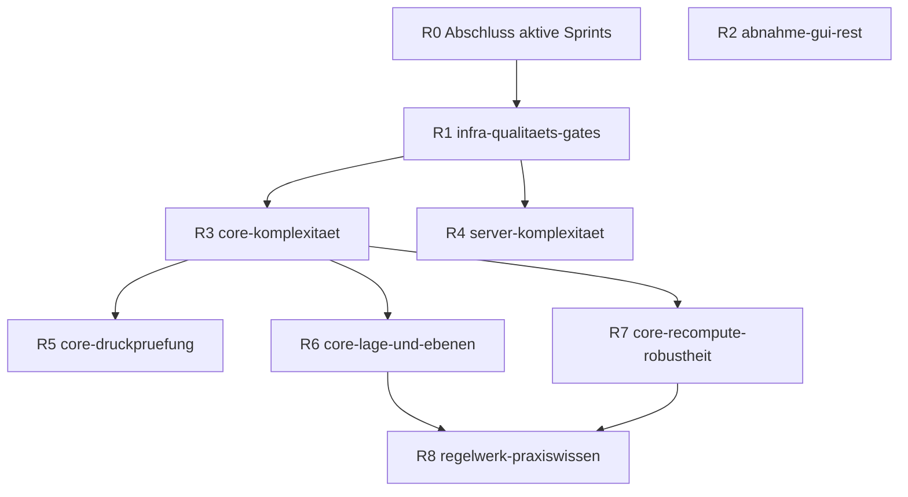

# Roadmap — FreeCAD Buddy

> Erstellt: 2026-09-29 │ Letzte Aktualisierung: 2026-09-29 │ Basis: Version 0.4.0, Commit `03e0881`, 60 Tools

## Zweck

Die Roadmap ist die **Planungsschicht über den Sprints**: Sie legt die Reihenfolge der kommenden Sprints fest, ordnet jedem Sprint genau eine Domäne zu und nennt die Quelle (Ticket oder Eingang). Spezifikation, Akzeptanzkriterien und Sessions entstehen erst im Ticket bzw. im Sprint-Index (SDD, siehe [README](README.md#spec-driven-development-sdd)).

Pflege:

- **Bei jeder Sprint-Planung:** Eingang im [Backlog](1-backlog/freecad-buddy/00-index.md#eingang) triagieren, Roadmap-Reihenfolge prüfen, nächsten Sprint aus der obersten offenen Zeile formen.
- **Bei jedem Sprint-Abschluss:** Status hier auf ✅ setzen, Review-Befunde, die in den Eingang gewandert sind, bei der nächsten Planung einsortieren.

Verbindliche Arbeitsregeln (Domänen, Sprintgröße, Session-Regeln, Review-Gate): [README → Arbeitsweise](README.md#arbeitsweise).

## Domänen

| Domäne | Umfang (Pfade) | Typische Arbeit |
|---|---|---|
| `core` | `addon/FreeCADBuddy/buddy_core/`, `tests/core/` | Modellierungslogik, Selektoren, Druckprüfung, Export |
| `bridge` | `addon/FreeCADBuddy/buddy_bridge/`, `addon/FreeCADBuddy/InitGui.py`, `tests/bridge/` | FreeCAD-seitiger Client: RPC, Dispatch, Stream/Replay, Buttons in FreeCAD |
| `server` | `src/buddy_server/` ohne TUI- und Regelwerk-Module, `tests/server/` | MCP-Tools, Schemas, Validierung, Payloads, Slicer-/Addon-Dienste |
| `tui` | `src/buddy_server/tui.py`, `chat.py`, `splitter.py`, `logs.py` | Terminal-Oberfläche |
| `regelwerk` | `src/buddy_server/design_rules.py`, `tools/rules.py`, `prompts.py`, `docs/tools/` | Design-Regeln, Server-Instructions, Tool-Beschreibungen |
| `infra` | `pyproject.toml`, `uv.lock`, `tools/`, CI, `.claude/`, `TODOs/0-vorlagen/`, `TODOs/README.md` | Frameworks und Abhängigkeiten, Qualitäts-Gates, Prozess |
| `abnahme` | `docs/acceptance.md`, Ticket [`gui-abnahme.md`](1-backlog/freecad-buddy/gui-abnahme.md) | Manuelle GUI-, Slicer- und Druckprüfungen durch Ralf; Code nur als Bugfix |

**Feature-Durchstich:** Ein neues Tool braucht Logik in `core`, einen dünnen Wrapper in `server` und die generierte Tool-Doku. Das zählt als **ein `core`-Sprint**, solange der Server-Anteil nur Wrapper/Schema ist. Refactorings anderer Domänen und Regelwerkstexte über den eigenen Tool-Hinweis hinaus gehören nicht dazu; sie gehen in den Eingang.

## Reihenfolge

| Nr. | Sprint (Ordnername) | Domäne | Quelle | Ziel | Umfang | Voraussetzung | Status |
|---|---|---|---|---|---|---|---|
| R0 | `freecad-buddy-partdesign` und `freecad-buddy-storepoints` abschließen | `abnahme` | aktive Sprints | GUI-Abnahmen G13 und G14/G15 bestanden (2026-09-30); offen: Review-Gate für beide Sprints (Bereiche `4fd92f8..da5701a` und `da5701a..0b8025f`, inkl. der Stream-Bugfixes) | 1–2 Sessions | Ralf hat Zeit für die GUI-Prüfung | 🔵 Nächster |
| R1 | `infra-qualitaets-gates` | `infra` | Eingang E-01 bis E-04 | Komplexitätsgrenze (ruff `C901`, max. 10) mit eingefrorener Baseline, `poe review-files` (geänderte Dateien seit Start-Commit), CI für `lint`/`typecheck`/`test-tools`, projekteigene `CLAUDE.md` | 2 Sessions | R0 | 🔴 |
| R2 | `abnahme-gui-rest` | `abnahme` | Ticket [`gui-abnahme.md`](1-backlog/freecad-buddy/gui-abnahme.md) | G2, G6, G8 abnehmen oder bewusst verwerfen | 1 Session | — (läuft, wenn Ralf prüfen kann) | 🟡 |
| R3 | `core-komplexitaet` | `core` | Eingang E-05, E-06 | `features.py` (1025 Zeilen) in ein Paket aufteilen; `C901`-Baseline in `core` abbauen (`fill_pattern` 20, `_add_constraint_item` 14, `_edge_filter` 13, `_face_filter` 12, `screenshot` 12, `add_fastener`/`loft`/`_primitive_props` 11) – verhaltensneutral | 2–3 Sessions | R1 | 🔴 |
| R4 | `server-komplexitaet` | `server` | Eingang E-07 | `register`-Funktionen der Tool-Module (`rules` 19, `feature` 17, `session` 13, `assembly` 11), `payloads` (16, 11), `slicer.read_result` 11 vereinfachen – verhaltensneutral | 2 Sessions | R1 | 🔴 |
| R5 | `core-druckpruefung` | `core` | Ticket [`druckpruefung-ueberhang-kruemmung.md`](1-backlog/freecad-buddy/druckpruefung-ueberhang-kruemmung.md) | Überhänge an gekrümmten Flächen und freie Brücken erkennen | 2–3 Sessions | Spec-Freigabe durch Ralf | 🟡 |
| R6 | `core-lage-und-ebenen` | `core` | Eingang E-10 bis E-12 (Praxisbefunde Becherschutz) | XZ-Offset-Richtung, Achsen flächengebundener Skizzen im Ergebnis melden, Ausdrücke mit `sin()`/`cos()` in `add_profile` | 2 Sessions (S1 Spike) | Ticket mit Spec aus dem Eingang | 🔴 |
| R7 | `core-recompute-robustheit` | `core` | Eingang E-13 bis E-15 (Praxisbefunde Becherschutz) | Winkeländerung an `datum_plane` erreicht abhängige Features; leerer Body zerstört den Recompute nicht mehr (Schutz oder Warnung); stabile Labels nach `add_fastener` | 2–3 Sessions (S1 Spike) | Ticket mit Spec aus dem Eingang | 🔴 |
| R8 | `regelwerk-praxiswissen` | `regelwerk` | Eingang E-16, gesammelte Regel-Nachträge aus R5–R7 | Bewährte Kniffe aus der Workspace-`CLAUDE.md` (Sweep mit `u_path`, Kreissegment, Muster auf Muster, Gewinde nicht spiegeln, `add_fastener` stapelt, Koordinatenrahmen für Assemblies, Bohrungsstart mit Sicherheitsabstand, mehrere Profile auf flacher Fläche) als Regeln in `get_design_rules`; danach Workspace-`CLAUDE.md` verschlanken | 1–2 Sessions | R6, R7 (damit keine Regeln für inzwischen behobene Fehler entstehen) | 🔴 |

## Kandidaten nach R8 (unsortiert, erst nach Spec einplanen)

| Kandidat | Domäne | Quelle |
|---|---|---|
| Slicer-Integration: Slicen per CLI, Druckzeit und Material zurückmelden | `server` | Eingang E-20 |
| Bauteil-Bibliothek: Snap-Fits, Scharniere, Gewindeeinsätze, Schraubendome | `core` (Durchstich) | Eingang E-21 |
| Multi-Body-Projekte mit Passungen ohne volle Assembly | `core` (Durchstich) | Eingang E-22 |
| `bridge`-Komplexität: `replay` (12) | `bridge` | Eingang E-08 |
| `tui`-Komplexität: `chat._flush` (12) | `tui` | Eingang E-09 |
| Tool-Budget-Review (60 von 100 Tools): Überschneidungen, Zusammenlegungen | `server` | Eingang E-23 |

## Abhängigkeiten

R2 hängt nur an Ralfs Verfügbarkeit und kann jederzeit zwischen zwei Sprints eingeschoben werden. R4 ist unabhängig von R3 und kann vorgezogen werden, wenn gerade am Server gearbeitet wird.

## Versionierung

- Sprint mit neuem oder geändertem Tool-Verhalten → Minor (`0.5.0`, …).
- Reiner Bugfix-, Refactoring- oder Regelwerk-Sprint → Patch (`0.4.1`, …).
- `abnahme`- und `infra`-Sprints ohne Laufzeitänderung → keine neue Version.
