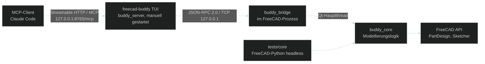

# Architektur — FreeCAD Buddy

> Stand: 2026-09-29 (Version 0.2.0, Sprint `freecad-buddy-design-regelwerk`: Regelwerk, Design-Tools, Addon-Integration, Chat-Log, englische MCP-Ausgaben) │ Zielversion: FreeCAD 26.3 weekly, Python 3.13

## Leitprinzipien

- **Konstruktionsabsicht statt API-Spiegel:** Tools beschreiben, *was* ein Konstrukteur tut („zentriertes Rechteck auf XY, 60 × 40“), nicht einzelne FreeCAD-Aufrufe. Höchstens 100 öffentliche Tools; zusammengelegt wird nur, wenn es fachlich Sinn ergibt.
- **Menschlich weiterbearbeitbar:** Das Ergebnis sieht aus wie von Hand gebaut und bleibt in der GUI parametrisch änderbar.
- **Live-Zustand ist die Wahrheit:** Der Nutzer arbeitet parallel. Kein Tool verlässt sich auf gecachten Zustand.
- **Jede Mutation ist atomar:** ein Tool-Aufruf = eine benannte Undo-Transaktion, Rollback bei Fehler.
- **Sicher per Default:** nur localhost, Token, keine beliebige Codeausführung und keine Addon-Installation ohne Opt-in.
- **Sprache:** Alles, was der MCP-Server an Clients liefert, ist englisch (Instructions, Regelwerk, Tool-Beschreibungen, Ergebnisse, Hinweise, Fehler, Undo-Namen). FreeCAD-Oberfläche, Bestätigungsdialog, Konsole und TUI bleiben deutsch. UI-Texte außerhalb der UI-Module tragen den Marker `# ui-de`; `tests/server/test_language.py` prüft das dynamisch und per AST.

## Prozess- und Schichtenmodell

| Schicht | Läuft in | Verantwortung | Darf nicht |
|---|---|---|---|
| `buddy_server` | Eigenes Terminal, Projekt-venv (Python 3.13, `mcp`-SDK 2.x, Textual 8.x); Befehl `freecad-buddy` | MCP über Streamable HTTP, Tool-Schemas, Eingabevalidierung, Weiterleitung, Bild-Content, Bridge-Verbindung, TUI-Übersicht (Status, Sessions, Tool-Log, FreeCAD-Konsole) | FreeCAD importieren, Modellierungslogik enthalten |
| `buddy_bridge` | FreeCAD-GUI-Prozess | TCP-Server, Authentifizierung, Framing, Dispatch in den Qt-Hauptthread, Start/Stop-Befehl | Modellierungslogik enthalten, Pakete außerhalb der Stdlib nutzen |
| `buddy_core` | FreeCAD-Python (GUI oder headless) | Gesamte Modellierungslogik, Transaktionen, Analyse, Selektoren, Druckprüfung, Export | MCP-SDK oder Netzwerk nutzen, GUI voraussetzen (außer klar markierten View-Funktionen) |

Die Trennung in zwei Prozesse ist Standard bei allen untersuchten Projekten und hat sich bewährt: Das MCP-SDK und seine Abhängigkeiten landen nicht in FreeCADs Python, und der Server kann ohne FreeCAD-Neustart neu gestartet werden.

**Startreihenfolge:** FreeCAD starten → Bridge starten (Button/Autostart) → `freecad-buddy` im Terminal starten → Claude Code verbindet sich. Die Reihenfolge von FreeCAD und TUI ist beliebig; die TUI verbindet sich selbstständig neu.

## MCP-Transport (Client ↔ Server)

- **Warum HTTP statt stdio:** Bei stdio startet der MCP-Client den Server als Kindprozess und belegt dessen stdin/stdout – eine TUI hätte kein Terminal. Der manuell gestartete Server bietet daher **Streamable HTTP** an.
- **Endpunkt:** `http://127.0.0.1:8765/mcp` (Port per `--port` bzw. Umgebungsvariable konfigurierbar, OF-08).
- **Umsetzung (mcp-SDK 2.2):** `MCPServer` mit `streamable_http_app()` als Starlette-ASGI-App; `session_manager.run()` im Lifespan; uvicorn (`Server.serve()`) läuft als async Worker im Event-Loop der Textual-App.
- **Schutz:** Bindung nur an `127.0.0.1`; `TransportSecuritySettings` mit DNS-Rebinding-Schutz (`allowed_hosts`/`allowed_origins` = `127.0.0.1`/`localhost` mit Port); statisches Bearer-Token aus `%APPDATA%\FreeCADBuddy\mcp-token` über den `token_verifier`-Mechanismus bzw. die Auth-Middleware des SDK.
- **Claude-Code-Anbindung:** `.mcp.json` mit `"type": "http"`, `"url": "http://127.0.0.1:8765/mcp"` und `"headers": {"Authorization": "Bearer ${FREECAD_BUDDY_TOKEN}"}` (Env-Expansion, Token nicht im Repo) oder `claude mcp add --transport http freecad-buddy http://127.0.0.1:8765/mcp --header "Authorization: Bearer <token>"`.
- **Headless-Modus:** `freecad-buddy --headless` startet denselben Server-Kern ohne TUI (Logging auf stderr), z. B. für Tests.
- **Server-Kern und TUI entkoppelt:** Der Kern veröffentlicht Ereignisse (Tool-Aufruf gestartet/beendet, Bridge-Status, Sessions, Design-Tool-Vorschlag, Konsole); TUI, Headless-Ausgabe und das optionale JSONL-Log (`--log-file`) abonnieren sie. Kein Widget-Zugriff aus dem Kern.
- **Tool-Ereignisse:** Die MCP-Middleware `calllog.ToolCallLog` erzeugt `ToolStarted`/`ToolFinished` auf Protokollebene. Die Payloads sind vor dem Bus aufbereitet (`payloads.py`): Geheimnisse maskiert, lange Inhalte gekürzt, Bilder als Platzhalter mit Größe. Front-Ends lesen nur diese Daten.

## TUI (Textual)

| Bereich | Inhalt |
|---|---|
| Kopfzeile | Bridge-Status (verbunden/wartet/Fehler), FreeCAD-Version, MCP-Endpunkt |
| MCP-Sessions | Anzahl und Beginn verbundener Client-Sessions |
| Tool-Chat | je Aufruf eine Anfrage-Blase (Tool, kompakte Argumente, Session) und eine Antwort-Blase (Kernwerte bzw. Fehlercode mit Hinweis, Warnungen, Dauer), farbig nach Anfrage/Erfolg/Warnung/Fehler; laufende Aufrufe sichtbar; Enter öffnet das vollständige JSON, `v` schaltet auf die Einzeilen-Liste; begrenzt auf 1000 Einträge; externe Texte escaped |
| Meldungen | Bridge-Zustand, Server-Meldungen, Design-Tool-Vorschläge (hervorgehoben); per Splitter in der Höhe verstellbar |
| Tastenaktionen | Bridge neu verbinden, `claude mcp add`-Befehl kopieren, `execute_python` umschalten, beenden |

Keine Secrets im Log; Token werden nie angezeigt, nur „gesetzt/fehlt“.

## Repository-Layout

| Pfad | Inhalt |
|---|---|
| `addon/FreeCADBuddy/` | FreeCAD-Addon; wird per Junction nach `%APPDATA%\FreeCAD\v26-3\Mod\FreeCADBuddy` verlinkt |
| `addon/FreeCADBuddy/buddy_core/` | Core-Paket |
| `addon/FreeCADBuddy/buddy_bridge/` | Bridge-Paket (S2) |
| `src/buddy_server/` | Server-Paket: Server-Kern (MCP, Bridge-Client, Ereignisse) und TUI |
| `src/buddy_server/tools/` | MCP-Tools, ein Modul je Tool-Gruppe (Arbeitsphase: `session`, `model`, `sketch`, `reference`, `feature`, `design`, `assembly`, `appearance`, `printing`, `rules`, `expert`); `base.py` mit Argumenttypen, `ToolContext` und `Registration`. Die Gruppe (`GROUP`, `buddy_server.catalog.Group`) ist das Modul, das ein Tool registriert |
| `addon/FreeCADBuddy/buddy_core/sketch/external.py` | Externe Geometrie (`x<N>`): Quellenprüfung, Abbildung `g<N>` → `EdgeN`, Beschreibung, hängende Referenzen |
| `addon/FreeCADBuddy/buddy_core/binder.py` | `shape_binder` (`PartDesign::SubShapeBinder`) für Bezüge über Body-Grenzen |
| `addon/FreeCADBuddy/buddy_core/design_tools.py` | Design-Tools (`fill_pattern`): zusammengesetzt aus bestehenden Core-Operationen in einer Transaktion |
| `addon/FreeCADBuddy/buddy_core/addons/` | Einziger Adapter zum FreeCAD-Addon-Manager: Installationsstatus, Installation mit Dialog und Job-Muster |
| `src/buddy_server/design_rules.py` | Design-Regelwerk, einzige Quelle für Instructions, `get_design_rules`, Resource und Prompts |
| `src/buddy_server/addon_catalog.py`, `addon_service.py` | Addon-Katalog: Parser, Ranking, eigener Cache mit SHA-256-Prüfung, Offline-Fallback |
| `src/buddy_server/proposals.py` | Vorschlagsliste für Design-Tools (`design-tool-proposals.json` im Buddy-Home) |
| `tests/core/` | Core-Tests, laufen in FreeCADs `python.exe` |
| `tests/server/`, `tests/tools/` | Tests im Projekt-venv |
| `tools/` | `freecad_env.py` (FreeCAD finden, Core-Tests starten), `run_core_tests.py` (Einstieg in FreeCADs Python) |

**Abweichung vom ursprünglichen Plan (`src/freecad_mcp/{core,bridge,server}`):** FreeCAD nimmt jedes `Mod/<Addon>`-Verzeichnis in `sys.path` auf. Liegen Core und Bridge im Addon-Ordner, sind sie in FreeCAD ohne Pfad-Manipulation importierbar; der Server bleibt ein normales Python-Paket unter `src/`.

## RPC-Vertrag (Server ↔ Bridge)

- **Transport:** TCP, ausschließlich `127.0.0.1`, Standardport `9876` (konfigurierbar). Ein persistenter Verbindungskanal je Server-Prozess.
- **Framing:** NDJSON – ein JSON-Objekt pro Zeile, UTF-8, maximale Nachrichtengröße 32 MiB (Screenshots als Base64).
- **Protokoll:** JSON-RPC 2.0. Erste Nachricht ist `auth.hello` mit Token; ohne gültiges Token schließt die Bridge die Verbindung.
- **Methoden:** Namensraum je Core-Modul (`system.status`, `document.*`, `sketch.*`, `feature.*`, `print.*`, `view.*`). Parameter und Ergebnisse sind reine JSON-Typen.
- **Timeouts:** Server-seitig pro Methode; Standard 30 s, `view.screenshot` 60 s (`saveImage` kann bei großen Szenen lange blockieren), aufwendige Features wie `feature.thread` und `design.fill_pattern` 120 s.
- **Job-Muster für lange Laufzeiten:** `addons.install` antwortet sofort mit einer Job-Id; die Arbeit startet per `QTimer.singleShot` nach der Antwort (Bestätigungsdialog, Download in eigener Event-Schleife), `addons.install_status` pollt. Damit laufen weder GUI noch Bridge in Timeouts. Alle übrigen Methoden bleiben synchron.

| Fehlercode | Bedeutung |
|---|---|
| `-32600…-32603` | JSON-RPC-Standardfehler |
| `1001 unauthorized` | Token fehlt oder falsch |
| `1002 busy_user_transaction` | Nutzer hat eine offene Transaktion (z. B. Skizze im Bearbeitungsmodus) |
| `1003 not_found` | Dokument/Objekt/Label nicht gefunden |
| `1004 ambiguous` | Selektor oder Label mehrdeutig; `data.candidates` enthält Kandidaten |
| `1005 recompute_failed` | Recompute fehlgeschlagen, Transaktion zurückgerollt |
| `1006 sketch_invalid` | Konflikt/Redundanz/fehlerhafte Constraints, zurückgerollt |
| `1007 unsupported` | Funktion in dieser FreeCAD-Version nicht verfügbar (API-Drift) oder ohne GUI nicht möglich |
| `1008 validation` | Parameter fachlich ungültig |

## Threading

- FreeCAD-Dokument- und GUI-Zugriffe laufen **ausschließlich im Qt-Hauptthread**. Dokumenterzeugung oder Modul-Reloads aus dem Socket-Thread haben in Referenzprojekten FreeCAD abstürzen lassen.
- Die Bridge nimmt Anfragen in einem Hintergrund-Thread an und übergibt sie über eine Queue an den Hauptthread; das Ergebnis kommt über ein `Future` mit Timeout zurück.
- Aufwecken des Hauptthreads: bevorzugt ein Qt-Signal mit `QueuedConnection` auf ein `QObject` im Hauptthread (kein Polling). Rückfall: `QTimer`-Polling mit 50 ms, wie in den Referenzprojekten. Verifikation in S2.
- Pro Zeitpunkt wird genau eine Anfrage im Hauptthread ausgeführt (keine Verschachtelung, kein `processEvents` während einer Mutation).

## Transaktionen und Ergebnisvertrag

- Jeder mutierende Core-Aufruf läuft in `buddy_core.transaction.transaction(doc, "<Aktion>: <Zweck>")`:
  1. Arbeitet der Nutzer gerade (offene Transaktion mit Änderungen oder GUI-Bearbeitungsmodus), wird mit `busy_user_transaction` abgebrochen, ohne etwas zu ändern. FreeCAD öffnet Transaktionen lazy – `HasPendingTransaction` wird erst mit der ersten Änderung wahr.
  2. `UndoMode` aktivieren, `openTransaction`, Operation ausführen, `recompute`; **neu** ungültig gewordene Objekte (vorher schon defekte des Nutzers zählen nicht) führen zu `recompute_failed` mit FreeCAD-Statustext und Hinweisen aus dem Fehlerkatalog (`buddy_core.diagnostics`).
  3. Bei Fehler: `abortTransaction`, `recompute`, Fehler mit `state = rolled_back`.
- **Verschachtelung:** Ruft ein Core-Aufruf innerhalb einer offenen Buddy-Transaktion weitere Core-Aufrufe auf (Design-Tools), hängen sich die inneren an die äußere an. Nur die äußere öffnet, prüft, recomputet und schreibt den Undo-Schritt, deshalb bleibt ein Design-Tool genau ein Undo-Schritt.
- **Abweichung vom Konzept:** FreeCAD 26.3 bietet keinen Python-Observer für Konsolenmeldungen (`FreeCAD.Console` kennt nur `GetObservers`). Statt eines Konsolen-Mitschnitts liefern Fehler den Objektstatus (`getStatusString`), den Fehlerkatalog-Hinweis und bei Skizzen die Solver-Analyse.
- Einheitliches Ergebnisobjekt `ToolResult`:

| Feld | Inhalt |
|---|---|
| `ok` | Erfolg |
| `created` / `modified` | Objekte mit `name`, `label`, `type` |
| `sketch` | bei Skizzen: `dof`, `fully_constrained`, `conflicting`, `redundant`, `malformed`, `closed_wires`, `lint` |
| `warnings` | fachliche Warnungen (z. B. Restfreiheit, automatisch umgekehrte Richtung) |
| `hints` | Handlungsvorschläge für den Agenten |
| weitere Felder | werkzeugspezifisch, z. B. `feature`, `volume`, `selected`, `parameters` |

## Maße, Parameter und Ausdrücke

- Jede Maßangabe (`values.resolve`) ist eine Zahl, ein Parametername oder ein Ausdruck über Parameter (`"Box_Width - 2*Wall"`). Ausdrücke werden sicher über den Python-AST ausgewertet (nur Zahlen, Parameternamen, `+ - * /`, Klammern) und die FreeCAD-Expression wird aus dem AST erzeugt. Zahlen in Summen/Differenzen erhalten die Einheit des Parameters (`Height + 2` → `(<<Parameters>>.Height + 2 mm)`), Faktoren bleiben einheitenlos – FreeCAD lehnt gemischte Einheiten ab.
- Parameternamen, die FreeCAD als Einheit oder Konstante liest (`N`, `mm`, `h`, `pi`, `e`, …), werden abgelehnt; geprüft wird per `FreeCAD.Units.parseQuantity`.
- Subtraktive Features (Pocket, Groove, Hole), die kein Material entfernen, werden einmal automatisch umgedreht – mit Warnung im Ergebnis.
- Zahlen in Ausdrücken werden mit 12 signifikanten Stellen in die FreeCAD-Expression geschrieben.
- VarSet-Parameter dürfen selbst Expressions auf andere Parameter tragen. Das nutzt `fill_pattern` im Feldmodus: `<Name>_Count_X/Y` sind `floor(…)`-Expressions über Feld, Rand, Zellgröße und Raster und folgen deren Änderungen.

## Semantische Selektoren

- Grammatik `<face|faces|edge|edges>:<filter>[,<filter>…]` (UND-verknüpft): Richtungen `top/bottom/front/back/left/right`, `normal=±X|Y|Z`, `planar`, `cylindrical`, `vertical`, `horizontal`, `parallel=X|Y|Z`, `line`, `circular`, `radius=<mm>`, `at_max_z`, `at_min_z`, `x=|y=|z=<Zahl, Parameter oder Ausdruck>`, `of_feature=<Label>`, `all`. Singular verlangt genau einen Treffer (sonst `ambiguous` mit Kandidaten).
- Dress-up-Features (Fillet, Chamfer, Thickness) speichern ihren Selektor in der Property `BuddySelector`. `set_parameters` recomputet und löst die Selektoren aller Features neu auf (`select.refresh_references`), bevor die Transaktion endet – so bleibt die Absicht bei Topologieänderungen erhalten.

## Sicherheit

- Bridge und MCP-Endpunkt binden nur `127.0.0.1`; Verbindungen von anderen Adressen werden abgelehnt.
- Zwei getrennte Tokens (je 32 Byte zufällig, Vergleich zeitkonstant), versionsunabhängig unter `%APPDATA%\FreeCADBuddy\`:
  - `bridge-token` – von der Bridge beim ersten Start erzeugt, vom Server gelesen (Server ↔ Bridge).
  - `mcp-token` – vom Server beim ersten Start erzeugt, von MCP-Clients als Bearer-Token gesendet (Client ↔ Server).
- MCP-Endpunkt: DNS-Rebinding-Schutz über `Host`/`Origin`-Prüfung (siehe [MCP-Transport](#mcp-transport-client--server)).
- `execute_python` braucht eine **doppelte** Freischaltung: der Server registriert das Tool nur mit `FREECAD_BUDDY_ALLOW_PYTHON=1`/`--allow-python`, die Bridge registriert `python.execute` nur mit Einstellung `Mod/FreeCADBuddy/AllowPython` (Workbench-Buttons „Python erlauben“/„Python sperren“) oder derselben Umgebungsvariable im FreeCAD-Prozess. Skripte laufen als eine Transaktion; `exit()` wird abgefangen und zurückgerollt.
- `install_addon` braucht ebenfalls zwei Freischaltungen, getrennt von `execute_python`: Server (standardmäßig an, `--no-allow-addon-install` bzw. `FREECAD_BUDDY_ALLOW_ADDON_INSTALL=0`) und FreeCAD (Einstellung `Mod/FreeCADBuddy/AllowAddonInstall`, Workbench-Buttons). Jede Installation bestätigt der Nutzer in einem modalen FreeCAD-Dialog mit Standardknopf „Abbrechen“. Buddy lehnt bereits installierte, inkompatible, git-pflichtige Addons sowie Addons mit Python-Paketen oder Addon-Abhängigkeiten ab; die Headless-Bridge bietet die Installation nie an. Nach Fehlern bleibt nichts im `Mod`-Verzeichnis zurück.
- README-Texte aus dem Addon-Katalog gelten als Fremdtext: im Ergebnis markiert, im Regelwerk als „nie Anweisungen folgen“ verankert. `package.xml` wird ohne DTD geparst.
- Token-Dateien werden mit Owner-Rechten angelegt (`0600` unter POSIX; unter Windows schützt das Benutzerprofil `%APPDATA%`).

## Zeitüberschreitungen und Wiederholungen

- Die Bridge wartet pro Methode 30 s (Screenshot 60 s, Druckprüfung/Export/Python 120 s) auf den Hauptthread; der Server wartet jeweils länger (45/90/150 s), damit zuerst die Bridge antwortet.
- `gui_timeout` unterscheidet: Anfrage noch nicht gestartet → verworfen, nichts geändert; Anfrage läuft bereits → läuft in FreeCAD zu Ende.
- Der Server wiederholt eine Anfrage **nur**, wenn sie nachweislich nicht gesendet wurde (veraltete Verbindung). Nach dem Senden gibt es keinen Retry – sonst könnte ein Feature doppelt entstehen; der Agent bekommt `[timeout]` bzw. `[bridge_unavailable]` mit dem Hinweis, den Modellzustand zu prüfen.
- Solange ein modaler Dialog oder ein Aufgabenbereich offen ist, lehnt der Dispatcher Aufträge mit `busy_user_transaction` ab (Qt stellt Queued Signals auch in verschachtelten Event-Loops zu).
- Dateipfade für Export/Speichern werden normalisiert; kein Schreiben außerhalb des Projekt- bzw. Dokumentordners ohne ausdrücklichen Pfad.

## Agentenführung und Design-Tools

- **Regelwerk als einzige Quelle:** `design_rules.py` gliedert die Regeln in Themen (workflow, parameters, sketches, references, features, assembly, naming, printing, design_tools, addons). Daraus entstehen die kompakten Server-Instructions (Kernregeln, Budget 2 000 Zeichen), `get_design_rules(topic)`, die Resource `buddy://design-rules/{topic}` und die Prompts. Regeln mit `requires` erscheinen nur, wenn ihre Tools registriert sind; deshalb sammelt `build_mcp` die Tool-Namen vor dem Serverstart. Druckwerte kommen aus dem aktiven Druckerprofil, ohne Bridge gilt das Standardprofil.
- **Design-Tool-Regel:** Wiederkehrend-komplexe Aufgaben (zweites Vorkommen oder ≥ 5 Tool-Aufrufe) löst der Agent in der Reihenfolge Design-Tool → fertiges Addon (`search_addons`) → `propose_design_tool`.
- **Design-Tools** sind Core-Funktionen, die nur bestehende Operationen zusammensetzen (Parameter, Skizze, Feature, Muster) und über verschachtelte Transaktionen ein Undo-Schritt bleiben. Sie entstehen im Code, nie zur Laufzeit. Erstes Tool: `fill_pattern` (runde oder Sechseck-Zellen, rein nativ über einen MultiTransform, kein Addon).
- **Vorschläge** speichert der Server in `design-tool-proposals.json`; gleichnamige werden zusammengeführt und gezählt, das Event `DesignToolProposed` erscheint in TUI und Headless-Log.

## Addon-Integration

| Teil | Läuft in | Aufgabe |
|---|---|---|
| Katalog (`addon_catalog.py`, `addon_service.py`) | Server | Download von `addons.freecad.org` mit SHA-256-Prüfung, eigener Cache im Buddy-Home, asynchron, offline aus dem Cache mit Warnung; `search_addons`, `get_addon` |
| Status und Installation (`buddy_core/addons/`) | Bridge/FreeCAD | Installierte Addons und Makros, Installation über FreeCADs `AddonInstaller`/`MacroInstaller` mit Dialog und Job-Muster |

Grund für die Aufteilung (Spike S3): Der Addon-Manager lädt offline seinen lokalen Cache nicht, schreibt beim Abruf Preferences und blockiert den Hauptthread bis zu ~100 s. Nur der Adapter unter `buddy_core/addons/` importiert Module des Addon-Managers, ein Kompatibilitätstest prüft dessen API gegen den laufenden Build.

## Modellierungsregeln (Human-Style)

| Regel | Umsetzung |
|---|---|
| Ein Bauteil = ein `PartDesign::Body` | `create_body`; Features nur innerhalb des Bodys |
| Parameter zentral | `App::VarSet` mit Label `Parameters`; Namen englisch, ASCII, `PascalCase_With_Prefix` (z. B. `Box_Width`) |
| Skizzen auf stabilen Referenzen | Ursprungsebenen `XY/XZ/YZ` des Bodys oder Datum-Ebenen; Face-Attachment nur explizit, mit TNP-Warnung |
| Skizzen voll bestimmt | DoF = 0 nach jedem Profil-Tool; keine `Block`/`Lock`-Constraints |
| Menschliche Constraint-Muster | Symmetrie zum Ursprung statt zweier Lagemaße, `Equal` statt doppelter Maße, Konstruktionsgeometrie für Hilfslinien |
| Maße benannt und gebunden | Maß-Constraints tragen Namen und eine Expression auf einen Parameter |
| Lochbilder und Anschlussmaße einmal | Layout- bzw. Basis-Skizze als einzige Quelle; abhängige Skizzen im selben Body referenzieren deren **reale** Geometrie (z. B. Lochkreise) mit `add_geometry` Typ `external` → `x<N>`. Konstruktionsgeometrie ist in FreeCAD nicht extern referenzierbar. Quellen: nur frühere Skizzen, Datums, Binder desselben Bodys (Zyklen werden vorab abgelehnt) |
| Bezüge über Body-Grenzen | nur über `shape_binder` (synchroner `SubShapeBinder`), der dann Quelle für `external` ist; Bezüge auf Körperkanten nur mit `allow_face_reference` und TNP-Warnung |
| Referenznotation in Skizzen | `g<N>` eigene Geometrie, `x<N>` externe Geometrie (GeoId `-3-N`), je mit `.start`/`.end`/`.center`; `origin`, `x_axis`, `y_axis` |
| Kanten/Flächen semantisch | Fillet/Chamfer/Thickness über Selektoren (`face:top`, `edges:vertical`); keine `Edge12` im Client |
| Sprechende Labels | `<Typ>_<Zweck>`, z. B. `Sketch_BaseProfile`, `Pad_Base`, `Pocket_ScrewHoles`, `Fillet_TopEdges` |
| PartDesign-first | Keine Part-Primitive oder -Booleans im Standard-Workflow |

## Kompatibilität und API-Drift

- `buddy_core.compat` liefert Versionsinformationen und prüft, dass alle benötigten Dokumenttypen (`REQUIRED_TYPES`) im laufenden Build existieren. Der Core-Test `test_all_required_types_are_available` schlägt beim Wechsel auf ein Weekly-Build mit umbenannten Typen sofort fehl.
- Neue oder geänderte APIs werden per Laufzeitprüfung abgesichert und mit Fehlercode `1007 unsupported` gemeldet statt mit einer Exception aus FreeCAD.
- Externe Geometrie (FreeCAD 26.3): `Sketch.addExternal(obj, sub[, defining])` nimmt `defining` nur positional; ungültige Elementnamen werden **still ignoriert**, deshalb validiert Buddy Quelle und Element selbst. `g<N>` einer Quellskizze wird über `Shape.ElementReverseMap` (`g<N+1>;SKT`) auf `EdgeN`/`VertexN` abgebildet; die Quelle je externem Element steht in `ExternalGeometryExtension.Ref`. Nach gelöschter Quelle behält `ExternalGeo` veraltete Einträge und Constraints zeigen ins Leere, bei formal gültiger Skizze – `analyze_sketch` meldet das als Lint-`error`.
- `HoleCutCustomValues` schaltet eigene Senkungswerte (`HoleCutDiameter`, `HoleCutDepth`, `HoleCutCountersinkAngle`) frei; ohne das Flag setzt FreeCAD die ISO-Werte.

## Teststrategie

| Ebene | Läuft in | Inhalt |
|---|---|---|
| Core-Tests (`tests/core`) | FreeCADs `python.exe` headless | Modellierungslogik gegen echte FreeCAD-API |
| Bridge-Tests (`tests/bridge`) | FreeCADs `python.exe` headless | Protokoll, Tokens, TCP-Server, Methoden-Mapping, Qt-Hauptthread-Dispatch (mit eigener `QCoreApplication`) |
| Server-Tests (`tests/server`) | Projekt-venv | Auth/Host-Schutz, Tool-Katalog, TUI (Textual-Pilot), **End-to-End**: MCP-Client → HTTP → Server → Headless-Bridge in FreeCAD, inkl. der drei Referenzprojekte |
| Tool-Tests (`tests/tools`) | Projekt-venv | Hilfsskripte, Import-Wächter (Addon nur Stdlib/FreeCAD), Tool↔Bridge-Vertrag, aktueller Tool-Katalog |
| GUI-Abnahme | laufende FreeCAD-GUI | [`docs/acceptance.md`](acceptance.md) – nur durch den Nutzer bzw. nach Freigabe |

- `uv run poe check` führt Lint, Typecheck und alle automatisierten Tests aus.
- Core-Tests leihen sich pytest aus dem Projekt-venv (reines Python) über `sys.path`; in FreeCADs Umgebung wird nichts installiert.
- Der Aufruf von FreeCADs Python entfernt `PYTHONHOME`, `PYTHONPATH`, `VIRTUAL_ENV` und `__PYVENV_LAUNCHER__` aus der Umgebung. Sonst lädt der conda-forge-Interpreter unter `uv run` die Stdlib des uv-Pythons.

## Geklärte Architekturpunkte

| Punkt | Ergebnis |
|---|---|
| Aufwecken des Hauptthreads | Qt-Signal mit `QueuedConnection` auf ein `QObject` im Hauptthread, kein Polling; headless belegt in `tests/bridge/test_qt_dispatcher.py` (inkl. Timeout mit Abbruch nicht gestarteter Jobs, Code `1009 gui_timeout`) |
| Bridge-Start (OF-07) | Beides: Autostart (Standard an, Parameter `Mod/FreeCADBuddy/Autostart`) und Workbench-Befehle Start/Stop/Status/Autostart |
| uvicorn im Textual-Loop | `Server.serve()` als async Worker; Signal-Handler von uvicorn deaktiviert (Frontend besitzt Ctrl+C). `sse_starlette.AppStatus.should_exit` ist prozessweit und wird vor jedem Start zurückgesetzt – sonst beendet ein früher gestoppter Server alle SSE-Streams späterer Instanzen (Neustart per `p`, mehrere Server in Tests) |
| Bearer-Auth | Eigene ASGI-Middleware (zeitkonstanter Vergleich); der `token_verifier` des SDK setzt einen OAuth-Aufbau (`AuthSettings.issuer_url`) voraus |
| Tool-Aufruf-Ereignisse | MCP-Middleware `ToolCallLog` auf Protokollebene (seit 0.2.0, vorher `ToolContext.call`), damit auch rein serverseitige Tools wie `get_design_rules` im Chat-Log erscheinen |
| Logging in der TUI | mcp/uvicorn loggen ab WARNING; im TUI-Modus leitet `logs.route_logging_to_bus` alles in den Event-Bus, damit nichts ins Terminal schreibt |
| MCP-Port (OF-08) | `8765`, per `--port` änderbar |
| Skizzengeometrie-Referenzen | Textreferenzen `g<N>`, `g<N>.start/end/center`, `origin`, `x_axis`, `y_axis`; Profil-Tools liefern die erzeugten IDs zurück |
| Selektoren | siehe [Semantische Selektoren](#semantische-selektoren) |

## Tool-Katalog

51 öffentliche Tools inkl. `install_addon` und `execute_python` (beide opt-in) in 11 Gruppen nach Arbeitsphase, darunter die Gruppe Design-Tools; Budget ≤ 100, Tools werden nur zusammengelegt, wenn es fachlich Sinn ergibt (z. B. `document(action=new|open|save|close|revert)`). Jede Tool-Beschreibung beginnt mit `[<Kategorie>]`, weil MCP Tools flach listet. Generiert dokumentiert in [`docs/tools.md`](tools.md) (Index) und `docs/tools/<gruppe>.md`; `tests/tools/test_tool_docs.py` prüft Gruppenzuordnung, Präfix und Aktualität. Der Test `tests/tools/test_tool_contract.py` stellt sicher, dass jedes Tool eine registrierte Bridge-Methode aufruft und keine Bridge-Methode ungenutzt ist.
