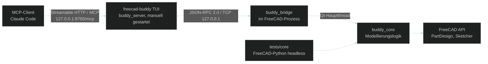

# Architektur — FreeCAD Buddy

> Stand: 2026-09-27 (Sprint `freecad-buddy-aufbau`, S1; Spec-Stand 2: TUI-Server + Streamable HTTP, Name „FreeCAD Buddy“) │ Zielversion: FreeCAD 26.3 weekly, Python 3.13

## Leitprinzipien

- **Konstruktionsabsicht statt API-Spiegel:** Tools beschreiben, *was* ein Konstrukteur tut („zentriertes Rechteck auf XY, 60 × 40“), nicht einzelne FreeCAD-Aufrufe. Höchstens 40 öffentliche Tools.
- **Menschlich weiterbearbeitbar:** Das Ergebnis sieht aus wie von Hand gebaut und bleibt in der GUI parametrisch änderbar.
- **Live-Zustand ist die Wahrheit:** Der Nutzer arbeitet parallel. Kein Tool verlässt sich auf gecachten Zustand.
- **Jede Mutation ist atomar:** ein Tool-Aufruf = eine benannte Undo-Transaktion, Rollback bei Fehler.
- **Sicher per Default:** nur localhost, Token, keine beliebige Codeausführung ohne Opt-in.

## Prozess- und Schichtenmodell

| Schicht | Läuft in | Verantwortung | Darf nicht |
|---|---|---|---|
| `buddy_server` | Eigenes Terminal, Projekt-venv (Python 3.13, `mcp`-SDK 2.x, Textual 8.x); Befehl `freecad-buddy` | MCP über Streamable HTTP, Tool-Schemas, Eingabevalidierung, Weiterleitung, Bild-Content, Bridge-Verbindung, TUI-Übersicht (Status, Sessions, Tool-Log, FreeCAD-Konsole) | FreeCAD importieren, Modellierungslogik enthalten |
| `buddy_bridge` | FreeCAD-GUI-Prozess | TCP-Server, Authentifizierung, Framing, Dispatch in den Qt-Hauptthread, Start/Stop-Befehl | Modellierungslogik enthalten, Pakete außerhalb der Stdlib nutzen |
| `buddy_core` | FreeCAD-Python (GUI oder headless) | Gesamte Modellierungslogik, Transaktionen, Analyse, Selektoren, Druckprüfung, Export | MCP-SDK oder Netzwerk nutzen, GUI voraussetzen (außer klar markierten View-Funktionen) |

Die Trennung in zwei Prozesse ist Standard bei allen untersuchten Projekten und hat sich bewährt: Das MCP-SDK und seine Abhängigkeiten landen nicht in FreeCADs Python, und der Server kann ohne FreeCAD-Neustart neu gestartet werden.

**Startreihenfolge:** FreeCAD starten → Bridge starten (Button/Autostart) → `freecad-buddy` im Terminal starten → Claude Code verbindet sich. Die Reihenfolge von FreeCAD und TUI ist beliebig; die TUI verbindet sich selbstständig neu.

## MCP-Transport (Client ↔ Server)

- **Warum HTTP statt stdio:** Bei stdio startet der MCP-Client den Server als Kindprozess und belegt dessen stdin/stdout – eine TUI hätte kein Terminal. Der manuell gestartete Server bietet daher **Streamable HTTP** an.
- **Endpunkt:** `http://127.0.0.1:8765/mcp` (Port per `--port` bzw. Umgebungsvariable konfigurierbar, OF-08).
- **Umsetzung (mcp-SDK 2.2):** `MCPServer` mit `streamable_http_app()` als Starlette-ASGI-App; `session_manager.run()` im Lifespan; uvicorn (`Server.serve()`) läuft als async Worker im Event-Loop der Textual-App (Spike in S3).
- **Schutz:** Bindung nur an `127.0.0.1`; `TransportSecuritySettings` mit DNS-Rebinding-Schutz (`allowed_hosts`/`allowed_origins` = `127.0.0.1`/`localhost` mit Port); statisches Bearer-Token aus `%APPDATA%\FreeCADBuddy\mcp-token` über den `token_verifier`-Mechanismus bzw. die Auth-Middleware des SDK.
- **Claude-Code-Anbindung:** `.mcp.json` mit `"type": "http"`, `"url": "http://127.0.0.1:8765/mcp"` und `"headers": {"Authorization": "Bearer ${FREECAD_BUDDY_TOKEN}"}` (Env-Expansion, Token nicht im Repo) oder `claude mcp add --transport http freecad-buddy http://127.0.0.1:8765/mcp --header "Authorization: Bearer <token>"`.
- **Headless-Modus:** `freecad-buddy --headless` startet denselben Server-Kern ohne TUI (Logging auf stderr), z. B. für Tests.
- **Server-Kern und TUI entkoppelt:** Der Kern veröffentlicht Ereignisse (Tool-Aufruf gestartet/beendet, Bridge-Status, Sessions, Konsole); die TUI abonniert sie. Kein Widget-Zugriff aus dem Kern.

## TUI (Textual)

| Bereich | Inhalt |
|---|---|
| Kopfzeile | Bridge-Status (verbunden/wartet/Fehler), FreeCAD-Version, MCP-Endpunkt |
| MCP-Sessions | Anzahl und Beginn verbundener Client-Sessions |
| Tool-Log | Tool-Name, Dauer, Ergebnis (ok/Fehlercode); begrenzt auf 1000 Einträge; externe Texte escaped |
| FreeCAD-Konsole | mitgeschnittene Warnungen/Fehler aus den `ToolResult`s |
| Tastenaktionen | Bridge neu verbinden, `claude mcp add`-Befehl kopieren, `execute_python` umschalten, beenden |

Keine Secrets im Log; Token werden nie angezeigt, nur „gesetzt/fehlt“.

## Repository-Layout

| Pfad | Inhalt |
|---|---|
| `addon/FreeCADBuddy/` | FreeCAD-Addon; wird per Junction nach `%APPDATA%\FreeCAD\v26-3\Mod\FreeCADBuddy` verlinkt |
| `addon/FreeCADBuddy/buddy_core/` | Core-Paket |
| `addon/FreeCADBuddy/buddy_bridge/` | Bridge-Paket (S2) |
| `src/buddy_server/` | Server-Paket: Server-Kern (MCP, Bridge-Client, Ereignisse) und TUI |
| `tests/core/` | Core-Tests, laufen in FreeCADs `python.exe` |
| `tests/server/`, `tests/tools/` | Tests im Projekt-venv |
| `tools/` | `freecad_env.py` (FreeCAD finden, Core-Tests starten), `run_core_tests.py` (Einstieg in FreeCADs Python) |

**Abweichung vom ursprünglichen Plan (`src/freecad_mcp/{core,bridge,server}`):** FreeCAD nimmt jedes `Mod/<Addon>`-Verzeichnis in `sys.path` auf. Liegen Core und Bridge im Addon-Ordner, sind sie in FreeCAD ohne Pfad-Manipulation importierbar; der Server bleibt ein normales Python-Paket unter `src/`.

## RPC-Vertrag (Server ↔ Bridge)

- **Transport:** TCP, ausschließlich `127.0.0.1`, Standardport `9876` (konfigurierbar). Ein persistenter Verbindungskanal je Server-Prozess.
- **Framing:** NDJSON – ein JSON-Objekt pro Zeile, UTF-8, maximale Nachrichtengröße 32 MiB (Screenshots als Base64).
- **Protokoll:** JSON-RPC 2.0. Erste Nachricht ist `auth.hello` mit Token; ohne gültiges Token schließt die Bridge die Verbindung.
- **Methoden:** Namensraum je Core-Modul (`system.status`, `document.*`, `sketch.*`, `feature.*`, `print.*`, `view.*`). Parameter und Ergebnisse sind reine JSON-Typen.
- **Timeouts:** Server-seitig pro Methode; Standard 30 s, `view.screenshot` 60 s (`saveImage` kann bei großen Szenen lange blockieren).

| Fehlercode | Bedeutung |
|---|---|
| `-32600…-32603` | JSON-RPC-Standardfehler |
| `1001 unauthorized` | Token fehlt oder falsch |
| `1002 busy_user_transaction` | Nutzer hat eine offene Transaktion (z. B. Skizze im Bearbeitungsmodus) |
| `1003 not_found` | Dokument/Objekt/Label nicht gefunden |
| `1004 ambiguous` | Selektor oder Label mehrdeutig; `data.candidates` enthält Kandidaten |
| `1005 recompute_failed` | Recompute fehlgeschlagen, Transaktion zurückgerollt |
| `1006 sketch_invalid` | Konflikt/Redundanz/fehlerhafte Constraints, zurückgerollt |
| `1007 unsupported` | Funktion in dieser FreeCAD-Version nicht verfügbar (API-Drift) oder ohne GUI nicht möglich |
| `1008 validation` | Parameter fachlich ungültig |

## Threading

- FreeCAD-Dokument- und GUI-Zugriffe laufen **ausschließlich im Qt-Hauptthread**. Dokumenterzeugung oder Modul-Reloads aus dem Socket-Thread haben in Referenzprojekten FreeCAD abstürzen lassen.
- Die Bridge nimmt Anfragen in einem Hintergrund-Thread an und übergibt sie über eine Queue an den Hauptthread; das Ergebnis kommt über ein `Future` mit Timeout zurück.
- Aufwecken des Hauptthreads: bevorzugt ein Qt-Signal mit `QueuedConnection` auf ein `QObject` im Hauptthread (kein Polling). Rückfall: `QTimer`-Polling mit 50 ms, wie in den Referenzprojekten. Verifikation in S2.
- Pro Zeitpunkt wird genau eine Anfrage im Hauptthread ausgeführt (keine Verschachtelung, kein `processEvents` während einer Mutation).

## Transaktionen und Ergebnisvertrag

- Jeder mutierende Core-Aufruf läuft in `document_transaction(doc, "<tool>: <Kurzbeschreibung>")`:
  1. Ist `doc.HasPendingTransaction` gesetzt (Nutzer arbeitet gerade, z. B. im Skizzen-Bearbeitungsmodus), wird mit `busy_user_transaction` abgebrochen, ohne etwas zu ändern.
  2. `UndoMode` aktivieren, `openTransaction`, Operation ausführen, `recompute`, Fehlerprüfung aller betroffenen Objekte, `commitTransaction`.
  3. Bei Fehler: `abortTransaction`, `recompute`, Sichtbarkeiten wiederherstellen, Fehler mit Status `rolled_back` melden.
- FreeCAD-Konsolenmeldungen (Warnungen/Fehler) werden während des Aufrufs mitgeschnitten und im Ergebnis zurückgegeben. Referenzprojekte verlieren diese Meldungen.
- Einheitliches Ergebnisobjekt `ToolResult`:

| Feld | Inhalt |
|---|---|
| `ok` | Erfolg |
| `created` / `modified` | Objekte mit `name`, `label`, `type` |
| `sketch` | bei Skizzen: `dof`, `fully_constrained`, `conflicts`, `redundancies` |
| `recompute` | Status je betroffenem Objekt |
| `warnings` / `console` | fachliche Warnungen, mitgeschnittene Konsolenmeldungen |
| `hints` | Handlungsvorschläge für den Agenten (z. B. „Wand unter Mindestwandstärke“) |

## Sicherheit

- Bridge und MCP-Endpunkt binden nur `127.0.0.1`; Verbindungen von anderen Adressen werden abgelehnt.
- Zwei getrennte Tokens (je 32 Byte zufällig, Vergleich zeitkonstant), versionsunabhängig unter `%APPDATA%\FreeCADBuddy\`:
  - `bridge-token` – von der Bridge beim ersten Start erzeugt, vom Server gelesen (Server ↔ Bridge).
  - `mcp-token` – vom Server beim ersten Start erzeugt, von MCP-Clients als Bearer-Token gesendet (Client ↔ Server).
- MCP-Endpunkt: DNS-Rebinding-Schutz über `Host`/`Origin`-Prüfung (siehe [MCP-Transport](#mcp-transport-client--server)).
- `execute_python` wird nur registriert, wenn `FREECAD_BUDDY_ALLOW_PYTHON=1` gesetzt ist, und läuft ebenfalls in einer Transaktion.
- Dateipfade für Export/Speichern werden normalisiert; kein Schreiben außerhalb des Projekt- bzw. Dokumentordners ohne ausdrücklichen Pfad.

## Modellierungsregeln (Human-Style)

| Regel | Umsetzung |
|---|---|
| Ein Bauteil = ein `PartDesign::Body` | `create_body`; Features nur innerhalb des Bodys |
| Parameter zentral | `App::VarSet` mit Label `Parameters`; Namen englisch, ASCII, `PascalCase_With_Prefix` (z. B. `Box_Width`) |
| Skizzen auf stabilen Referenzen | Ursprungsebenen `XY/XZ/YZ` des Bodys oder Datum-Ebenen; Face-Attachment nur explizit, mit TNP-Warnung |
| Skizzen voll bestimmt | DoF = 0 nach jedem Profil-Tool; keine `Block`/`Lock`-Constraints |
| Menschliche Constraint-Muster | Symmetrie zum Ursprung statt zweier Lagemaße, `Equal` statt doppelter Maße, Konstruktionsgeometrie für Hilfslinien |
| Maße benannt und gebunden | Maß-Constraints tragen Namen und eine Expression auf einen Parameter |
| Kanten/Flächen semantisch | Fillet/Chamfer/Thickness über Selektoren (`face:top`, `edges:vertical`); keine `Edge12` im Client |
| Sprechende Labels | `<Typ>_<Zweck>`, z. B. `Sketch_BaseProfile`, `Pad_Base`, `Pocket_ScrewHoles`, `Fillet_TopEdges` |
| PartDesign-first | Keine Part-Primitive oder -Booleans im Standard-Workflow |

## Kompatibilität und API-Drift

- `buddy_core.compat` liefert Versionsinformationen und prüft, dass alle benötigten Dokumenttypen (`REQUIRED_TYPES`) im laufenden Build existieren. Der Core-Test `test_all_required_types_are_available` schlägt beim Wechsel auf ein Weekly-Build mit umbenannten Typen sofort fehl.
- Neue oder geänderte APIs werden per Laufzeitprüfung abgesichert und mit Fehlercode `1007 unsupported` gemeldet statt mit einer Exception aus FreeCAD.

## Teststrategie

| Ebene | Läuft in | Inhalt |
|---|---|---|
| Core-Tests (`tests/core`) | FreeCADs `python.exe` headless | Modellierungslogik gegen echte FreeCAD-API |
| Server-Tests (`tests/server`) | Projekt-venv | Schemas, Fehler-Mapping, Bridge-Client gegen Bridge-Stub, MCP-Client gegen `--headless`-Server (HTTP, Token, Origin), TUI per Textual-Pilot |
| Tool-Tests (`tests/tools`) | Projekt-venv | Hilfsskripte |
| GUI-Integration | laufende FreeCAD-GUI | Bridge-Threading, Screenshots – nur nach Freigabe |

- `uv run poe check` führt Lint, Typecheck und alle automatisierten Tests aus.
- Core-Tests leihen sich pytest aus dem Projekt-venv (reines Python) über `sys.path`; in FreeCADs Umgebung wird nichts installiert.
- Der Aufruf von FreeCADs Python entfernt `PYTHONHOME`, `PYTHONPATH`, `VIRTUAL_ENV` und `__PYVENV_LAUNCHER__` aus der Umgebung. Sonst lädt der conda-forge-Interpreter unter `uv run` die Stdlib des uv-Pythons.

## Offene Architekturpunkte

| Punkt | Klärung in |
|---|---|
| Signal-basiertes Aufwecken des Hauptthreads aus Python-Threads verifizieren | S2 (#1.5) |
| Bridge-Start: Workbench-Button und/oder Autostart (OF-07) | S2 (#1.5) |
| uvicorn `Server.serve()` als async Worker im Textual-Loop (Spike), Beenden ohne hängende Tasks | S3 (#1.6/#1.8) |
| mcp-SDK 2.2: strukturierte Tool-Rückgaben, Image-Content, Bearer-Auth per `token_verifier`, Hook für Tool-Aufruf-Ereignisse (nicht dokumentiert → ggf. eigener Wrapper um Tool-Funktionen) | S3 (#1.6) |
| MCP-Standardport (OF-08) | S3 (#1.9) |
| Stabile Referenzierung von Skizzengeometrie (IDs + Rollen) | S5 (#3.2) |
| Selektor-Grammatik und Re-Resolve bei Recompute | S8 (#4.5) |
