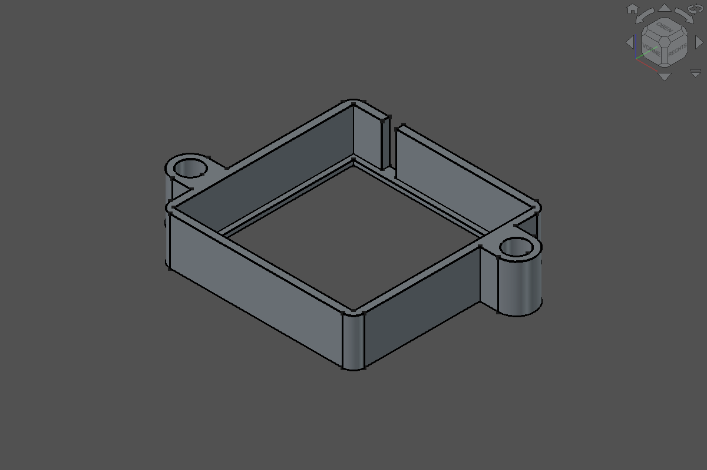

# Sample: Lüfterrahmen (Referenzmodell 2)

Zweites Referenzmodell neben dem [`referenzmodell.md`](referenzmodell.md). Es prüft den **Referenz-Workflow**: Das Lochbild steht genau einmal in einer Layout-Skizze. Laschen und Kopftaschen übernehmen die Bohrungslage als externe Geometrie (`add_geometry` Typ `external`), die Bohrungen kommen per Hole-Feature direkt aus der Layout-Skizze. Anlass war ein realer Montage-Adapter für einen 50-mm-CPU-Lüfter auf eine 60-mm-Lüfterhalterung mit zwei Schrauben im Abstand von 70 mm.

Die Aufgabe ist deterministisch:
- Der Prompt legt alle Maße und Parameternamen fest.
- Die Prüfung ([`luefterrahmen.py`](luefterrahmen.py) `check`) bewertet ausschließlich Tool-Ergebnisse.
- Einzige Quelle für Prompt, Soll-Werte und Referenzlösung ist das Skript. Dieses Dokument zeigt sie nur an, ein Test hält beides gleich.



*Aktueller Stand: Stufe 1, 2026-09-28, FreeCAD 26.3.0 (Build 2026-09-22), FreeCAD Buddy 0.1.0+.*

## Stufen

| Stufe | Inhalt | Neue Parameter | Neue Feature-Typen | Soll-Volumen | Abmessungen |
|---|---|---|---|---|---|
| 1 | Klemmrahmen 50-mm-Lüfter mit Innenrand, Kabelkerbe, zwei D-Laschen mit Kopftaschen; Lochbild aus einer Layout-Skizze, extern referenziert | Fan_W, Fan_H, Fit, Wall, Corner_R, Rim_T, Rim_W, Notch_W, Notch_Offset, Mount_Diag, Mount_Hole_D, Head_D, Lug_D, Lug_Floor | Pad, Pocket, Hole | 7367.6 mm³ | 74.8 × 54.3 × 13.2 mm |

Für eine neue Stufe musst du an diesen Stellen ergänzen:
- In `luefterrahmen.py`: `STAGE_PROMPTS`, `STAGE_PARAMETERS`, `STAGE_FEATURES`, die Soll-Formeln (`expected_volume`, `expected_size`), dazu `build` und `LATEST_STAGE`. Ändert sich Kopf oder Schluss des Prompts, kommt ein Eintrag in `PROMPT_HEADS` bzw. `PROMPT_TAILS` dazu; frühere Stufen behalten ihren Text.
- In diesem Dokument: die Zeile oben und den Prompt.

Danach den Screenshot neu erzeugen.

## Prompt der aktuellen Stufe (wörtlich verwenden)

Die Prompts früherer Stufen gibt `uv run python examples/samples/luefterrahmen.py prompt --stage N` aus.

```text
Erstelle mit FreeCAD Buddy ein neues Dokument „Luefterrahmen“ mit genau einem Body „Frame“: einen Klemmrahmen, in den ein 50-mm-CPU-Lüfter (50 × 50 × 12 mm) von oben gesteckt wird und der mit zwei Schrauben (Abstand 70 mm) auf eine 60-mm-Lüfterhalterung geschraubt wird.

1. Rahmen außen quadratisch, mittig zum Ursprung auf der XY-Ebene: Innenmaß Lüfterbreite plus 0,15 mm Spiel je Seite, Wand 2 mm, äußere Ecken R 3 mm. Höhe = Lüfterhöhe plus Innenrand.
2. Unten ein umlaufender Innenrand als Anschlag, 1,5 mm breit und 1,2 mm dick; darüber die Lüftertasche 12 mm tief von oben.
3. Kabelkerbe 4 mm breit durch die Wand auf der +Y-Seite, Mitte 10 mm von der inneren Ecke bei −X, von oben bis auf den Innenrand.
4. Lochbild genau einmal in einer Layout-Skizze: eine Konstruktionslinie der Länge Mount_Diag symmetrisch zum Ursprung, an ihren Enden die zwei Bohrungskreise Ø 3,4 mm. Ein Maß legt den Abstand der Bohrungsmitte zur Rahmenaußenkante in X auf Wall + Head_D/2 fest, damit richtet sich die Linie aus. Die Bohrung auf der +X-Seite liegt bei positivem Y.
5. Außen zwei D-förmige Schraubenlaschen, 10 mm breit, rund um die Bohrungen, bis zur Wandmitte und über die ganze Rahmenhöhe. Von oben je eine Kopftasche Ø 6,5 mm bis 3 mm über der Unterseite, darunter die Durchgangsbohrung Ø 3,4 mm als Hole-Feature direkt aus der Layout-Skizze.
6. Laschen und Kopftaschen übernehmen die Bohrungslage als externe Geometrie aus der Layout-Skizze; keine andere Skizze enthält ein Lagemaß des Lochbilds.
7. Keine Fasen und Verrundungen außer den Rahmenecken.
8. Alle Maße als Parameter im VarSet „Parameters“ mit genau diesen Namen: Fan_W, Fan_H, Fit, Wall, Corner_R, Rim_T, Rim_W, Notch_W, Notch_Offset, Mount_Diag, Mount_Hole_D, Head_D, Lug_D, Lug_Floor.
9. Zum Schluss Druckbarkeit prüfen und Ansicht iso. Nicht speichern, nicht exportieren.
```

## Was geprüft wird

Die Aufgabe prüft, ob ein Modell Lochbilder wie ein Mensch nur einmal definiert:
- Parameter zuerst anlegen.
- Das Lochbild als Layout-Skizze mit Konstruktionslinie und Abstand zum Rahmen bauen.
- Abhängige Skizzen über externe Geometrie an die **realen** Lochkreise binden; Konstruktionsgeometrie ist in FreeCAD nicht extern referenzierbar.
- Bohrungen als Hole-Feature aus der Layout-Skizze bauen.

`check --stage N` prüft kumulativ bis Stufe N:

| Prüfung | Stufe | Toleranz |
|---|---|---|
| genau ein Body „Frame“, alle Features gültig, keine Label-Probleme, alle Skizzen DoF 0 | 1 | exakt |
| Parameter je Stufe vollständig und mit Soll-Wert | je Stufe | exakt |
| Feature-Typen je Stufe vorhanden | je Stufe | – |
| Volumen | N | ± 1 mm³ |
| Abmessungen | N | X ± 0,1 mm (über die Laschenbögen, siehe Grenzen), Y/Z ± 0,01 mm |
| Bohrungen gemessen: Lage ±(x, y) und Abstand = Mount_Diag | 1 | ± 0,01 mm |
| Kopftaschen koaxial zu den Bohrungen | 1 | ± 0,01 mm |
| Lochbild genau eine Quelle: nur eine Skizze bindet `Mount_Diag` | 1 | exakt |
| Laschen und Kopftaschen referenzieren die Layout-Skizze extern (mindestens zwei Skizzen) | 1 | exakt |
| Parametrik `Mount_Diag = 74`: Bohrungen und Kopftaschen folgen, Volumen gleich (danach Undo) | N | ± 0,01 mm / ± 1 mm³ |
| Parametrik `Wall = 2.5`: Bohrungen wandern mit der Rahmenkante, Volumen folgt (danach Undo) | N | ± 0,01 mm / ± 1 mm³ |

Soll-Volumen nach den Parametrik-Proben:

| Stufe | Mount_Diag 74 | Wall 2.5 |
|---|---|---|
| 1 | 7367.6 mm³ | 8922.3 mm³ |

Herleitung:
- Bohrungsmitte: `x = Fan_W/2 + Fit + 2·Wall + Head_D/2`, `y = √((Mount_Diag/2)² − x²)` (Konstruktionslinie symmetrisch, Abstand zur Rahmenkante `Wall + Head_D/2`).
- Grundkörper: `(S² − (4 − π)·Corner_R² + 2·A_Lasche) · (Fan_H + Rim_T)` mit `S = Fan_W + 2·Fit + 2·Wall` und `A_Lasche = π·(Lug_D/2)²/2 + (x − S/2)·Lug_D` (Laschenteil außerhalb des Rahmens).
- Abzüge: Lüftertasche `(Fan_W + 2·Fit)² · Fan_H`, Öffnung im Innenrand `(Fan_W + 2·Fit − 2·Rim_W)² · Rim_T`, Kabelkerbe `Notch_W · Wall · Fan_H`, zwei Kopftaschen `π·(Head_D/2)² · (Fan_H + Rim_T − Lug_Floor)`, zwei Bohrungen `π·(Mount_Hole_D/2)² · Lug_Floor`.
- Gültig, solange die Laschen auf der geraden Wand sitzen (`y + Lug_D/2 ≤ S/2 − Corner_R`); das Skript prüft das für alle Proben.

## Ablauf eines Vergleichslaufs

1. FreeCAD neu starten, damit kein Dokument offen ist. `freecad-buddy` mit Log starten: `uv run freecad-buddy --log-file out/runs/<modell>-luefterrahmen-stufe<N>-<datum>.jsonl`.
2. Neue Claude-Code-Session (bzw. neuen Client) mit dem gewünschten Modell und der gewünschten Thinking-Stufe starten. Keine weiteren Hinweise geben.
3. Den Prompt der Stufe wörtlich einfügen und nicht eingreifen.
4. Bewerten mit `uv run python examples/samples/luefterrahmen.py check --stage <N>`. Das Skript gibt JSON mit `score` aus, jede Prüfung trägt ihre Stufe. Bei vollem Score endet es mit Exit-Code 0.
5. Tool-Aufrufe zählen, also die Zeilen mit `"type": "request"` im JSONL-Log.
6. Ergebnis unten eintragen.

Referenzlösung: `… luefterrahmen.py build --stage <N>`. Stufe 1 braucht 29 Tool-Aufrufe. Den Screenshot erneuerst du mit `… screenshot`, er zeigt immer die aktuelle Stufe. `tests/server/test_sample_luefterrahmen.py` fährt Build und Check headless und verlangt den vollen Score.

## Ergebnisse

| Datum | Stufe | Modell / Thinking | Client | Score | Tool-Aufrufe | Fehler/Undo | Bemerkung |
|---|---|---|---|---|---|---|---|
| 2026-09-28 | 1 | Referenzskript | Skript (`build`) | 16/16 | 29 | 0 | Baseline, GUI und headless |

## Bekannte Grenzen

- Mit laufender FreeCAD-GUI folgen Bounding-Boxen der Anzeige-Tessellierung und schneiden die Laschenbögen ab (74,73 statt 74,80 mm). Die X-Abmessung hat deshalb ± 0,1 mm; die Laschengeometrie sichert das Volumen (± 1 mm³) exakt ab.
- `select_geometry` meldet für Bögen den Kantenschwerpunkt, nicht den Kreismittelpunkt; Lagen werden deshalb nur an Vollkreisen (Bohrungen, Kopftaschen) gemessen.
- Der Screenshot hängt von Theme und Fenstergröße der GUI ab und dient nur der Sichtprüfung, nicht dem Score.
