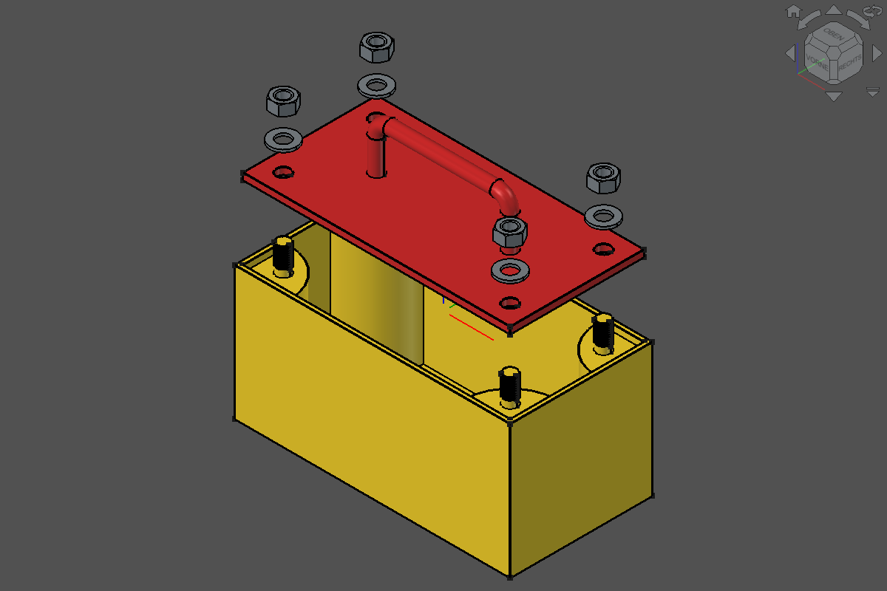

# Sample: Referenzmodell

Mitwachsende Referenzaufgabe, mit der sich LLMs und Thinking-Stufen an FreeCAD Buddy vergleichen lassen. Das Modell wird in **Stufen** ausgebaut. Jede Stufe bringt neue Features, Parameter und Prüfungen mit, frühere Stufen bleiben unverändert. Ergebnisse derselben Stufe sind deshalb immer vergleichbar.

Die Aufgabe ist deterministisch:
- Der Prompt legt alle Maße und Parameternamen fest.
- Die Prüfung ([`referenzmodell.py`](referenzmodell.py) `check`) bewertet ausschließlich Tool-Ergebnisse.
- Einzige Quelle für Prompt, Soll-Werte und Referenzlösung ist das Skript. Dieses Dokument zeigt sie nur an, ein Test hält beides gleich.



*Aktueller Stand: Stufe 5, 2026-09-28, FreeCAD 26.3.0 (Build 2026-09-22), FreeCAD Buddy 0.1.0+.*

## Stufen

| Stufe | Inhalt | Neue Parameter | Neue Feature-Typen | Soll-Volumen | Abmessungen |
|---|---|---|---|---|---|
| 1 | Grundplatte | Plate_Length, Plate_Width, Plate_Thickness | Pad | 100000.0 mm³ | 200 × 100 × 5 mm |
| 2 | Runder U-Griff mittig, Beinabstand 50 % der Länge | Handle_Diameter, Handle_Clearance, Handle_Bend_Radius | AdditivePipe (Sweep) | 112677.6 mm³ | 200 × 100 × 45 mm |
| 3 | Zweiter Body „Box“: Kasten 100 mm hoch unter dem Deckel mit 0,2 mm Spiel und vier viertelrunden Eck-Auflagen (R 35 mm) vom Boden bis unter den Deckel, Deckel bündig eingelegt | Box_Clearance, Box_Wall, Box_Floor, Box_Height, Support_Radius | Pocket | Platte 112677.6 mm³, Kasten 598498.0 mm³ | Kasten 206.4 × 106.4 × 100 mm, z = −95 … 5 |
| 4 | M10-Stifte Ø 10 mm auf den Auflagen, 15 mm vom Plattenrand, 15 mm Überstand über dem Deckel für Mutter (ISO 4032, 8,4 mm) und Scheibe (ISO 7089, 2 mm), Gewinde nicht modelliert; danach die passenden Bohrungen Ø 10,4 mm im Deckel | Pin_Diameter, Pin_Edge_Distance, Pin_Protrusion | Hole | Platte 110978.6 mm³, Kasten 604781.2 mm³ | Kasten 206.4 × 106.4 × 115 mm, z = −95 … 20 |
| 5 | Gewinde M10 × 1,5 auf den Stiften, Material/Farbe (Deckel ABS rot, Kasten PLA gelb), Assembly4-Baugruppe mit Scheiben ISO 7089 und Muttern ISO 4032, Explosionsansicht als Konfiguration; benötigt die Addons Fasteners und Assembly4 | Thread_Pitch | SubtractiveHelix, MultiTransform | Platte 110978.6 mm³, Kasten 604781.2 mm³ minus Gewinde ≈ 576.5 mm³ | unverändert |

Ab Stufe 5 braucht das Modell Addons (`STAGE_ADDONS` im Skript): `build` bricht ohne sie ab, `check` wertet ihren Installationsstatus als eigene Prüfung. Workbenches brauchen nach `install_addon` einen FreeCAD-Neustart.

Die Stufen wurden am 2026-09-28 neu geschnitten: Die Eckbohrungen der früheren Stufe 1 entfallen, an ihre Stelle treten in Stufe 4 die Stifte mit Passbohrungen. Ergebnisse vor diesem Datum sind nicht vergleichbar.

Für eine neue Stufe musst du an diesen Stellen ergänzen:
- In `referenzmodell.py`: `STAGE_PROMPTS`, `STAGE_PARAMETERS`, `STAGE_FEATURES`, die Soll-Formeln (`expected_volume`, `expected_size`, ab Stufe 3 `expected_box_*`), dazu `build` und `LATEST_STAGE`. Ändert sich Kopf oder Schluss des Prompts, kommt ein Eintrag in `PROMPT_HEADS` bzw. `PROMPT_TAILS` dazu; frühere Stufen behalten ihren Text.
- In diesem Dokument: die Zeile oben und den Prompt.

Danach den Screenshot neu erzeugen.

## Prompt der aktuellen Stufe (wörtlich verwenden)

Die Prompts früherer Stufen gibt `uv run python examples/samples/referenzmodell.py prompt --stage N` aus.

```text
Erstelle mit FreeCAD Buddy ein neues Dokument „Referenzmodell“ mit genau zwei Bodies, „Plate“ (Deckel) und „Box“ (Kasten):

1. Grundplatte 200 × 100 × 5 mm, mittig zum Ursprung auf der XY-Ebene, Länge in X.
2. Mittig ein Haltegriff als runde Stange Ø 10 mm mit gerundeten Ecken (Biegeradius 10 mm auf der Mittellinie). Beinabstand 50 % der Plattenlänge in X-Richtung, lichte Höhe 30 mm über der Plattenoberseite. Die Beine reichen durch die ganze Platte. Der Beinabstand ist ein Ausdruck von Plate_Length.
3. Unter dem Deckel ein Kasten „Box“, außen 100 mm hoch, in den die Platte vertieft eingelegt wird: Innenmaß gleich Plattenmaß plus 0,2 mm Spiel je Seite, Wand 3 mm, Boden 3 mm. In den vier Innenecken je eine viertelrunde Auflage mit Radius 35 mm (Mittelpunkt in der Innenecke), vom Kastenboden bis unter die Platte. Einbaulage: Die Plattenunterseite liegt bei z = 0 auf den Auflagen, die Plattenoberseite schließt bündig mit dem Kastenrand ab. Alle Kastenmaße sind Ausdrücke der Plattenmaße und von Box_Height.
4. Auf jeder der vier Auflagen ein runder Stift Ø 10 mm (M10) nach oben, Mittelpunkt 15 mm von beiden Plattenrändern. Der Stift ragt 15 mm über die Plattenoberseite hinaus (Überstand für eine M10-Mutter mit Scheibe, das Gewinde wird nicht modelliert). Danach in der Platte die passenden Durchgangsbohrungen: Stiftdurchmesser plus Box_Clearance Spiel je Seite, als Ausdruck.
5. Benötigte Addons: Fasteners Workbench und Assembly4 (fehlt eines: nach Rückfrage installieren, FreeCAD neu starten und neu beginnen). Auf jeden der vier Stifte oberhalb der Platte ein echtes Außengewinde M10 × 1,5 (ISO-Profil, Steigung Thread_Pitch) über die ganze Überstandslänge.
6. Material und Farbe: Deckel ABS rot, Kasten PLA gelb.
7. Eine Assembly4-Baugruppe „Assembly“ mit Kasten und Deckel in Einbaulage. Auf jeden Stift eine Scheibe ISO 7089 M10 auf die Plattenoberseite und darauf eine Mutter ISO 4032 M10.
8. Explosionsansicht als Assembly4-Konfiguration „Exploded“: Deckel +60 mm, Scheiben +80 mm, Muttern +100 mm in Z; die Einbaulage heißt „Assembled“.
9. Alle Maße als Parameter im VarSet „Parameters“ mit genau diesen Namen: Plate_Length, Plate_Width, Plate_Thickness, Handle_Diameter, Handle_Clearance, Handle_Bend_Radius, Box_Clearance, Box_Wall, Box_Floor, Box_Height, Support_Radius, Pin_Diameter, Pin_Edge_Distance, Pin_Protrusion, Thread_Pitch.
10. Zum Schluss Druckbarkeit beider Bodies prüfen und Ansicht iso. Nicht speichern, nicht exportieren.
```

## Was geprüft wird

Die Aufgabe prüft, ob ein Modell den menschlichen PartDesign-Weg geht:
- Parameter zuerst anlegen.
- Vollständig bestimmte Skizzen auf Ursprungsebenen verwenden.
- Bohrungen als Hole-Feature bauen.
- Den runden Griff als Sweep bauen (Pfad plus Querschnitt).
- Maße über Ausdrücke koppeln.

`check --stage N` prüft kumulativ bis Stufe N. Volumen, Abmessungen und Parametrik gelten genau für Stufe N, ein Modell einer höheren Stufe erreicht bei `--stage 1` also keinen vollen Score:

| Prüfung | Stufe | Toleranz |
|---|---|---|
| genau ein Body (ab Stufe 3: genau die Bodies „Plate“ und „Box“), alle Features gültig, keine Label-Probleme | 1 (3) | exakt |
| alle Skizzen DoF 0 (über alle Bodies) | 1 | exakt |
| Parameter je Stufe vollständig und mit Soll-Wert | je Stufe | exakt |
| Feature-Typen je Stufe vorhanden | je Stufe | – |
| Volumen und Abmessungen der Platte | N | ± 1 mm³ / ± 0,01 mm |
| ab Stufe 3: Volumen, Abmessungen und Einbaulage (z-Bereich) des Kastens | N | ± 1 mm³ / ± 0,01 mm |
| Parametrik: `Plate_Length = 240`, das Volumen folgt (danach Undo), ab Stufe 3 auch beim Kasten | N | ± 1 mm³ |
| ab Stufe 5: Gewindeabtrag gegen die Pappus-Näherung; nach der Parametrik-Probe derselbe Abtrag (Gewinde folgt den Stiften) | 5 | ± 25 % / ± 1 mm³ |
| ab Stufe 5: Addons installiert, Material und Farbe je Body, Assembly mit beiden Bodies | 5 | exakt |
| ab Stufe 5: je 4 Scheiben und Muttern M10 an den Stiften in der richtigen Höhe | 5 | ± 0,01 mm |
| ab Stufe 5: Konfiguration „Exploded“ hebt Deckel/Scheiben/Muttern um 60/80/100 mm gegenüber „Assembled“ (danach Undo) | 5 | ± 0,01 mm |

Soll-Volumen nach der Parametrik-Probe:

| Stufe | Platte | Kasten |
|---|---|---|
| 1 | 120000.0 mm³ | – |
| 2 und 3 | 134248.4 mm³ | 634546.0 mm³ (Stufe 3) |
| 4 | 132549.4 mm³ | 640829.2 mm³ |
| 5 | 132549.4 mm³ | 640829.2 mm³ minus derselbe Gewindeabtrag wie vor der Probe |

Herleitung:
- Platte als Quader.
- Ab Stufe 2 plus Griff nach Pappus: Kreisfläche mal Länge der Mittellinie, also `2·40 + 100 − 4·10 + π·10`.
- Davon ab die zwei Beinstücke, die in der Platte stecken.
- Kasten ab Stufe 3: Außenquader `206,4 · 106,4 · 100` minus Innenraum über dem Boden `200,4 · 100,4 · 97`, plus vier Viertelkreise vom Boden bis unter den Deckel, zusammen ein voller Kreis `π · 35² · 92`.
- Ab Stufe 5: Gewinde nach Pappus, `4 · (15 / 1,5) · 2π · (5 − h3/3) · h3² · tan 30°` mit h3 = 0,6134 · 1,5 mm. Die Näherung ignoriert das Profilende an der Stiftspitze, daher ± 25 %.
- Ab Stufe 4: Kasten plus vier Stifte `π · 5² · 20` (Deckeldicke plus Überstand), Platte minus vier Bohrungen `π · 5,2² · 5`.

## Ablauf eines Vergleichslaufs

1. FreeCAD neu starten, damit kein Dokument offen ist. `freecad-buddy` mit Log starten: `uv run freecad-buddy --log-file out/runs/<modell>-stufe<N>-<datum>.jsonl`.
2. Neue Claude-Code-Session (bzw. neuen Client) mit dem gewünschten Modell und der gewünschten Thinking-Stufe starten. Keine weiteren Hinweise geben.
3. Den Prompt der Stufe wörtlich einfügen und nicht eingreifen.
4. Bewerten mit `uv run python examples/samples/referenzmodell.py check --stage <N>`. Das Skript gibt JSON mit `score` aus, jede Prüfung trägt ihre Stufe. Bei vollem Score endet es mit Exit-Code 0.
5. Tool-Aufrufe zählen, also die Zeilen mit `"type": "request"` im JSONL-Log.
6. Ergebnis unten eintragen.

Referenzlösung: `… referenzmodell.py build --stage <N>`. Stufe 5 braucht 47 Tool-Aufrufe (Stufe 4: 34). Den Screenshot erneuerst du mit `… screenshot`, er zeigt immer die aktuelle Stufe.

## Ergebnisse

| Datum | Stufe | Modell / Thinking | Client | Score | Tool-Aufrufe | Fehler/Undo | Bemerkung |
|---|---|---|---|---|---|---|---|
| 2026-09-28 | 5 | Referenzskript | Skript (`build`) | 31/31 | 47 | 0 | Baseline, Fasteners 0.5.67, Assembly4 0.61.1 |
| 2026-09-28 | 4 | Referenzskript | Skript (`build`) | 19/19 | 34 | 0 | Baseline (Kasten 100 mm, M10-Stifte) |
| 2026-09-28 | 4 | Referenzskript | Skript (`build`) | 19/19 | 34 | 0 | Baseline, Kasten 28 mm, Stifte Ø 5 mm bündig, nicht mehr vergleichbar |
| 2026-09-28 | 2 | Referenzskript | Skript (`build`) | 12/12 | 17 | 0 | Baseline, alter Stufenschnitt (mit Eckbohrungen), nicht mehr vergleichbar |

## Bekannte Grenzen

- `check_printability` meldet für den Griff keinen Überhang, obwohl der Querstab rund 80 mm frei spannt. Der Fehler liegt in der Prüfung, siehe Backlog-Ticket [`druckpruefung-ueberhang-kruemmung.md`](../../TODOs/1-backlog/freecad-buddy/druckpruefung-ueberhang-kruemmung.md). Die Druckprüfung fließt deshalb nicht in den Score ein.
- Der Screenshot hängt von Theme und Fenstergröße der GUI ab und dient nur der Sichtprüfung, nicht dem Score.
- Stufe 5: Assembly4 hat keine eigene Explosionsansicht; sie ist eine Assembly4-Konfiguration (Spreadsheet in „Configurations“) und lässt sich auch im Assembly4-Dialog anwenden.
