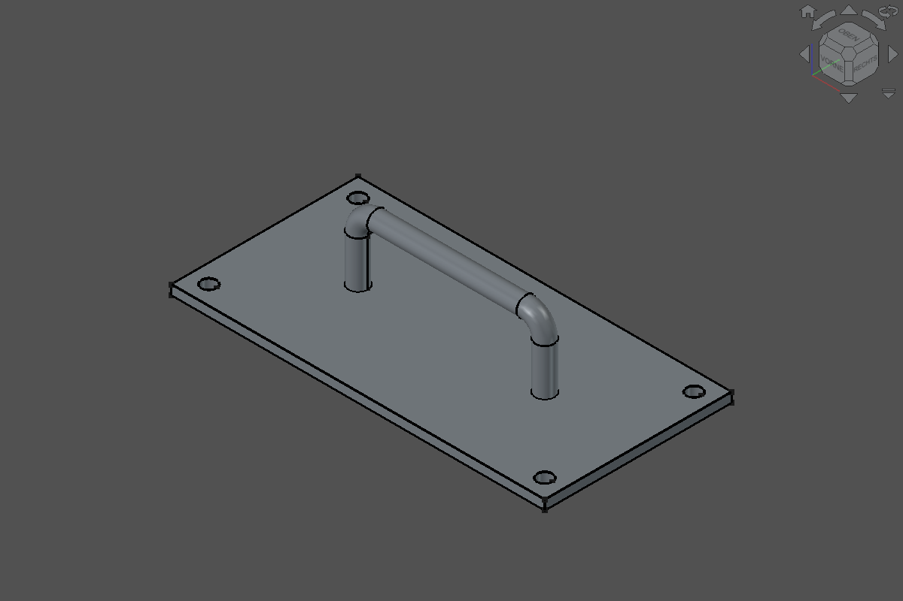

# Sample: Testplatte mit Griff

Referenzaufgabe, mit der sich LLMs und Thinking-Stufen an FreeCAD Buddy vergleichen lassen. Sie ist deterministisch: Der Prompt legt alle Maße und Parameternamen fest, und die Prüfung ([`testplatte_griff.py`](testplatte_griff.py) `check`) bewertet ausschließlich Tool-Ergebnisse.



*Referenzstand 2026-09-28, FreeCAD 26.3.0 (Build 2026-09-22), FreeCAD Buddy 0.1.0+ (Commit nach `22217da`).*

## Prompt (wörtlich verwenden)

```text
Erstelle mit FreeCAD Buddy ein neues Dokument „Testplatte“ mit genau einem Body „Plate“:

1. Grundplatte 200 × 100 × 5 mm, mittig zum Ursprung auf der XY-Ebene, Länge in X.
2. In den vier Ecken je eine Durchgangsbohrung Ø 8 mm, Mittelpunkt 10 mm von beiden Rändern.
3. Mittig ein Haltegriff als runde Stange Ø 10 mm mit gerundeten Ecken (Biegeradius 10 mm auf
   der Mittellinie). Beinabstand 50 % der Plattenlänge in X-Richtung, lichte Höhe 30 mm über der
   Plattenoberseite. Die Beine reichen durch die ganze Platte.
4. Alle Maße als Parameter im VarSet „Parameters“ mit genau diesen Namen: Plate_Length,
   Plate_Width, Plate_Thickness, Hole_Diameter, Hole_Edge_Distance, Handle_Diameter,
   Handle_Clearance, Handle_Bend_Radius. Der Beinabstand ist ein Ausdruck von Plate_Length.
5. Zum Schluss Druckbarkeit prüfen und Ansicht iso. Nicht speichern, nicht exportieren.
```

## Beschreibung

Eine Grundplatte mit vier Eckbohrungen und einem mittigen U-Griff aus Rundstab. Die Aufgabe prüft, ob ein Modell den menschlichen PartDesign-Weg geht:
- Parameter zuerst anlegen.
- Vollständig bestimmte Skizzen auf Ursprungsebenen verwenden.
- Bohrungen als Hole-Feature statt als Kreis-Pocket bauen.
- Den runden Griff als Sweep (Pfad plus Querschnitt) bauen, nicht aus Zylinderstücken zusammensetzen.
- Den Griff über einen Ausdruck an die Plattenlänge koppeln.

## Soll-Werte

| Größe | Soll | Toleranz |
|---|---|---|
| Bodies | 1 | exakt |
| Abmessungen (X × Y × Z) | 200 × 100 × 45 mm | ± 0,01 mm |
| Volumen | 111672.3 mm³ | ± 1 mm³ |
| Volumen nach `Plate_Length = 240` | 133243.1 mm³ | ± 1 mm³ |
| Skizzen | alle DoF 0 | exakt |
| Parameter | 8 Namen und Werte wie im Prompt | exakt |
| Feature-Typen | enthält `PartDesign::Hole` und `PartDesign::AdditivePipe` | – |
| Label-Probleme | keine | – |

Herleitung des Volumens:
- Platte minus vier Bohrungen.
- Plus Griff nach Pappus: Kreisfläche mal Länge der Mittellinie, also `2·40 + 100 − 4·10 + π·10`.
- Minus die zwei Beinstücke, die in der Platte stecken.

Die Formel steht in `expected_volume()`.

## Ablauf eines Vergleichslaufs

1. FreeCAD neu starten, damit kein Dokument offen ist. `freecad-buddy` mit Log starten: `uv run freecad-buddy --log-file out/runs/<modell>-<datum>.jsonl`.
2. Neue Claude-Code-Session (bzw. neuen Client) mit dem gewünschten Modell und der gewünschten Thinking-Stufe starten. Keine weiteren Hinweise geben.
3. Den Prompt oben wörtlich einfügen und nicht eingreifen.
4. Bewerten mit `uv run python examples/samples/testplatte_griff.py check`. Das Skript gibt JSON mit `score` aus und endet bei vollem Score mit Exit-Code 0.
5. Tool-Aufrufe zählen, also die Zeilen mit `"type": "request"` im JSONL-Log.
6. Ergebnis unten eintragen.

Referenzlösung mit 19 Tool-Aufrufen: `uv run python examples/samples/testplatte_griff.py build`. Den Screenshot erneuerst du nach einer Referenzänderung mit `… screenshot`.

## Ergebnisse

| Datum | Modell / Thinking | Client | Score | Tool-Aufrufe | Fehler/Undo | Bemerkung |
|---|---|---|---|---|---|---|
| 2026-09-28 | Referenzskript | Skript (`build`) | 10/10 | 19 | 0 | Baseline |

## Bekannte Grenzen

- `check_printability` meldet für den Griff keinen Überhang, obwohl der Querstab rund 80 mm frei spannt. Der Fehler liegt in der Prüfung, siehe Backlog-Ticket [`druckpruefung-ueberhang-kruemmung.md`](../../TODOs/1-backlog/freecad-buddy/druckpruefung-ueberhang-kruemmung.md). Die Druckprüfung fließt deshalb nicht in den Score ein.
- Der Screenshot hängt von Theme und Fenstergröße der GUI ab und dient nur der Sichtprüfung, nicht dem Score.
